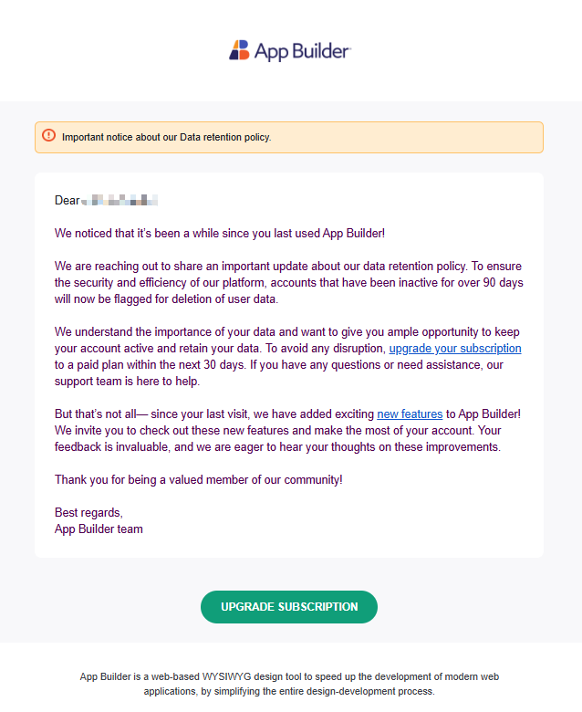

# Account Inactivity and Data Retention Policy in App Builder

This help topic outlines the official data retention policy for accounts using App Builder, particularly after subscription expiration and periods of inactivity. It also covers shared preview links and user data deletion in compliance with GDPR.

## Data Retention Timeline

When a user's **App Builder subscription expires**, the following policy applies:

| Time Since Subscription Expiry | Action Taken |
|-------------------------------|--------------|
| 90 days                       | Account flagged for deletion. User receives first email notification. |
| Day 90–120                    | A total of **4 warning emails** are sent, including 30-day and 10-day reminders. |
| 120 days                      | **All App Builder user data is permanently deleted.** |

> [!NOTE]
> This data deletion policy applies **only to App Builder** user data. Infragistics retains general account information unless the user explicitly requests its deletion.

For more information on how we handle personal data and data retention, see our [Privacy Policy](https://www.appbuilder.dev/privacy-policy).

## What Data Is Deleted?

After 120 days of subscription expiration and inactivity, the following data is deleted:

- **Projects**, **apps**, **datasources**, **assets**, **viewports**
- **Personal workspaces**
- **Shared preview links** (they return a 404 or similar error)
- User is removed from shared workspaces
- Workspaces with no members are deleted

## Shared Preview Links

Shared (anonymous) preview links are tied to the availability of the source project.  
If the project is deleted, the link becomes invalid.

- Shared links **remain active for 120 days** post-subscription expiry.
- Once the associated project is deleted, the shared link will no longer work and may return a **404 Not Found** or similar error message.

## Example Deletion Warning Email

Example Deletion Warning Email

## Summary

| Condition                      | Outcome                                  |
| ------------------------------ | ---------------------------------------- |
| Subscription expired < 90 days | No action                                |
| 90 days post-expiry            | Deletion process begins, email sent      |
| 120 days post-expiry           | All App Builder data is deleted          |
| Subscription renewed           | Timer is reset, no deletion              |
| GDPR deletion requested        | Personal info and workspace data deleted |

For details on personal data collection and retention practices, refer to our [Privacy Policy](https://www.appbuilder.dev/privacy-policy).

---

## FAQ

**Q: What happens if I share a preview link and then delete the source app?**
A: The shared link will become invalid and return a 404 error.

**Q: Will my Infragistics account be deleted too?**
A: No, your general Infragistics account stays unless you specifically request deletion.

**Q: Can I retrieve my projects after they are deleted?**
A: No. Once the 120-day deletion is complete, data cannot be recovered.

For further assistance or questions, please [contact us](https://www.infragistics.com/about-us/contact-us).
