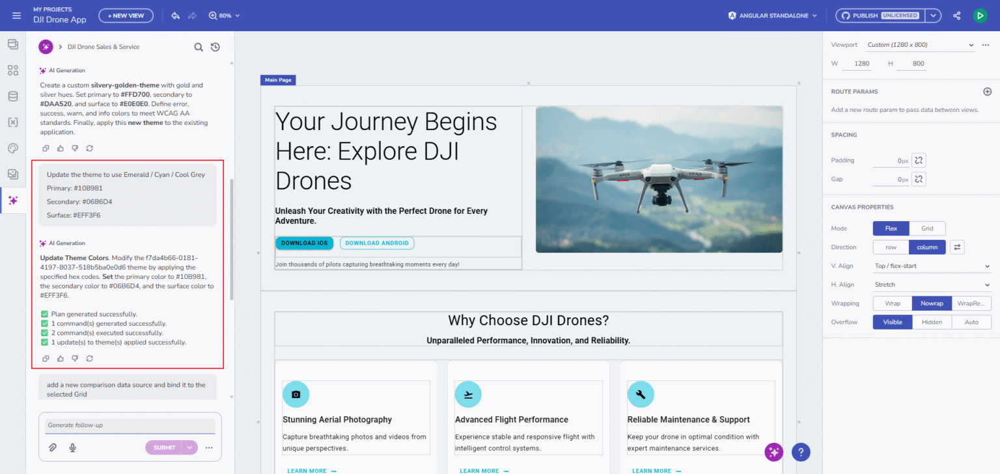
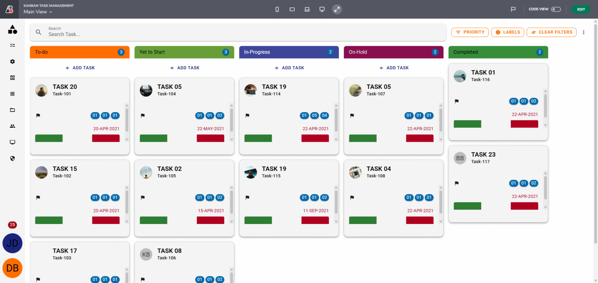

# Getting Started with App Builder AI

App Builder’s AI Chat capabilities will help you build multi-view apps with navigation. Easily iterate on existing UIs in context without disrupting other parts of your app. Upload images or screenshots to create complete UIs with custom themes.

The AI Chat panel is your central hub for all AI-powered generation and assistance within App Builder.

## Key Capabilities

### 1. End-to-End Application & UI Generation

The AI functionality can now generate full applications from natural language, including multi-page structures, viewports, navigation, and themes. It builds complete screens like dashboards, landing pages, product lists, and e-commerce or login/register screens. All output is created using Ignite UI’s enterprise-grade components for consistent, high-quality UI.

### 2. Smarter Commands and Structured Execution

A powerful command engine that ensures accuracy and consistency.

- **CREATE**: apps, views, components, themes, viewports, data sources, images.
- **UPDATE**: modify components, themes, images, and properties.
- **DELETE**: remove elements safely from the canvas (views & themes excluded).

The process includes previews, step-by-step execution, and clear diagnostics when errors occur.

### 3. AI Understands & Generates Real, Working Data

It understands and generates real, working data from natural text descriptions. It creates data sources automatically, generates JSON, detects schemas, and binds data to components without manual setup. It also maps fields, creates variables, and configures bindings intelligently, ensuring everything works out of the box.

### 4. Theme Generation and Visual Styling

The AI produces consistent, aesthetic themes from simple text prompts. It can also generate full theme palettes from uploaded design references or explicit color values. All colors and tokens are mapped correctly, resulting in a unified visual style across the entire application.

### 5. Image-to-Application Generation

You can generate full applications from uploaded images thanks to the AI’s context-aware interpretation. It can also create images from prompts and automatically place them into the design where needed. This makes both visual exploration and final UI production faster and more intuitive.

## Multi-Mode AI Chat

The AI chat now performs intent classification, it determines whether your prompt aims to generate content (e.g., create or edit a component) or seeks product-related help.

- **Analyze Mode (Submit)**: Detects user intent and routes the request (support vs. generate).
- **Generate Mode (Generate)**: Creates applications, views, layouts, components, themes, and data.
- **Support Mode (Ask)**: Answers questions based on documentation and help content.

This enhancement allows App Builder to respond contextually, switching seamlessly between content generation and in-app support.

## Rich Conversational Experience

The conversational workspace provides a flexible, interactive environment for building apps.

- **Chat Component**: The Ignite UI Chat Component supports text, speech-to-text, and both image generation and uploads.
- **Session Management**: Sessions can be renamed, searched, pinned, or removed, helping you stay organized throughout long workflows.
- **Pinned Chat History**: Lets you quickly revisit important sessions.
- **Image Uploads**: Effortless thanks to support for drag-and-drop, paste, or traditional selection copy->paste.
- **Guidance**: The AI provides helpful follow-up suggestions, prompts, and recommends next steps as you build. Every action comes with command previews, execution progress, and actionable error explanations. When something needs refinement, retry options make the process easy and forgiving.

### Speech-to-Text

Interacting with AI is even more intuitive with speech-to-text support. Click the microphone button in the prompt area, speak your instructions, and watch them transcribe directly into the text field, perfect for hands-free workflow or rapid idea capture.

## Contextual Editing & Live Design Controls

There is deep integration between the AI Chat and the Design Surface for even easier interaction.

- **Contextual Popup**: You can click any UI element to modify it through AI contextual popup.
- **Component Indicator**: Shows what’s selected at all times.
- **Real-time Feedback**: Real-time feedback via the Design-Area Processing Indicator keeps you informed during generation or updates.

## AI-Driven "Create New App" Dialog

Start your project with the AI-Driven "Create New App" dialog, featuring a richer prompt gallery with prompt cards for a personalized experience, improved filtering, and discovery.

## Additional Resources

- [App Builder Interface Overview](../interface-overview.md)
- [App Builder Components](../indigo-design-app-builder-components.md)
- [Generating an App](../generate-app/generate-app-overview.md)
