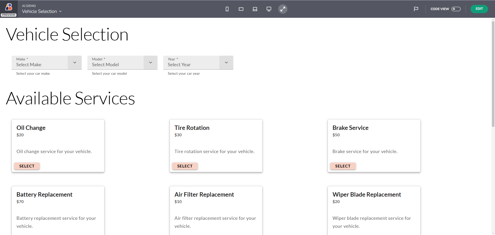
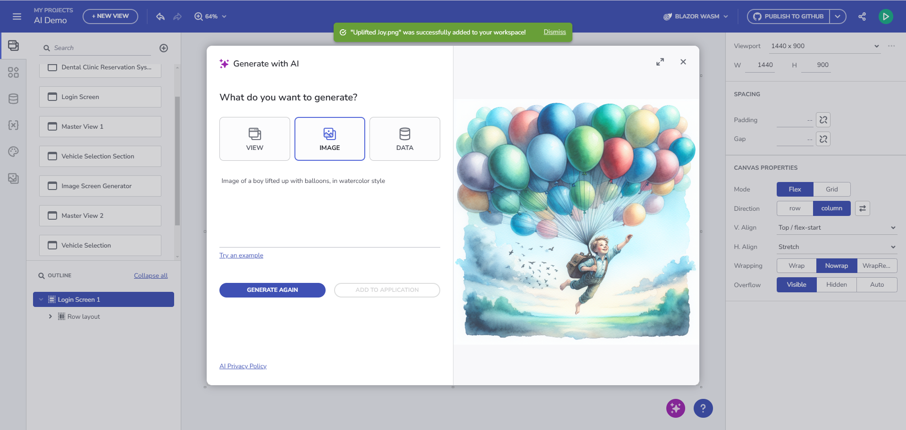

# Getting Started with App Builder AI
This help topic covers the newly introduced AI-powered content generation in App Builder. 

## View Generation
The generative AI–powered view generation in App Builder provides a powerful alternative to traditional layout pickers. By leveraging free-text user prompts and multiple prompt patterns, users can generate highly customized views that are automatically transformed into a working applications.

This approach not only accelerates the App Views creation process but also simplifies the design of app interfaces, making UI generation accessible to users with varying levels of technical expertise.

## User flow
1. Users enter free-text prompts into the GenAI Dialog. Prompts can be descriptive or follow recommended patterns for more precise results.
2. The result is displayed in a Preview section where you can see the output result
3. Apply and action by using the plus button part of the Preview section to "Ädd a content", "Replace content" or "Create a new View".

- Add content will append the content at the end of the current view
- Replace content will search for the item context that you selected in the current view and replace it with the generated output result.
- Create new View will add the newly generated content into a separate View page.

## Content Creation Options

### Prompt based 
Users can iteratively generate and refine views using different context menu options. The behavior depends on the **current view state** and **selected components**:

| Context              | No components selected on current view | One layout container selected | One or more (non-container) components selected |
|----------------------|--------------------------------------|------------------------------|-----------------------------------------------|
| **Add Content**      | Appends content at the end of the current view | Appends content at the end of the selected container | Inserts content before the first selected component |
| **Replace Content**  | Fully replaces the current view’s content | Fully replaces the selected container’s content | Replaces all selected components |
| **Create New View**  | Creates a **new master view** with generated content | Creates a **new master view** with generated content | Creates a **new master view** with generated content |

> [!NOTE]
> - **Undo/Redo is supported** for **Add** and **Replace** actions but **not** for creating new views.
> - **Child views can be created** when a view container is involved in the generated content.
> - This iterative approach allows users to refine both **AI-generated** and **manually created** views.


### Image Based - Via Ppload

> [!NOTE]
> The image-based generation does not guarantee perfect adherence to the reference; some components or layouts may be interpreted differently by the LLM

Use the upload button provided under the View tab of the GenAI Dialog.


<p style="text-align:center;">Image upload view generation</p>

**App Builder Preview:**


<p style="text-align:center;">Image upload view generation</p>

## Example Use Cases

### Example 1: Login Screen

**Prompt:**  
*"Create a detailed login screen."*


<p style="text-align:center;">Login screen</p>

**AI Output - Angular template:**
```html
<div class="column-layout group">
	<h1 class="content">
		Login
	</h1>
	<p class="content">
		Enter your username and password to log in.
	</p>
	<form class="column-layout form">
		<igx-input-group type="box" class="input">
			<input type="text" placeholder="Enter your username" required igxInput />
			<label igxLabel>Username</label>
			<igx-hint>Username</igx-hint>
		</igx-input-group>
		<igx-input-group type="box" class="input">
			<input type="password" placeholder="Enter your password" required igxInput />
			<label igxLabel>Password</label>
			<igx-hint>Password</igx-hint>
		</igx-input-group>
		<igx-checkbox labelPosition="after" class="checkbox">
			Remember me
		</igx-checkbox>
		<button igxButton="contained" type="button" igxRipple class="button">
			Login
		</button>
		<a href="#" target="_self" class="ig-typography__body-1 hyperlink">
			Forgot password?
		</a>
		<a href="#" target="_self" class="ig-typography__body-1 hyperlink">
			Create an account
		</a>
	</form>
</div>
```


<p style="text-align:center;">Login screen with Blazor code</p>

### Example 2: Car-service View

**Prompt:**  
*"Design a booking screen for an auto-service shop app that allows customers to schedule common car services. The screen should include sections for vehicle selection, available services, appointment scheduling, and a booking summary. Users first select their car make, model, and year from dropdown menus. Then, they choose a service from a grid of six cards, each displaying the service name, price, description, and a "Select" button. Next, they pick a date from a calendar and select an available time slot from a grid of eight buttons. Finally, the booking summary lists the selected services and provides "Confirm Booking" and "Cancel" buttons. The layout should follow a structured column and row format, ensuring a seamless flow from vehicle selection to appointment confirmation."*


<p style="text-align:center;">Auto-service Shop</p>

**AI Output - Angular template:**
```html
<div class="row-layout group">
		<h2 class="content">
			Vehicle Selection
		</h2>
		<igx-select type="border" placeholder="Select Make" required class="select">
			<igx-select-item value="Toyota">
				Toyota
			</igx-select-item>
			<igx-select-item value="Honda">
				Honda
			</igx-select-item>
			<igx-select-item value="Ford">
				Ford
			</igx-select-item>
			<label igxLabel>Make</label>
			<igx-hint>Select your car's make</igx-hint>
		</igx-select>
		<igx-select type="border" placeholder="Select Model" required class="select">
			<igx-select-item value="Corolla">
				Corolla
			</igx-select-item>
			<igx-select-item value="Civic">
				Civic
			</igx-select-item>
			<igx-select-item value="Mustang">
				Mustang
			</igx-select-item>
			<label igxLabel>Model</label>
			<igx-hint>Select your car's model</igx-hint>
		</igx-select>
```

And here is the App Preview:


<p style="text-align:center;">Auto-service Shop Preview</p>


### Useful Patterns for More Precise Results

> [!NOTE]
> Consider these patterns as recomendations, you can always use the regular prompt descriptions phrasing.


## Theme Generation

Step-by-Step Guide:

1. Open the AIGen dialog and navigate to the "Theme" tab.
2. Enter a Prompt - You can use the prompt input to describe the theme you want to generate.
3. You can also click the "Example prompt" button for inspiration.
4. Generate and Review
5. Once the theme is generated, review the result. Regenerate until you are satisfied with the result
7. Click the "Add" button to save your theme to the Theme Library.
8. Use in your project - The theme is now available to apply within your project.


<p style="text-align:center;">App Theme Generation</p>

## Image Generation

Step-by-Step Guide:
1. Head over to the AIGen Dialog "Image" tab 
2. Use the prompt input to descripe an image. You can also use the Example prompt button.
3. Ones you like the result, click on the Add button and add your image to the images library.

You can now start using it within your project.


<p style="text-align:center;">Image generation</p>

## Data Source Generation

Step-by-Step Guide:

1. Open the AIGen dialog and navigate to the "Data" tab.
2. Enter a Prompt - You can use the prompt input to describe the theme you want to generate.
3. You can also click the "Example prompt" button for inspiration.
4. Click the "Add" button
5. Generate the data source and either Create a new data source in the DATA section or Add to an existing data source.
8. Use in your project


<p style="text-align:center;">Data source Generation</p>

## Give Us Feedback

Use the Send Feedback form to reach out to us with any suggestions, problems or challanges that you experience.


<p style="text-align:center;">Give Us Feedback</p>


## Additional Resources
<div class="divider--half"></div>

* [App Builder Interface Overview](../interface-overview.md)
* [Single Page And Navigation](../single-page-apps-and-navigation.md)
* [App Builder Components](../indigo-design-app-builder-components.md)
* [Flex Layouts](../flex-layouts/flex-layouts.md)
* [Running Desktop App](../running-desktop-app.md)
* [Generate app](../generate-app/generate-app-overview.md)
* [Indigo.Design Getting Started]({environment:infragisticsBaseUrl}/products/indigo-design/help/getting-started)