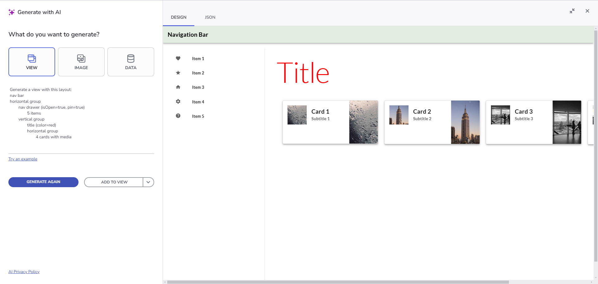

# Getting Started with App Builder AI
This guide covers the newly introduced AI-powered content generation in App Builder.

AI capabilities are currently available only as a **Preview** and are not yet with a finalized design. These AI features are still being polished and are intended for gathering feedback. As such, they may not be fully refined and may evolve based on user input. You can access the **Preview** functionalities here: https://preview.appbuilder.dev/

## View Generation
The generative AI-powered view generation in App Builder provides a powerful alternative to traditional layout pickers. By leveraging free-text user prompts and multiple prompt patterns, users can generate highly customized views that are automatically transformed into fully functional applications. This approach not only accelerates the creation of App Views but also simplifies UI design, making interface generation accessible to users with varying levels of technical expertise.


<p style="text-align:center;">Login screen</p>

### Prompt-Based Generation
**Step 1**: Enter a free-text prompt into the GenAI Dialog.

**Step 2**: View the generated result in the **Preview** section.

**Step 3**: Apply an action using the plus button in the Preview section:
- **Add Content** – Appends the content to the end of the current view.
- **Create New View** – Adds the newly generated content to a separate View page.
- **Replace Content** – Replaces the selected component in the current view with the generated output. Simply select a section/layout/component that you want to transform into something else, and open the GenAI Dialog again, place your prompt and click on the Add button -> Replace Content option.

**Example of replacing an element with an input of type "search," specifying a placeholder value and a width of 200px:**


<p style="text-align:center;">Replace Content Example</p>

Users can iteratively generate and refine views using various context menu options. The behavior depends on the **current view state** and **selected components**:

| Context             | No components selected                    | Layout container selected                       | Non-container components selected                   |
| ------------------- | ----------------------------------------- | ----------------------------------------------- | --------------------------------------------------- |
| **Add Content**     | Appends content at the end of the view    | Appends content to the selected container       | Inserts content before the first selected component |
| **Replace Content** | Fully replaces the current view’s content | Fully replaces the selected container’s content | Replaces all selected components                    |
| **Create New View** | Creates a **new master view**             | Creates a **new master view**                   | Creates a **new master view**                       |

> [!NOTE]
> **Undo/Redo** is supported for **Add** and **Replace** actions but **not** for creating new views.
> **Child views can be created** when a view container is involved in the generated content.
> Users can refine both **AI-generated** and **manually created** views iteratively.

<!-- ### Image-Based Generation

Upload an image using the button under the View tab in the GenAI Dialog.


<p style="text-align:center;">Image upload view generation</p>

> [!NOTE] 
> The image-based generation does not guarantee perfect adherence to the reference; some components or layouts may be interpreted differently by the AI. -->

### Example Use Cases

#### Example 1: Login Screen

Prompt:
```
Create a detailed login screen
```


<p style="text-align:center;">Login screen</p>

AI Output - Angular template:

```html
<div class="column-layout group">
    <h1 class="content">Login</h1>
    <p class="content">Enter your username and password to log in.</p>
    <form class="column-layout form">
        <igx-input-group type="box" class="input">
            <input type="text" placeholder="Enter your username" required igxInput />
            <label igxLabel>Username</label>
            <igx-hint>Username</igx-hint>
        </igx-input-group>
        <igx-input-group type="box" class="input">
            <input type="password" placeholder="Enter your password" required igxInput />
            <label igxLabel>Password</label>
            <igx-hint>Password</igx-hint>
        </igx-input-group>
        <igx-checkbox labelPosition="after" class="checkbox">Remember me</igx-checkbox>
        <button igxButton="contained" type="button" igxRipple class="button">Login</button>
        <a href="#" target="_self" class="ig-typography__body-1 hyperlink">Forgot password?</a>
        <a href="#" target="_self" class="ig-typography__body-1 hyperlink">Create an account</a>
    </form>
</div>
```


<p style="text-align:center;">Login screen with Blazor code</p>

#### Example 2: Car-service View

Prompt:

```
Design a booking screen for an auto-service shop app that allows customers to schedule common car services. The screen should include sections for vehicle selection, available services, appointment scheduling, and a booking summary. Users first select their car make, model, and year from dropdown menus. Then, they choose a service from a grid of six cards, each displaying the service name, price, description, and a "Select" button. Next, they pick a date from a calendar and select an available time slot from a grid of eight buttons. Finally, the booking summary lists the selected services and provides "Confirm Booking" and "Cancel" buttons. The layout should follow a structured column and row format, ensuring a seamless flow from vehicle selection to appointment confirmation.
```


<p style="text-align:center;">Auto-service Shop</p>

AI Output - Angular template:

```html
<div class="row-layout group">
		<h2 class="content">
			Vehicle Selection
		</h2>
		<igx-select type="border" placeholder="Select Make" required class="select">
			<igx-select-item value="Toyota">
				Toyota
			</igx-select-item>
			<igx-select-item value="Honda">
				Honda
			</igx-select-item>
			<igx-select-item value="Ford">
				Ford
			</igx-select-item>
			<label igxLabel>Make</label>
			<igx-hint>Select your car's make</igx-hint>
		</igx-select>
		<igx-select type="border" placeholder="Select Model" required class="select">
			<igx-select-item value="Corolla">
				Corolla
			</igx-select-item>
			<igx-select-item value="Civic">
				Civic
			</igx-select-item>
			<igx-select-item value="Mustang">
				Mustang
			</igx-select-item>
			<label igxLabel>Model</label>
			<igx-hint>Select your car's model</igx-hint>
		</igx-select>
```

And here is the App Preview:


<p style="text-align:center;">Auto-service Shop Preview</p>

### Useful Patterns for More Precise Results

> [!NOTE]
> Consider these patterns as recommendations; you can always use regular prompt descriptions phrasing.

#### Pattern 1: Combined Layout and Component Prompts
For more structured outputs that combine layout and detailed component configurations, users can specify an overall screen design with multiple sections. For instance:

```
A login screen with:
row layout
	col layout
		title: Login
		text: Please enter your email and password to sign in
		form:
			input: email
			input: password
			switch: remember me
			button: login
			row layout
				text: Don't have an account?
				link: sign up
	image
```

Result:


<p style="text-align:center;">Login screen</p>

#### Prompt 2:

Structured equivalent prompt

```
Generate a view with this layout:
nav bar
horizontal group
	nav drawer (isOpen=true, pin=true)
		5 items
	vertical group
		title (color=red)
		horizontal group
			4 cards with media

```
Result:


<p style="text-align:center;">Complex View</p>

## Additional AI Features

<!-- ### Theme Generation

**Steps:**
1. Open the **AIGen** dialog and navigate to the **Theme** tab.
2. Enter a prompt describing the theme.
3. Click the **Example Prompt** button for inspiration.
4. Generate and review the result.
5. Click **Add** to save the theme to your **Theme Library**.
6. Apply the theme in your project.


<p style="text-align:center;">App Theme Generation</p> -->

### Image Generation

**Steps:**
1. Open the **AIGen** dialog and navigate to the **Image** tab.
2. Enter a prompt describing the image or use an **Example Prompt**.
3. Once satisfied with the result, click **Add** to save it to your **Image Library**.
You can now start using it within your project.


<p style="text-align:center;">Image generation</p>

### Data Source Generation

**Steps:**
1. Open the **AIGen** dialog and navigate to the **Data** tab.
2. Enter a prompt describing the data you need.
3. Click the **Example Prompt** button for inspiration.
4. Click **Add** to create a new data source or append it to an existing one.


<p style="text-align:center;">Data source Generation</p>

## Give Us Feedback

Use the **Send Feedback** form to share your suggestions, report issues, or describe challenges you experience.


<p style="text-align:center;">Give Us Feedback</p>

## Additional Resources
<div class="divider--half"></div>

* [App Builder Interface Overview](../interface-overview.md)
* [Single Page and Navigation](../single-page-apps-and-navigation.md)
* [App Builder Components](../indigo-design-app-builder-components.md)
* [Flex Layouts](../flex-layouts/flex-layouts.md)
* [Running Desktop App](../running-desktop-app.md)
* [Generating an App](../generate-app/generate-app-overview.md)
* [Indigo.Design Getting Started]({environment:infragisticsBaseUrl}/products/indigo-design/help/getting-started)
