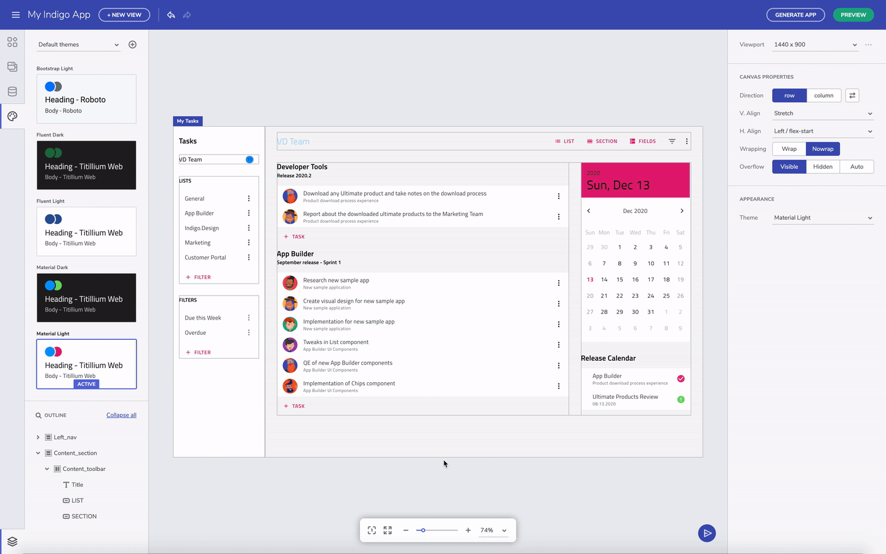
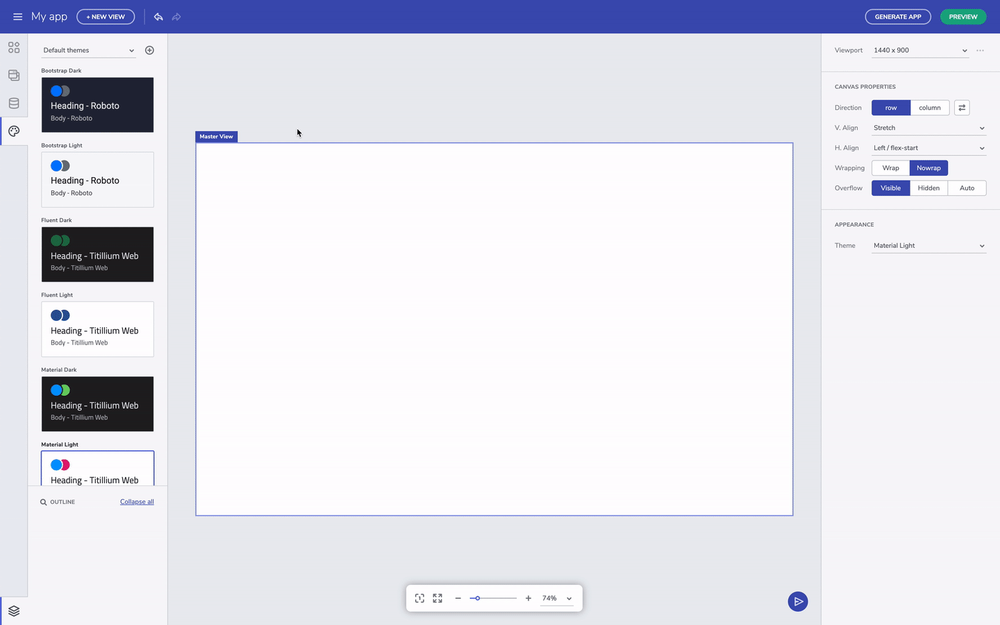
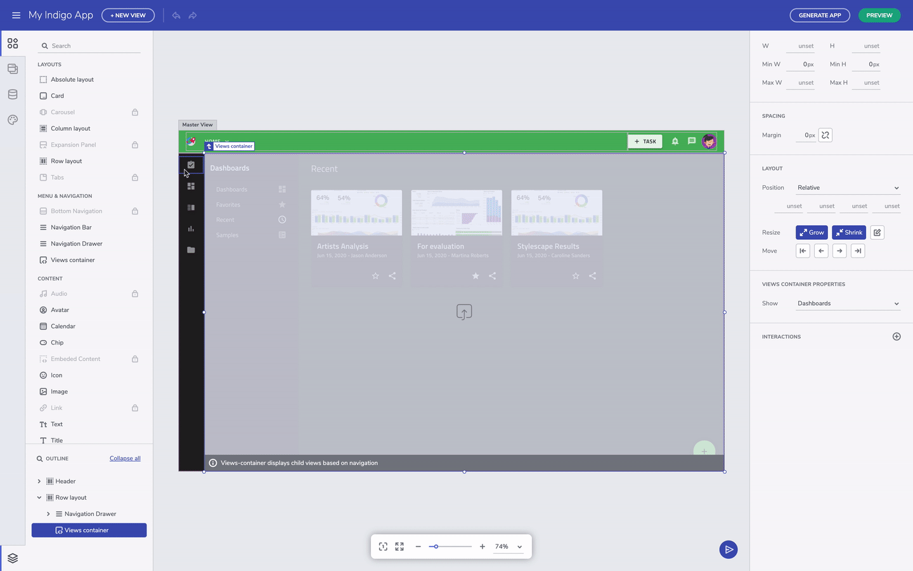

# What Are App Themes – Overview

An app theme is a collection of color palettes and attributes that create a sense of visual persistency throughout the entire app, view, or activity. With app themes, you can define the look and feel of your application by selecting and configuring different panels, styles, layouts, typography, pre-built theme widgets. Or you can create a custom theme file too. 

# App Builder themes

<section class="video-container">
    

        

            <iframe src="https://www.youtube.com/embed/tuTELBXDKYA" frameborder="0" allowfullscreen></iframe>
        

        
Customize App Themes

    

</section>

The [App Builder]({environment:infragisticsBaseUrl}/products/indigo-design/app-builder) adopts a design systems approach to UI creation and you can download app themes and apply them at the app-level. With a single selection of a theme, the theme is globally applied to the whole application immediately. Having global theme avoids the need to create local styles that are difficult to maintain.  

## Switching App Builder themes 

There are six built-in app themes based on Material, Fluent or Bootstrap. Each have a dark version and light version. You can try it out by selecting the theme card in the toolbox.  

Switching between themes

## Material vs. Fluent vs. Bootstrap 

When we switch from Material to Fluent, you will see the components look different. For example, the floating label style for the input field in Material switches to a fixed label. And the switch is also visually different. Some of the other changes are more subtle, but it's there. 

## How To Customize & Apply App Themes  

You can create a custom app theme to match your brand. You do this by creating a new theme, and picking one of the base themes as the starting point. The color palettes are automatically generated based on the primary and secondary color you pick. As far as typography is concerned, for now we have a set of fonts built in, but we plan to add more creative control in future versions. Once you are done editing, save the app theme to apply the changes.  

Create a new theme

Switching between themes

After an app theme is selected, when you apply a fill color for a container, the color picker now reflects the palette from the selected theme. This helps us stay true to the design systems approach where brand attributes are decided and maintained at the app level, and not decided on an ad-hoc basis depending on who is creating the UI. 

Change the appearance of a layout

In the future, we will include a way to add custom colors too, but as a secondary usage scenario. For now, if you still want to further customize the appearance of a layout and further restyle the app using a custom color, you can always type in the color code in the input field on the side. The app-level themes you created in the editor is persisted in a platform-compliant way when generating the app. It also makes it really simple to change the theme in the future.  

Keep in mind that with the App Builder you can take advantage of Flex layouts, providing a set of advanced position capabilities for easier and faster creation of custom layouts. This way the app you build will adapt to any screen size. Whereas compared to an absolute layout, you get a particular design for only one screen size. 

## Additional Resources

* [Flex Layouts](../flex-layouts/flex-layouts.md)
* [Ignite UI for Angular Theming]({environment:infragisticsBaseUrl}/products/ignite-ui-angular/angular/components/themes/index)
