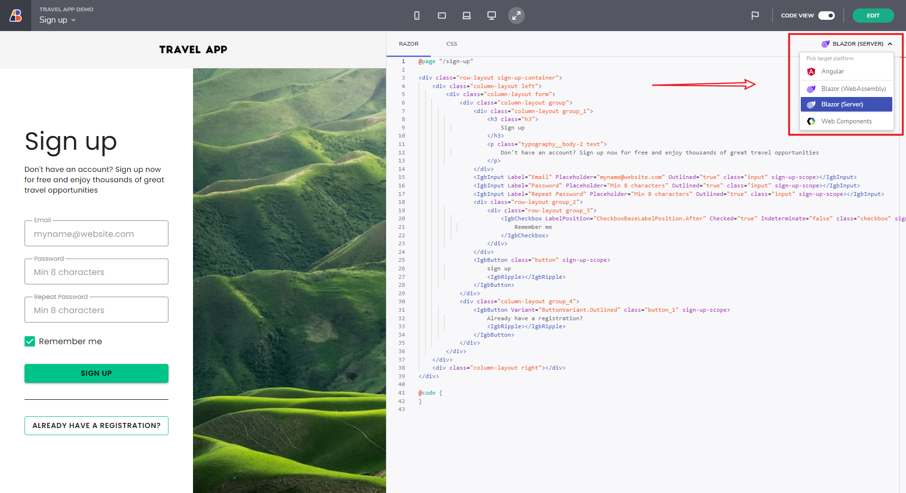

# Blazor Code Generation with App Builder

With .NET 6 we are officially supporting a version of App Builder with Blazor WASM and Server code generation options. This version comes live following the overwhelming feature requests around Blazor support.

This means that you can now create any Blazor UI with simple drag & drop and get all of the production ready Razor, C# and CSS code in a single click for almost all components now.

For a list of Blazor components availability see [Generate App](generate-app/generate-app-overview.md#supported-components) supported components section.

You can generate both Blazor Web Assembly or Blazor Server apps based on your preferences and requirements.

Blazor Code Generation from AppBuilder

> [!NOTE]
><b>Trying to generate code for components not available yet will put a placeholder informing that such a component is not yet supported. This makes it possible for you not to refrain from developing more complex UI in the designer.

### In this article:
* <a href="#introduction">Introduction of the feature</a>
* <a href="#blazor-code-generation">Blazor Code generation</a>
* <a href="#uploading-an-application-to-github">Uploading an application to GitHub</a>
* <a href="#known-issues-and-limitations">Known issues and limitations</a>

## Introduction
As mentioned, Blazor Code generation feature supports a lot of new components and many are yet to come. Don't miss out on the Grid and Tree Grid code generation - as most of the grid features are now supported, like data binding that gives you the ability to run a Blazor application with a native grid component from Ignite UI for Blazor! Features like Excel-style filtering, Paging, Row editing, Cell selection and a lot more, are available to you.

## Blazor Code Generation
After finalizing the design of your application and before previewing its code, pay attention to the Platform picker dropdown, located in the navigation bar just next to the `Publish to Github` and `Preview` action buttons. Choose the `Blazor WASM` or `Blazor Server` option to generate code for Blazor, `Angular` or `Web Components` if this is the preferred framework for your app. The picker remembers your choice and next time you go to AppBuilder you will have your desired framework preselected for you.

## Uploading an application to GitHub
In addition to see your application in Preview mode or download it locally on the machine, there is the option for generating the full app code repository. In order to do that, simply go to the Generate app button and then connect your GitHub account to the App Builder.

## Known issues and limitations
Generating Blazor application has the following limitations:
- Bootstrap is turned off in the generated application.

Generated components have the following limitations:

- Card:
    - reversed actions are not reflected in generated code.
    - divider in "Actions-column" type is not reflected in generated code.
- Navigation Drawer
    - does not support pin threshold.
- Avatar:
    - the "Initials" type does not limit the content to the first two chars.
- Icon
    - does not use `IgbIcon` in generated code. All components, which use icons, are also not generated with `IgbIcon`.
- Date Picker:
    - does not support Dialog mode.
    - does not support displaying multiple months.
    - does not support action buttons.
- Icon Button
    - does not generate `IgbIconButton`, but `IgbButton` with icon instead.
- Input Group - when type is set to "Date":
    - does not support input format.
    - does not fully support display formats.
    - does not support help text.
    - does not support custom prefix and suffix.
    - does not support min and max values.
    - does not support value loop.
- Radio Group
    - does not support required.
- Grid/Tree Gird:
    - does not support column selection.
    - does not support row actions (action strip).
- Rating:
    - does not support [ngModel] binding for `readonly` and `disabled` inputs (for Angular)
    - does not support repeating of rating elements for exported code
    - is included only for Angular and WC, there is no Rating for Blazor

For a list of all supported components see [Generate App](generate-app/generate-app-overview.md#supported-components)

## Additional Resources

* [Generate App](./generate-app/generate-app-overview.md)
* [App Builder Components](indigo-design-app-builder-components.md)
* [Flex Layouts](flex-layouts/flex-layouts.md)
* [Running Desktop App](running-desktop-app.md)
* [Indigo.Design Getting Started](https://www.infragistics.com/products/indigo-design/help/getting-started)
* [Indigo.Design Components](https://www.infragistics.com/products/indigo-design/help/components/components-overview)