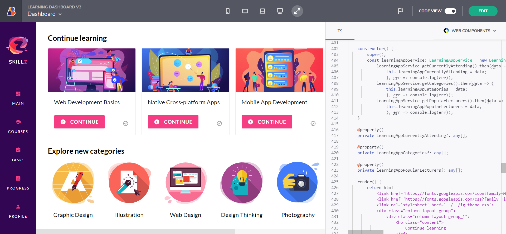
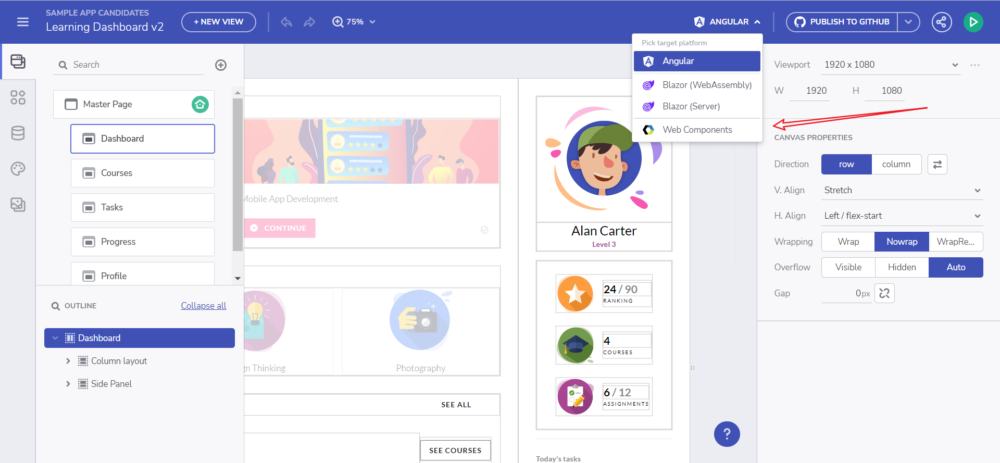
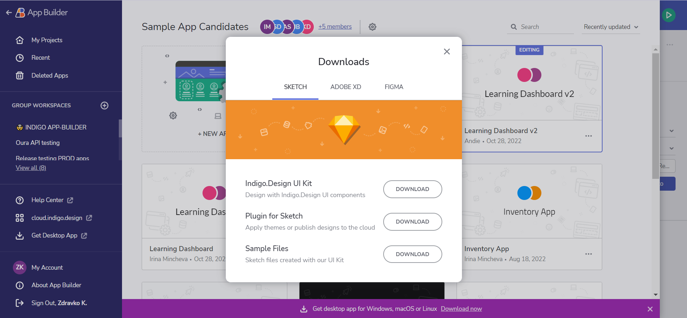
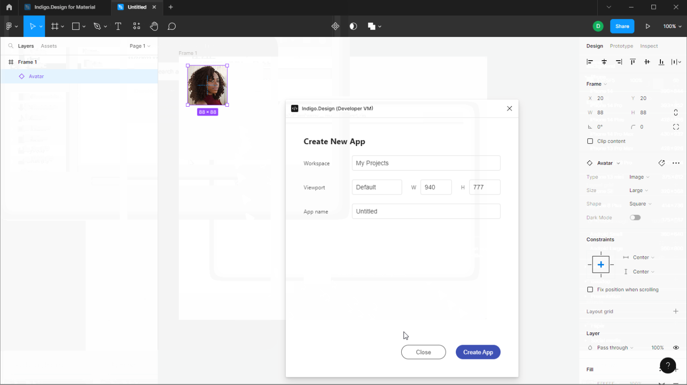

# Design-to-Code App Builder story

App Builder enables you to go from Design to Code in a single click. First, create your designs with the [Indigo.Design System](https://www.infragistics.com/products/appbuilder/ui-toolkit)  for Figma or Sketch. You can then use our Figma plugin to publish as apps in App Builder. For Sketch, you can import your Sketch files directly into app builder when creating a new app. Once imported, you will find your UI kit components are mapped to components available in the toolbox. This will allow you to extend your app with data and variables to create dynamic app experiences.

Indigo.Design UI Kit

> [!NOTE]
> You can download our UI Kits, Plugins and Sample Apps from the [Download Assets page.](https://cloud.indigo.design/resources/figma) or [though direct links](#download-assets).

## Indigo.Design System

The [Indigo.Design System](https://www.infragistics.com/products/appbuilder/ui-toolkit) uniquely combines UI Kits that map to real UI controls and components, with tooling that delivers unprecedented productivity helping digital product teams go from pixel-perfect design to production-ready code. Anything you design can be turned into real, usable code, simplifying the designer-developer handoff.
### What is a Design System?

Design systems are usually described as a set of design principles and assets that translate to consistency in the way you build user interfaces. The three core advantages of using a design system are:

- Tunes into a specific usage context and app domain.
- Works as an inventory of UX design patterns and brand style guidance.
- Speeds up the design process and significantly improves consistency.

### Turn Your Designs into Code
Use file import or your favorite design tool.
#### File import

Below are the 4 simple steps to get from Design to Code with the App Builder with simple drag & drop.

##### Step 1: Click New App from the Indigo Cloud or App Builder Home Screen

New app

##### Step 2: Drag your Sketch File into the "Create from existing design" Drop Area

Import Designs

##### Step 3: Review the Design in the Cloud IDE

App Preview

##### Step 4: Review or Download your Angular Code

Download the application

#### Publish via Plugin

The plugin will help you to publish your designs into App Builder. You can download it by following these steps:
1. Open App Builder
2. Click on "Create new application"
3. Click on "Get assets for..."

Available assets

Now you can start using the plugin.

##### Figma Plugin

Figma Plugin

## Download Assets

You can download the Plugins, UI kits and sample apps from the [Download Assets page.](https://cloud.indigo.design/resources/figma).

Or through the direct links below:
- [Figma UI Kit](https://www.figma.com/@infragistics)
- [Plugin for Figma](https://www.figma.com/community/plugin/1170035114372031474) 
- [Sample Apps](https://download.infragistics.com/products/Infragistics/Indigo.Design/Samples/Infragistics_IndigoDesign_Sample_Apps_Figma.zip)
- [Sketch UI Kit](https://dl.infragistics.com/products/Infragistics/Indigo.Design/ABECAC7231EE434C8CD3DC619BE6F75B/Infragistics_IndigoDesign_UI_Kit.zip)
- [Sample apps](https://dl.infragistics.com/products/Infragistics/Indigo.Design/Samples/Infragistics_IndigoDesign_Sample_Apps.zip)
 
## Additional Resources

* [Figma UI Kit](ui-kits/figma.md)
* [Sketch UI kit](ui-kits/sketch.md)
