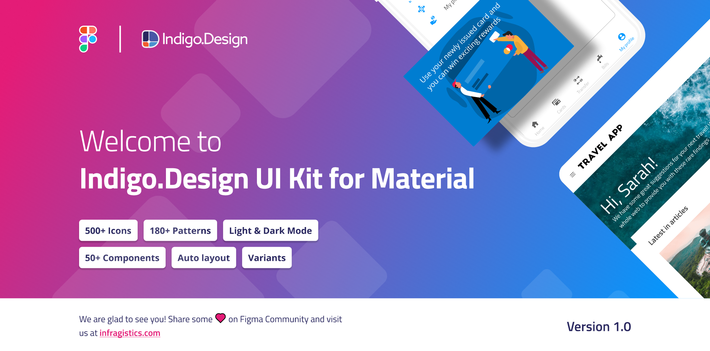

# Design-to-code App Builder story

App Builder enables you to go from Design to Code in a single click. Import Figma, Sketch and Adobe XD files and create Apps directly from the Designs.

This happens by importing your design files with App Builder or by using the Indigo.Design System plugins directly inside Figma, Sketch and Adobe XD. The plugins even deliver custom themes, import images assets, and ensure all components are mapped one-to-one with controls from the App Builder Toolbox. More below.

Indigo.Design UI Kit

## Indigo.Design System

### What is a Design System?

Design systems are usually described as a set of design principles and assets that translate to consistency in the way you build user interfaces. The three core advantages of using a design system are:

- Tunes into a specific usage context and app domain.
- Works as an inventory of UX design patterns and brand style guidance.
- Speeds up the design process and significantly improves consistency.

### Turn your designs into code

Here are the 4 simple steps to get from Design to Code with the App Builder with simple drag & drop.

#### File import

##### Step 1: Click New App from the Indigo Cloud or App Builder Home Screen

New app

##### Step 2: Drag your Sketch file into the "Create from existing design" Drop Area

Import Designs

##### Step 3: Review the Design in the Cloud IDE

App Preview

##### Step 4: Review or Download your Angular code

Download the application

#### Publish via Plugin

The plugin will help you to publish your designs into App Builder. You can download it by following these steps:
1. Open App Builder
2. Click on "Crete new application"
3. Click on "Get assets for.."

Available assets

Now you can start using the plugin.

##### Figma Plugin

Figma Plugin

##### Adobe XD Plugin

Adobe XD Plugin Create App

##### Sketch Plugin

Sketch Plugin Create App

## Figma UI Kit
With support for Sketch and Adobe XD already available and Figma being added as part of the latest App Builder 22.2 Release, we are marking a new milestone in our design-to-code story, covering all the major tools for UX and UI design. 

Figma UI Kit

The brand-new Figma Material Light UI kit maps to our Ignite UI for Angular, Blazor and Web Components UI toolset to completely redefine design-development processes. You now get a robust set of components, patterns, styling, and customization options, enabling you to import prototypes or any type of screen designed in Figma and transform it clean code. The best part is that all static designs become interactive, responsive apps with real UI components, branding, and styling – in a single click. 

Here are the fresh new controls, components and a healthy dose of quality improvements that arrive with the addition of Figma UI kit today:

- Accordion
- Avatar
- Badge
- Banner
- Button
- Button Group
- Calendar
- Card
- Carousel
- Charts - Category and Pie Chart
- Checkbox
- Chip and Chips Area
- Combo
- Date Picker
- Dialog
- Divider
- Drop Down
- Expansion Panel
- Gauges - Linear and Radial Gauge
- Grids - Data Grid, Tree Grid, Hierarchical Grid, Pivot Grid
- Hyperlink
- Icon
- Input
- List
- Navigation Drawer
- Progress Bar
- Radio Group
- Select
- Slider
- Snackbar
- Splitter
- Stepper
- Switch
- Tabs
- Text Area
- Time Picker
- Toast
- Tree
- Tooltip

## Adobe XD UI Kit

Crafted from the ground-up to equip designers with a modern and easy-to-use arsenal of tools which allow them to design wireframes and apps, Adobe XD is one of the popular vector graphic design platforms in the market today. Along with wireframe features, designers can create hi-fidelity prototypes, collaborate across teams through the design process, configure animations and collect feedback.

Adobe XD Plugin

**How to Convert Adobe XD to HTML Code using App Builder?**

There are a couple pre-requisites to get started:

1. Login to your account or start a free trial of App Builder 
2. Login to your account or start a free trial of Adobe XD 

Once you have installed Adobe XD, you need to install the Indigo.Design App Builder plugin, which enables design to code.  You can access this from the Stock & Marketplace -> Plugins in the Creative Cloud app, simply search for Indigo.Design.

Once you have installed the Indigo.Design App Builder plugin, you need a design based on the UI Kits from Infragistics. The way design to code works with App Builder is that designs in Adobe XD must be created using out UI Kits, which are full-featured, extensible and customizable libraries of UI components and UI patterns that accelerate the design phase.

When your design is ready, you can publish it to App Builder.

For more in-depth tutorial how to import your Adobe XD designs into App Builder, [please refer to this blog article](https://www.infragistics.com/community/blogs/b/jason_beres/posts/adobe-xd-to-html-code) that shows everything with images and detailed descriptions.

## Sketch UI Kit

A strong design-to-code movement emerged in the last few years to pick up where Sketch left off – the goal being to create a seamless, consistent, easy-to-use process that ensures Sketch designs can be easily transformed into usable code.
