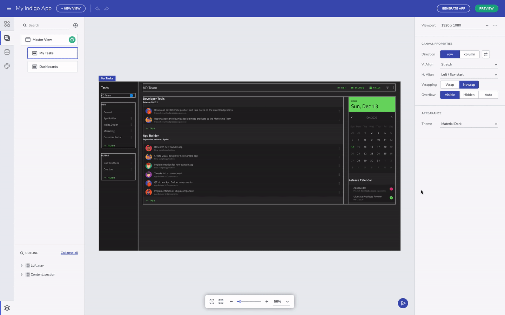
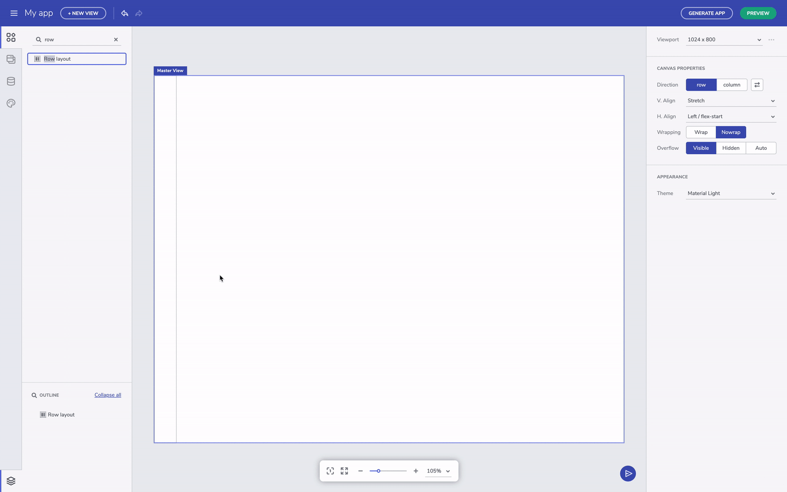
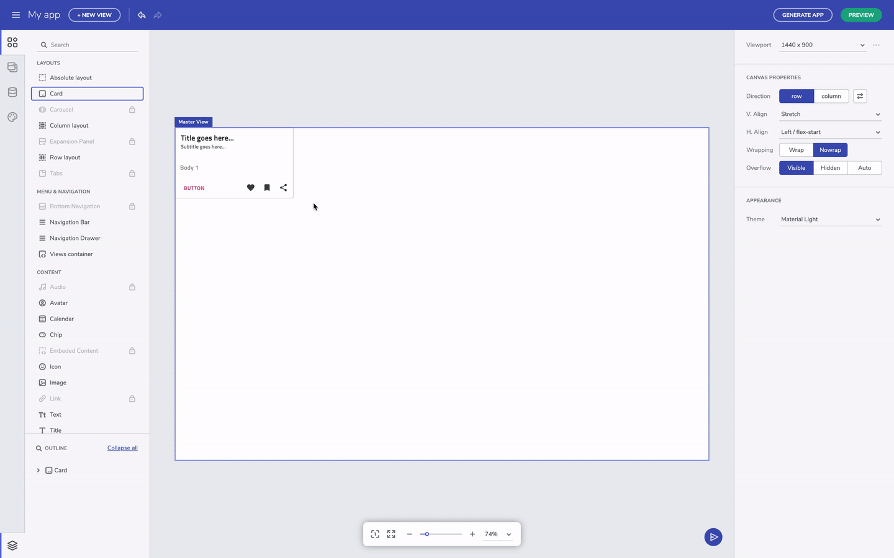

# Flex layouts (and positioning) 
### What is Flex layout?  
Flex layout is used for component positioning, space distribution between items, and resizing. It provides powerful alignment capabilities, lays out elements in either columns or rows, and helps you build responsive page layouts that easily adapt to any screen size.

### How to use Flex layout? 
In essence, the Flex layout is designed to enable developers to easily specify the sizing of a layout container, define visibilities and viewport sizes, and respectively shrink or expand items in order to best fit into the available space.

In order to achieve all of this, the first thing you have to do when using Flex layout is to target the container or parent element and adjust the CSS of your container elements.  

### How to create Flex layouts in App Builder? 
In order to use the Flex layout in the App Builder, you need to define a container (which in the video is referred to as canvas). Note that it has its display property automatically set to Flex. Go to Views, add new container, choose Flex layout row or Flex layout column. 

You can now choose from different Flex layout properties to define alignment, default behavior for how flex items are laid, set other values, and more. 

<section class="video-container">
    

        

            <iframe width="800" height="450" src="https://www.youtube.com/embed/MUq3MGm9YlU" frameborder="0" allowfullscreen></iframe>
        

        
 Create App Layouts

    

</section>

One of the greatest differences between the App Builder and the regular product design tools are the flex-based layouts used in the design-to-code tool. Since the App Builder is targeting web apps, we are offering Flex as one of the approaches to create layouts. It's available to you as a row or column layout component in the toolbox. The outermost container you see here is the canvas and has flex settings already applied to it. You can change the canvas size by editing the viewport size in the properties panel. 

Change canvas size

## Row and column layout 

Flex-layout containers have settings that allow us to modify the position of the nested UI elements. There are flex properties for h.align and v.align properties that can be easily applied from the respective dropdowns. The canvas defaults to row layout, horizontally aligned to the left and stretched vertically. You can always switch between row and column layout irrespective of what you started with. The layout container is sized based on the content, but you can always specify a height and width. You can also add the padding property to container, and margins to space out the child UI elements - that can be done after selection a particular component and editing the padding or margin in the Property Panel on the right-hand side of the screen.

Layout properties

You can always select the parent UI element by clicking on the label for the child element. This is helpful when you have nested layout containers. On the other hand, you can also select the component you need directly from the Outline menu in the bottom left corner.  

Select parent component

## Fluid resizing & wrapping 

The other note-worthy properties are related to grow and shrink. These affect resizing for components when the viewport changes size. Setting a component to `grow` will expand a container in row direction if it's row layout or column direction if it's column layout.  
 

Grow column/row layout option

## Add to layout via context menu 

If you come up with the need to add an existing component to a new layout, there is a very handful option – with right on a selected component, you can trigger the context menu and to add the element to a row or column layout.  

Add component to layout through the context menu

## Additional Resources

To summarize quickly, whatever you have learned about Flex layouts can be used here in the editor as-is. For someone new to Flex and CSS, it will take some getting used to, but over time it will become a lot easier to think of layouts as rows and columns. The most important is that Flex layout help us build application adapting to a screen size and define components behavior within the layout, while the absolute layout let us have a particular design for only one screen size. 

* [App Builder Components](../indigo-design-app-builder-components.md)
* [Flexbox](https://developer.mozilla.org/en-US/docs/Learn/CSS/CSS_layout/Flexbox)
* [A Guide to flexbox](<https://css-tricks.com/snippets/css/a-guide-to-flexbox/)
* [Flexbox Froggy](https://flexboxfroggy.com/)
* [Indigo.Design Getting Started](https://www.infragistics.com/products/indigo-design/help/getting-started)
* [Indigo.Design Styling Overview](https://www.infragistics.com/products/indigo-design/help/style/styling-overview)