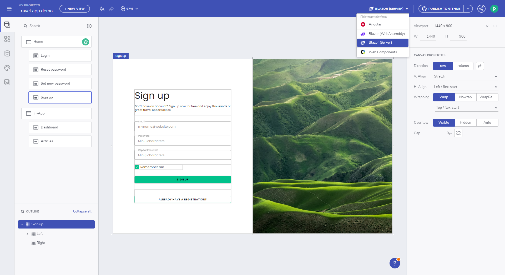

# Generate App

> [!NOTE]
><b>The applications, designed in Ignite UI App Builder can be downloaded or directly uploaded to a GitHub repository. 

<section class="video-container">
    

        

            <iframe width="100%" height="450" src="https://www.youtube.com/embed/zxT-nIXKn7I" frameborder="0" allowfullscreen></iframe>
        

        
Preview and Generate App Code

    

</section>

App Builder with Angular code generation has been in the market for a few months now, but with .NET 6 release we launched the Blazor Code Generation and as of today we do support Web Components code generation as well.

With the Platform picker dropdown, located in the navigation bar just next to the `Publish to Github` and `Preview` action buttons. Choose the `Blazor Server`/`Blazor Web Assembly` option to generate code for Blazor, or `Angular` to see a preview of the generated app and code. `Web Components` option is also available.

Pick platform for code generation

The design and development user story will be completed once the application is generated with all styling and layout properties. Currently, Ignite UI App Builder offers options to upload all your application files to a GitHub repository or download them as a package and then run it locally.

## Licensed code export

### Licensed user
If you are a **licensed user** then the licensed packages of [Ignite UI for Angular](https://www.infragistics.com/products/ignite-ui-angular) will be used, upon app generation. This applies for both _application download_ and _publish to GitHub_. 

When the application is published to GitHub we add a CI that will build your project and run basic tests. We also publish NPM_AUTH_TOKEN that is required from the GitHub CI, in order to be able to use the licensed package.

NPM Authentication Token

### Trial user
If you are a **trial user** then the free trial package of [Ignite UI for Angular](https://www.infragistics.com/products/ignite-ui-angular) will be used, upon app generation. This applies for both _application download_ and _publish to GitHub_.

See the [License FAQ and Installation documentation](https://www.infragistics.com/products/ignite-ui-angular/angular/components/general/ignite-ui-licensing) for information on how to upgrade to the full licensed package, if the project is using a Trial version of Ignite UI for Angular, and how to setup your environment and CI to use our licensed npm feed.

Alternatively run `npm run infragistics-login` for a guided login to our licensed feed.

## Supported Components

Currently, the App Builder supports code generation for Angular and Blazor. Below is a list of supported components per platform:

| Component              | Angular            | Blazor             | Web Components     |
|------------------------|--------------------|--------------------|--------------------|
| **Layouts**                                                                           |
| Absolute Layout        | :heavy_check_mark: | :heavy_check_mark: | :heavy_check_mark: |
| Card                   | :heavy_check_mark: | :construction:     | :construction:     |
| Column Layout          | :heavy_check_mark: | :heavy_check_mark: | :heavy_check_mark: |
| Expansion Panel        | :heavy_check_mark: | :heavy_check_mark: | :heavy_check_mark: |
| Row Layout             | :heavy_check_mark: | :heavy_check_mark: | :heavy_check_mark: |
| Tab Layout             | :heavy_check_mark: | :heavy_check_mark: | :heavy_check_mark: |
| Divider                | :heavy_check_mark: | :x:                | :x:                |
| **Menu and Navigation**                                                               |
| Navigation Bar         | :heavy_check_mark: | :heavy_check_mark: | :heavy_check_mark: |
| Navigation Drawer      | :heavy_check_mark: | :construction:     | :construction:     |
| Views Container        | :heavy_check_mark: | :heavy_check_mark: | :heavy_check_mark: |
| **Content**                                                                           |
| Avatar                 | :heavy_check_mark: | :construction:     | :construction:     |
| Calendar               | :heavy_check_mark: | :heavy_check_mark: | :heavy_check_mark: |
| Chip                   | :heavy_check_mark: | :heavy_check_mark: | :heavy_check_mark: |
| Icon                   | :heavy_check_mark: | :construction:     | :construction:     |
| Image                  | :heavy_check_mark: | :heavy_check_mark: | :heavy_check_mark: |
| Link                   | :heavy_check_mark: | :heavy_check_mark: | :heavy_check_mark: |
| Text                   | :heavy_check_mark: | :heavy_check_mark: | :heavy_check_mark: |
| Title                  | :heavy_check_mark: | :heavy_check_mark: | :heavy_check_mark: |
| **Input & Forms**                                                                     |
| Button                 | :heavy_check_mark: | :heavy_check_mark: | :heavy_check_mark: |
| Button Group           | :heavy_check_mark: | :x:                | :x:                |
| Checkbox               | :heavy_check_mark: | :heavy_check_mark: | :heavy_check_mark: |
| Combo                  | :heavy_check_mark: | :x:                | :x:                |
| Date Picker            | :heavy_check_mark: | :construction:     | :construction:     |
| Drop Down              | :heavy_check_mark: | :heavy_check_mark: | :heavy_check_mark: |
| Floating Action Button | :heavy_check_mark: | :heavy_check_mark: | :heavy_check_mark: |
| Icon Button            | :heavy_check_mark: | :construction:     | :construction:     |
| Input Group            | :heavy_check_mark: | :construction:     | :construction:     |
| Radio Group            | :heavy_check_mark: | :construction:     | :construction:     |
| Select                 | :heavy_check_mark: | :x:                | :x:                |
| Slider                 | :heavy_check_mark: | :heavy_check_mark: | :heavy_check_mark: |
| Switch                 | :heavy_check_mark: | :heavy_check_mark: | :heavy_check_mark: |
| Text Area              | :heavy_check_mark: | :x:                | :x:                |
| Rating                 | :heavy_check_mark: | :x:                | :heavy_check_mark: |
| **Grids & Lists**                                                                     |
| Grid                   | :heavy_check_mark: | :construction:     | :construction:     |
| Tree Grid              | :heavy_check_mark: | :construction:     | :construction:     |
| List                   | :heavy_check_mark: | :heavy_check_mark: | :heavy_check_mark: |
| Tree                   | :heavy_check_mark: | :heavy_check_mark: | :heavy_check_mark: |
| **Notifications**                                                                     |
| Badge                  | :heavy_check_mark: | :heavy_check_mark: | :heavy_check_mark: |
| Banner                 | :heavy_check_mark: | :x:                | :x:                |
| Dialog Window          | :heavy_check_mark: | :x:                | :x:                |
| Snackbar               | :heavy_check_mark: | :heavy_check_mark: | :heavy_check_mark: |
| Reveal Dashboard       | :heavy_check_mark: | :x:                | :x:                |

> Note: Partially generated components are marked with :construction:. See [Blazor Support](../blazor-support.md#known-issues-and-limitations) for more details on the known issues and limitations for Blazor components.

## Additional Resources

* [Blazor Support](../blazor-support.md)
* [Upload Application to GitHub](upload-application-to-github.md)
* [Run Application Locally](run-application-locally.md)
* [Preview Application Code](../preview-code.md)
* [Indigo.Design Getting Started](https://www.infragistics.com/products/indigo-design/help/getting-started)
* [App Builder Components]({environment:appbuilderBaseUrl}/components)
