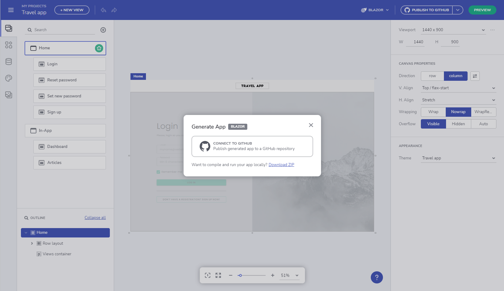
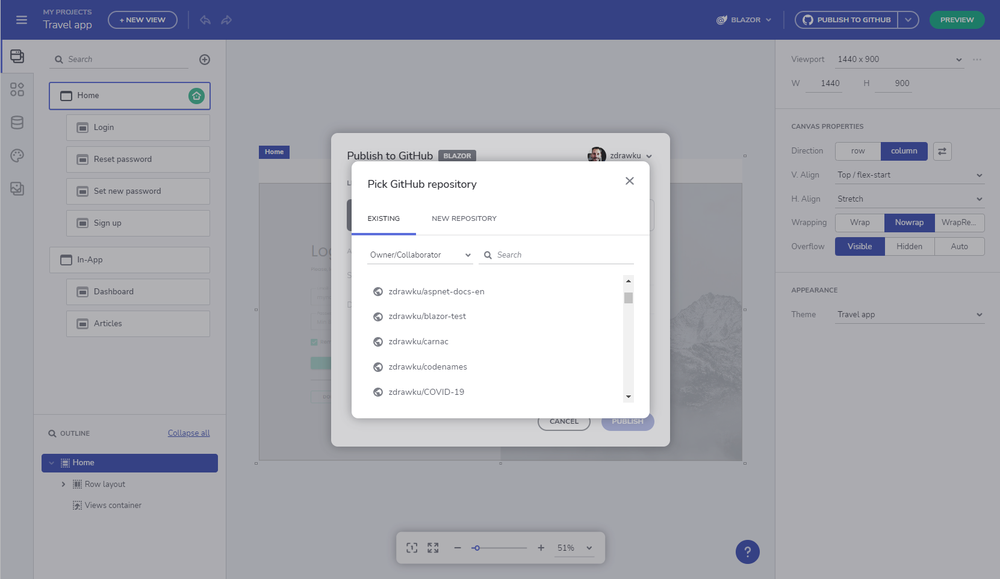
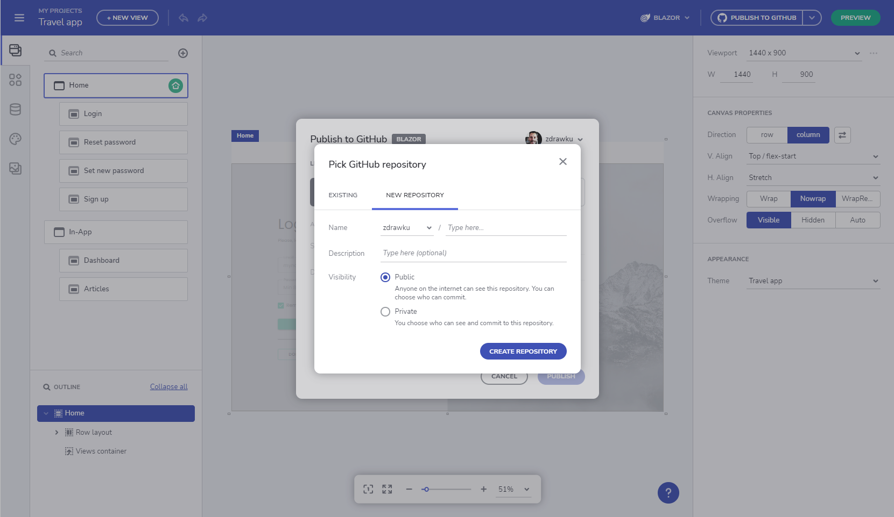
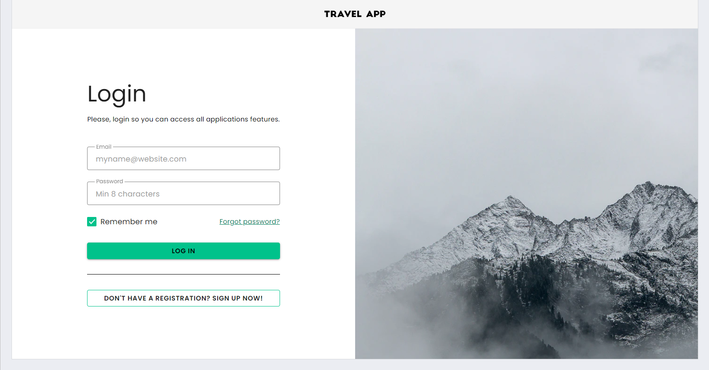
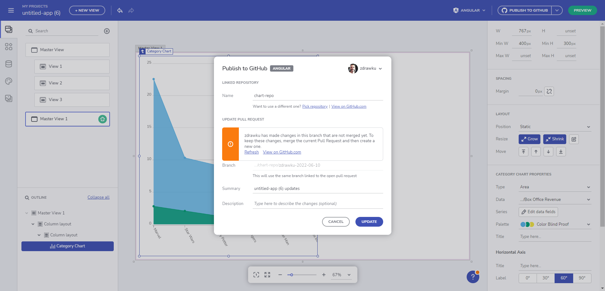
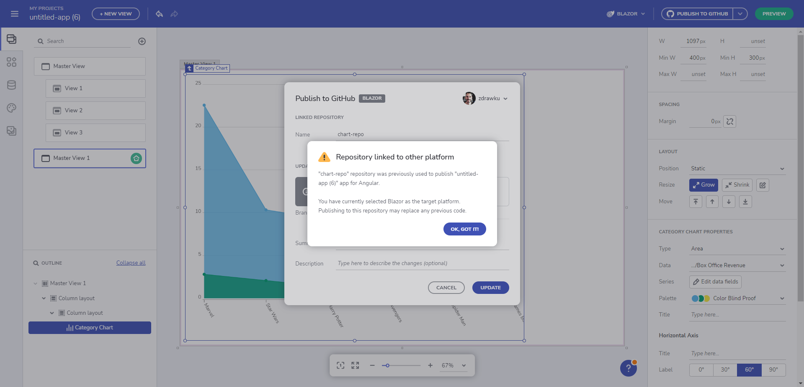

# Upload Application To Github

> [!NOTE]
><b>Once ready with your design in App Builder you can upload it to your private or GitHub repository. 

### In this article:
* <a href="#intro">Introduction of the feature</a>
* <a href="#uploading-an-application-to-github">Uploading an application to GitHub</a>

## Intro
One of the great App Builder features is actually the code generation service, so once the app design is ready and the code reviewed, users can get the final application code. However, what makes the experience even greater is the fact that the app code can be easily uploaded to a GitHub repository directly from inside the App Builder. GitHub is a favorite tool for thousands of developers, so this App Builder feature allows users to benefit from all GitHub features, such as assigning reviewers, tracking changes, commenting and many more. By delivering this feature, the product team adds one more piece to the full design-to-code collaborative story, but also integrates the App Builder platform with a well-known service that engineers are already used to. 

## Uploading an application to GitHub
After finalizing the design of your application and previewing its code, it comes the time for generating the full app code repository. In order to do that, simply go to the Generate app button and then connect your GitHub account to the App Builder. You can also download your application files from the button menu.

Connect App Builder to GitHub

Once you log in with your GitHub account, you should authorize Indigo.Design to access it in order to pick up the repository where the app code will be stored. There, you can select between creating a new repository or adding to an existing one. When creating a new repository you can specify the name of the app, add description and choose between public or private repo. Once ready, the app files are being uploaded to GitHub, creating a new GitHub repository.

Publish application to an existing repo in GitHub

Create a new repository to GitHub

When the upload process is done, users can apply changes to the GitHub repo from inside the App Builder or click to "View it on GitHub" and see the updated files in GitHub.

An application running in VSCode

## GitHub integration features

### Already pushed changes won't be overwritten
There are times when you will be doing application changes externally with code and not via the App Builder. Those changes won't be overwritten once you push a change from the App Builder GitHub UI. We've added a new integration point that now respects the user modifications in main/master branch outside AppBuilder. You are now able to merge App Builder work to `main` branch and next time App Builder will create a PR that contains only the new differences. 

Improvements:
- Warnings when external changes are made in a pull request's associated branch. In order to keep these changes, merge the current Pull Request and then create a new one.

'X' has made changes in this branch that are not merged yet

- Warnings when a repository corresponding to other application or platform is chosen.

'X' repository was previously used to publish 'Y' app for 'Z' platform

- Ability to go back and forth between different repositories used in the history of an application.
- Warnings and guidance when conflicts are found.

> [!NOTE]
> Please note these changes are one-way interaction with GitHub (i.e. Github changes cannot go back to AppBuilder).

## Additional Resources

* [Run Application Locally](run-application-locally.md)
* [Preview Application Code](../preview-code.md)
* [Indigo.Design Getting Started](https://www.infragistics.com/products/indigo-design/help/getting-started)
* [Indigo.Design Components](https://www.infragistics.com/products/indigo-design/help/components/components-overview)
