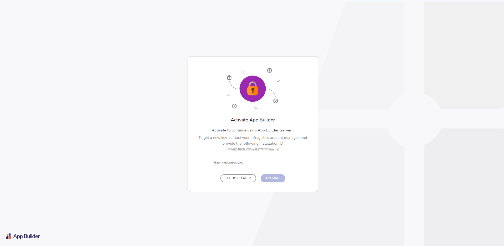

# Getting started with App Builder

App Builder is a low-code platform that lets you quickly turn designs into functional web apps—without writing all the code. Start from scratch, use templates, or import Figma designs, then visually build your app with drag-and-drop components, real data connections, and layout customization. It generates production-ready code for Angular, React, Blazor, and Web Components, with one-click export or deployment to GitHub or Azure.

## How Everything Works Together

The diagram below gives you a high-level overview of how App Builder fits into the broader ecosystem of design and development tools:

Platform Ecosystem

### In Simple Terms

- **Design System → UI Kits & Adapters**:
  It starts with a design system, implemented as UI kits (like Indigo.Design for Figma). Adapters translate your design into a format App Builder can use.
- **App Builder + Integrations**:
  You use App Builder to visually create your app. It supports REST data, Reveal SDK widgets (for dashboards), and Slingshot tasks (for project management).
- **Common App Model**:
  Everything flows into a central **Common App Model**—a unified format that describes your app, regardless of how you started (design import or manual build).
- **Code Generation (Codegen)**:
  The model is then used by the **code generator**, which outputs real, usable code for:
  - **Angular**
  - **React**
  - **Web Components**
  - **Blazor**
- **Deployment Targets**:
  Finally, the generated code can be deployed directly to platforms like **GitHub** or **Microsoft Azure**.

## Launch App Builder

To access App Builder, navigate to [https://appbuilder.dev](https://appbuilder.dev) and sign in. Alternatively, you can launch App builder directly by visiting [https://my.appbuilder.dev](https://my.appbuilder.dev). You will need an active trial or paid subscription to create and edit apps.

## Create new app

There are three ways in which you can create a new app from the "Create new application" dialog:

1. **Sample apps** - the getting started apps will help you explore applications that have been created using the App Builder and also allow you to modify them in your own user space. They are also a good source for you to preview generated code for a larger application without having to create your own app from scratch. If you use the App Builder for first time, we recommend to use the sample app option as a starting point. This is the quickest way to onboard yourself with the awesome features of the tool and to start building your application.
2. **App layouts** - start a new app from scratch, benefiting from predefined layouts. You will also find the option to create an app based on a blank template from here.
3. **Import design** - if you have an existing design file, created using the Indigo.Design UI kit for Figma or Sketch, you can use this as a starting point for your apps. To do this, get our Indigo.Design system, which includes plugins to publish your design, UI kits, and sample design files.

 

> [!NOTE]
> Due to the differences between the absolute layout in Sketch and the Flex layout in the App Builder, some additional adjustments may be needed after parsing your Sketch file.
 

New project dialog

Note that once in the App Builder, users are enabled to easily switch between their active applications or go back to their workspace in App Builder from the in-app side menu at design time without leaving the App Builder.

Side menu

## Getting the code

The App Builder always displays a live-running web application both on the design surface and in the preview window. The underlying code and application model are updated in real time as you make changes to the application in the design surface. You can view the generated application code at any time in the preview window and you can also download the generated application at any time as a complete application code repository, which you can then open in a code editor of your choice. Then you can build and run the application you've designed using the App Builder locally on your machine and you can make additional modifications on the generated code.

Application preview window

Code of a generated application run in VS Code

> [!NOTE]
> Once the code for your application is downloaded, changes made locally will not be reflected in your App Builder user space.

## On-Premises version of App Builder

App Builder is a SaaS which provides Developers, Designers and Product Managers with a consolidated platform for software product discovery, software product design, building interactive product PoCs and emitting pixel-perfect code projects ready for subsequent modifications.

Some businesses are part of highly regulated industries. Mostly for security reasons, a lot of them have limited to no access to cloud-based solutions like the App Builder, or limited internet connectivity in certain locations. In order to cover this segment, we had to provide an easy way for such organizations to bring the App Builder behind the firewall, by allowing them to use their own instance of the platform to run on their own infrastructure and to be accessible only by internal personnel.

On-premises applications are reliable, secure, and allow enterprises to maintain a level of control that the cloud often cannot.

Check out this topic for [more technical details on how to install](on-prem-prerequisites-and-installation.md) the On-premises solution.

On-Premises version

## Running the generated app locally

In order to run the downloaded application, the following prerequisites need to be installed on your machine. Check out [this topic](generate-app/run-application-locally.md) for more information on how to run the generated application locally.

1. NodeJS.
2. Visual Studio Code (we recommend VS Code, but you can use a different code editor).

    

      
      <a target="_blank" href="https://nodejs.org/en/download/" class="no-external-icon"
         style="color:white;background-color:#09f;text-decoration:none;font-weight:700;font-size:16px;padding: 5px 15px 5px 15px;">
        DOWNLOAD NODE
      </a>
    

    

      
      <a target="_blank" href="https://code.visualstudio.com/download" class="no-external-icon"
         style="color:white;background-color:#09f;text-decoration:none;font-weight:700;font-size:16px;padding: 5px 15px 5px 15px;">
        DOWNLOAD VS CODE
      </a>
    

## Video tutorial

> [!Video https://www.youtube.com/embed/QnQV80hWfco?si=Kcg2ZTIBeENvgaga&list=UULF8cj8_eJROxAXsOjhbvduLw&rel=0]

## Report an issue or send feedback

[This repository](https://github.com/IgniteUI/app-builder) is intended for issues and feature requests submission, as well as for general product discussions, questions and any feedback that you want to share. You can also <a href="mailto:appbuilder@infragistics.com">send us an email</a>.

## Additional Resources

- [App Builder Interface Overview](interface-overview.md)
- [Single Page And Navigation](single-page-apps-and-navigation.md)
- [App Builder Components](indigo-design-app-builder-components.md)
- [Flex Layouts](flex-layouts/flex-layouts.md)
- [Running Desktop App](running-desktop-app.md)
- [Generate app](generate-app/generate-app-overview.md)
- [Indigo.Design Getting Started]({environment:infragisticsBaseUrl}/products/indigo-design/help/getting-started)
