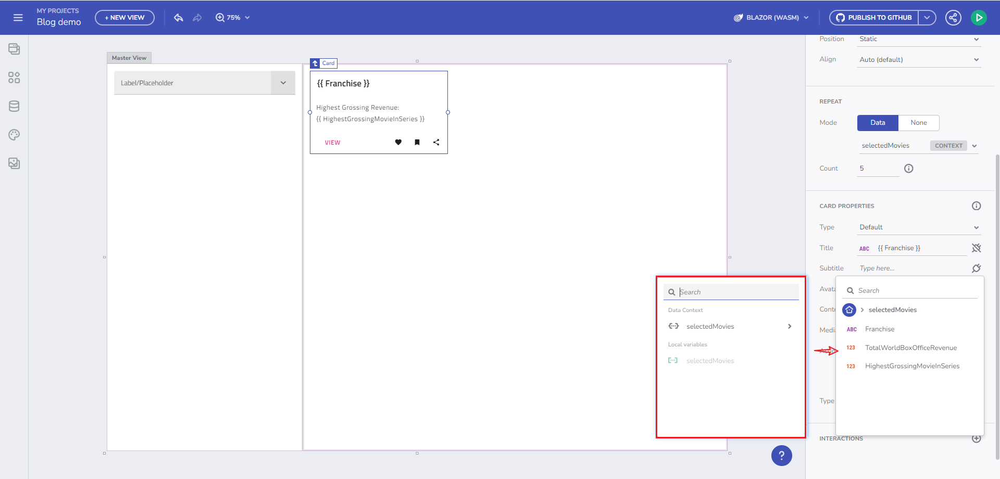

# Guide to Variables in App Builder

## Component Properties Binding in App Builder

Binding component properties to variables is a fundamental aspect of creating interactive and dynamic applications in the App Builder. This section delves into how you can bind properties of UI components to different types of variables, enhancing the interactivity of your applications.

### Overview of Properties Binding

In the App Builder, properties of components can be bound to variables, enabling dynamic updates and interactions within your application. This binding is essential for creating responsive UIs that react to user inputs or other changes in the application state.

### How to Bind Component Properties

- **Accessing Bindable Properties**: Each component in the App Builder has configurable properties that can be bound to variables. These properties are accessible through the component's configuration panel.
- **Binding Process**: The actual binding is facilitated through a plug icon shown next to each bindable property. This intuitive interface allows for a seamless binding experience.

### Expanded Binding Options

The App Builder has enhanced the binding capabilities, allowing for more flexibility and control:

#### Binding to Simple and Complex Data Types

- **Primitive Data Types**: You can bind properties to variables of primitive data types like String, Number, or Boolean.
- **Complex Data Types**: It's also possible to bind to more complex types like Objects or Arrays, enabling more sophisticated data structures to be represented in your UI.

#### Data Repeating Through a Variable of Type Array

- **Use Case Example**: Imagine you have a collection of data, like Movies, and you want to display details based on user selection. You can bind a component, like a Combo box, to an Array type variable representing the selected movies.
- **Binding Process**: After creating the variable, you can bind properties of UI components, like a Card, to different fields of this array. This allows for dynamic updates and displays based on the user's selection.

### Practical Example: Binding in a Master-Detail Interface

In a master-detail application, binding component properties to variables is crucial. For instance:

- **Master List**: In the master view, you might have a list of items where the selection is bound to a local variable.
- **Detail View**: The detail view can have components like text fields or images bound to the properties of the selected item, dynamically updating as different items are selected from the master list.

*Example of Data Context Binding in App Builder*

### Conclusion

Binding component properties to variables in the App Builder is a powerful feature that brings your UI to life. By leveraging this functionality, you can create applications that are not only interactive but also intuitive and responsive to user interactions. Understanding and utilizing this feature effectively can significantly enhance the user experience in your applications.
