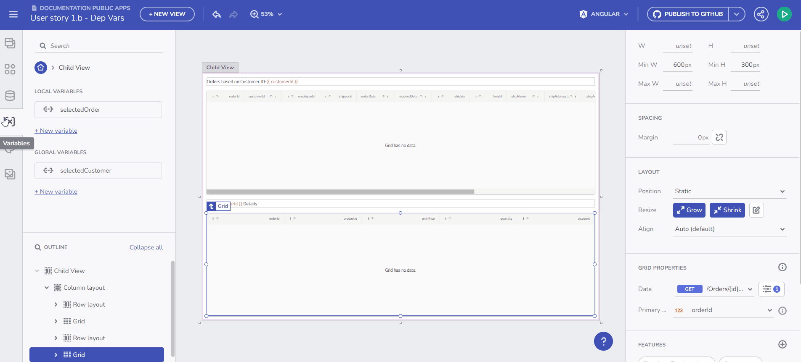
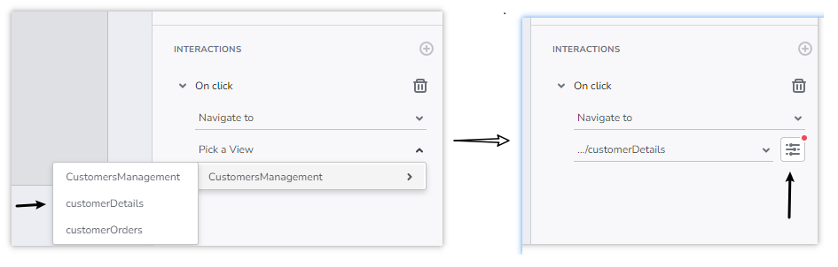

# Guide to Navigation with Route Parameters

As part of supporting the application state, using of variables in AppBuilder now facilitates the navigation within the application with a *special kind* of variables, i.e. `Route parameters`.

## Understanding Route Parameters

Route parameters function as variables, allowing users to create, store values, assign values, and bind them to other properties in the application. However, these route parameters have a specific primary use - enabling users to build navigation within the app (refer to Navigation). When a navigation route requires parameter binding, users can bind a route parameter to facilitate this process.

Key distinctions between variables and Route parameters:

Route parameters can only be created in a child view, where the child view may serve as the landing page for a specific navigation route.
Route parameters can only be of string, numeric, or boolean types. Support for other types will be introduced in future versions.
Route parameters support initial values, with boolean route parameters supporting only a FALSE initial value.
Route parameters are not target variables for a Set Variable action.

Variables Introduction

## Creating a Route parameter

Users can create a Route parameter in two ways:

Through the New Variable > Route param flow in the Variables section.
Using the + add button in the Route Params section, part of the Properties panel.
The parameter name undergoes the same validation as a variable.

Create Route parameter

## Route Parameter Usage

- If a child view has only one Route param, it is treated as a path parameter for application routing. This allows navigation to `/child-view/pathParameter` while passing a certain value for the pathParameter.

- When more than one route param is created for the view, these params are treated as query params in the navigation: `/child-view/pathParameter=value1&pathParameter2=value2`. If the only route param in a view is of type boolean, it is treated like a query param.

## Optional and required Route parameters

If a `Route param` has an initial value, it is treated as an optional parameter in navigation. Creating an optional Route param means your application will have two valid routes:

1. `/app/customerDetails/customerID`
2. `app/customerDetails`

In option 2, when a value for customerID param is not set, the handling of the `customerID` property may vary depending on your target framework. Angular and WebComponents frameworks will assign a value of `undefined` by default, but this value will be overridden by the initial value set for the property in AppBuilder.

## Navigate to a child page using Route parameter

1. Add a component on design surface (for example a button) and attach a `Navigate to` interaction to it, choosing a child view from the dropdown.

2. If the selected child view has Route parameters, the user will get an option to open a dialog, where the Route parameters can be provided with or bound to values:

Initialize data from and endpoint

## Additional Resources

* [Component properties binding](component-properties-binding.md)
* [URL parameters binding](url-parameters-binding.md)
* [Working with Events and Actions](working-with-events-and-actions.md)
* [Master-detail concept](../master-detail/master-detail.md)
* [Step-by-step App Creation examples](../master-detail/step-by-step-examples.md)
* [App Builder Components](../indigo-design-app-builder-components.md)