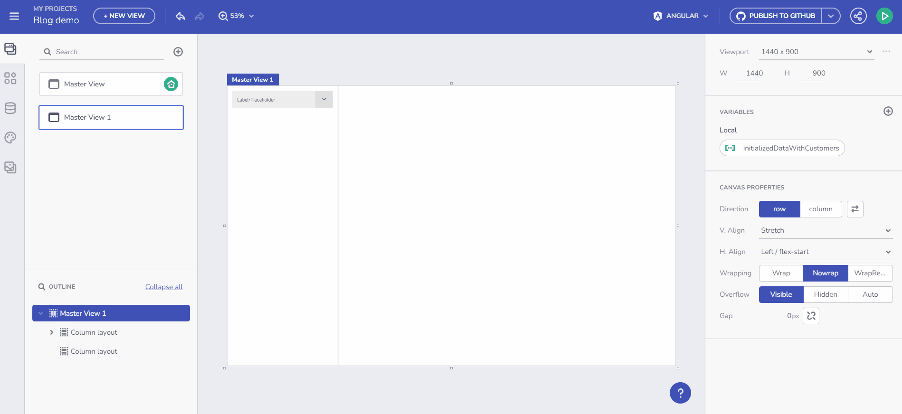

# Guide to Variables Management in App Builder

App Builder now offers a comprehensive and user-friendly approach to managing variables within your applications. This feature is essential for facilitating data transfer across components and views, thereby enriching the interactivity and dynamic capabilities of your applications.

## Understanding Variable Types

In the App Builder, variables are classified into two primary categories:

- **Global Variables**: Utilized for data transfer across different views in your application.
- **Local Variables**: Employed for data movement between components within the same view.

These variables can be of various data types, such as String, Number, Boolean, Date, Object, and Array. The App Builder's flexible design allows for easy definition of these variables, meeting the diverse requirements of your application.

For primitive types, you can set a Default value using a value editor. For Array and Object types, you can select an endpoint or Schema type from the fly-out menu, based on the data source schemas available in your app.

Managing Variables

## How to Create a Variable?

### Interactions Section
Manage your variables through the Interactions section, associated with the specific component event that will utilize the Variable.

For instance, if you add a Combo bound to the Financial -> Box Office Revenue table and add a Selection Changed event handler with a Set Variable Action, you can select the Variable field and use the “+ new variable” button.

Through component's event handler

Clicking this opens the New Variable dialog with the Data type pre-filled, based on the Combo Data source type (Box Office Revenue) and the Combo selection mode. The variable type is determined by the selection mode: Single-selection mode suggests a single object (Box Office Revenue), while multi-selection mode indicates an array of objects (Array of Box Office Revenues).

New Variable dialog

**This is considered the primary flow of Variable creation**, integral to the application lifecycle:

1. Start with a component.
2. Bind it to data.
3. Add an event.
4. Link it to a specific action (Set Variable action).
5. Create a variable to maintain the state.
6. Utilize this variable later within your app.

User flow video

### Variables Toolbox Section

Here, you can create and edit variables. A validation process assists with the naming. Set a variable type either by selecting from the predefined drop-down menu or through automatic initialization from an API request, which determines the Data Type based on the Schema data type of the selected endpoint.

Create Variable

Below, more details on utilizing Variables are provided.

## Initialize Data from an Endpoint 

Store data in a Variable and use it in the data context for any component. The Variable type is automatically determined based on the selected endpoint's Data Schema.

For example, to bind data from a /Customers endpoint request to a Combo component, create the Variable and select “Initialize with data from an API request”. This results in an Array of Customers.

Initialize data from and endpoint

## Set a Variable Value through Component Event Context or Data Context

This feature enables you to dynamically populate an empty variable with data. Begin by creating an empty variable of type Customers Array. Select the “array” item from the Data type dropdown in the Create/edit Variable dialog, then choose the data source, e.g., /Customers. Name the variable `selectedCustomers`. The gif below demonstrates creating this variable and filling it with data upon Combo value selection change. The final step in this scenario is to bind a Grid component to the `selectedCustomers` array.

Example with Event and Data contexts

A similar scenario is discussed in the next section, focusing on Binding to Components, with an emphasis on property binding rather than setting a Variable value.

## Takeaways

What we've learned so far while building an application with Variables?

- **Efficient Data Management**: App Builder's variable management system streamlines data flow within applications, enhancing efficiency and user experience.
- **Flexibility and Control**: The platform offers flexibility in variable types and initialization methods, allowing for precise control over data handling.
- **Intuitive User Interface**: With user-friendly dialogs and a structured process for variable creation and management, App Builder simplifies complex tasks.
- **Dynamic Data Binding**: The ability to initialize variables from endpoints and set variable values through event or data contexts enables dynamic and responsive applications.
- **Seamless Integration**: The integration of variable management with component events and data binding ensures a cohesive and intuitive development experience.

By mastering these aspects of variable management in App Builder, developers can create more dynamic, responsive, and data-driven web applications.

## Additional Resources

* [Component properties binding](component-properties-binding.md)
* [URL parameters binding](url-parameters-binding.md)
* [Working with Events and Actions](working-with-events-and-actions.md)
* [Master-detail concept](../master-detail/master-detail.md)
* [Step-by-step App Creation examples](../master-detail/step-by-step-examples.md)
* [App Builder Components](../indigo-design-app-builder-components.md)