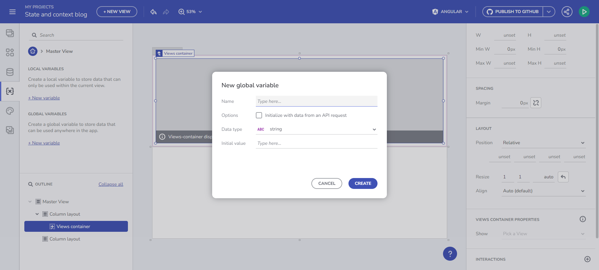

# Guide to Variables Management in App Builder

The App Builder introduces a robust and intuitive way to manage variables within your application. This functionality is crucial for passing data between components and views, enhancing the interactivity and dynamism of your applications.

## Understanding Variable Types

In App Builder, variables are categorized into two main types:

- **Global Variables**: These are used for passing data between different views in your application.
- **Local Variables**: These are utilized for transferring data between components within the same view.

Variables can be of various data types, including String, Number, Boolean, Date, Object, and Array. The App Builder provides flexibility in defining these variables, catering to the diverse needs of your application.

For any of the primitive types you can specify a Default value with a value editor, as for Array and Object, you can pick an endpoint or Schema type from the fly-out menu. We list those based on the available data source schemas in your app. 

Managing Variables

## How to create a Variable?

### Interactions section
You can now manage your variables through the Interactions section for the specific component event that will be using the Variable.

For example, if you add a Combo bound to the Financial -> Box Office Revenue table, and add a Selection Changed event handler, with Set Variable Action, you can pick the Variable field and use the “+ new variable” button.  

Through component's event handler

Clicking this will open the New Variable dialog with the Data type already pre-filled for you, based on the Combo Data source type (Box office revenue) and the Combo selection mode. Why? If Single-selection mode is specified, the variable is expected to use a single object (Box office revenue) and if multi-selection mode is used, it should use an array of objects (Array of Box office revenues), as it is in our case.  

New Variable dialog

**We consider this as the main flow of Variable creation** as it is part of the application lifecycle creation: 

1. You start with a component

2. Bind it to data

3. Add an event

4. Tight it to a certain action (Set Variable action)

5. Create a variable to preserve the state

6. And use this variable later on within your app. 

User flow video

### Variables Toolbox section

From there you can open a dialog to create and edit variables. There is a validation in place that will guide you through the naming process. There are two ways to set a variable type, whether by specifying it as a type from the predefined in the drop-down menu or through the automatic initialization from an API request (by selecting an endpoint). With that option, the Data Type will be automatically picked based on the Schema data type of the selected endpoint.  

Create Variable

In the section below you will find more details on how to make use of the Variables. 

### Initialize data from an endpoint 

You can now store data in a Variable and use it in the data context for any of the existing components. It also detects automatically what the Variable type is, based on the endpoint that you picked. We get that information from the Data Schema. 

Let's look at a concrete example. If I want to get the data from a /Customers endpoint request and later bind it to a Combo component, this can now be easily achieved. While creating the Variable click on the checkbox “Initialize with data from an API request”. This will result in getting an Array of Customers. 

Initialize data from and endpoint

### Set a variable value through Component Event context or Data context.  

This functionality allows you to dynamically fill an empty variable with data. Start by creating an empty variable of type Customers Array. You can do that by opening the Data type dropdown from the Create/edit Variable dialog and pick the “array” item and then the data source. In the example’s case that would be /Customers. Let us name the variable `selectedCustomers`. The gif below shows you how to create such a variable and start filling it with data upon Combo value selection changing. The last step of this scenario would be to bind a Grid component, for example, to the `selectedCustomers` array. 

Example with Event and Data contexts

A similar scenario is listed as part of the next Binding to Components section although the focus there would be properties binding rather than setting a Variable value. 

## Takeaways 