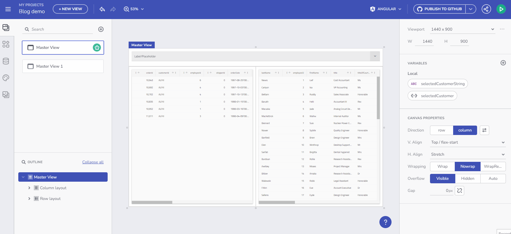

# Guide to Variables in App Builder

## Working with Events and Actions in App Builder

Integrating events and actions is a key aspect of creating interactive applications in the App Builder. This section explores how you can leverage events and actions to enhance the functionality and user experience of your applications.

### Overview of Events and Actions

Events in the App Builder are user interactions or other triggers that can initiate actions. Actions are the responses to these events, which often involve manipulating variables, updating UI components, or triggering data requests.

### Key Event Handlers in App Builder

- **Selection Changed Event**: Used primarily with components like Combo boxes or Grids, this event triggers when the user selection changes.
- **Row Selection Changed Event**: Specific to Grid components, it activates when the selection of a row in a grid changes.
- **Click Event**: A versatile event applicable to almost all components, triggered when the component is clicked.

### Setting Up Event Handlers

- **Configuring Events**: Events can be configured in the properties panel of each component. You can select the event type and define the action that should occur in response.
- **Binding Events to Variables**: Many actions involve setting or modifying variables. For instance, selecting an item in a Combo box can set a variable to the selected value.

### Practical Examples of Event-Driven Interactions

#### Example: Using Selection Changed Event in a Combo Component

- **Scenario**: In a Combo component bound to an array of customers, selecting a customer can trigger a 'Selection Changed' event.
- **Action**: This event can be set to update a variable, which in turn updates other components in the UI, like a detail view or a grid.

#### Example: Grid Row Selection

- **Scenario**: In an application with a Grid component, selecting a row can trigger a 'Row Selection Changed' event.
- **Action**: This can be used to display detailed information about the selected row in another part of the application, like a detailed information card or a modal.

### Advanced Event Handling

- **OnClick Event Handling**: Every component in the App Builder can be configured to respond to OnClick events. This can be particularly useful for creating interactive lists, where clicking an item can trigger various actions like opening a detail view or modifying a variable.
- **Dynamic Variable Manipulation**: Events can dynamically manipulate variables, which is essential for maintaining the state and context of the application.

### Example: Dynamic Interaction in a Master-Detail Interface

In a master-detail application:

- **Master List Interaction**: Selecting an item in the master list (e.g., a Combo box or a Grid) triggers an event that updates a variable representing the selected item.
- **Detail View Update**: The detail view listens to changes in this variable and updates its content accordingly, providing a dynamic and responsive user experience.

*Example of Event Handling in App Builder*

### Conclusion

Understanding and effectively utilizing events and actions in the App Builder is crucial for creating interactive and responsive applications. By harnessing these features, you can build applications that not only react to user inputs but also provide a seamless and engaging user experience.
