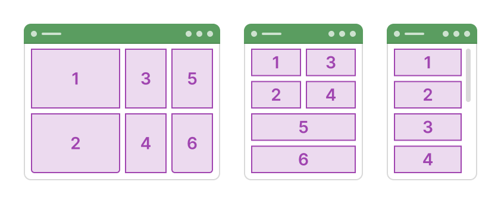
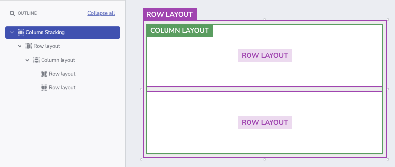
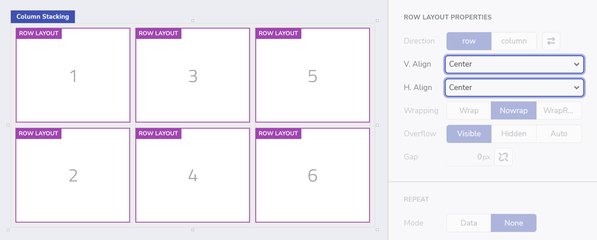
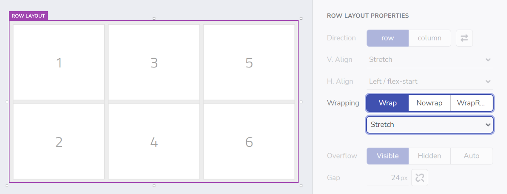
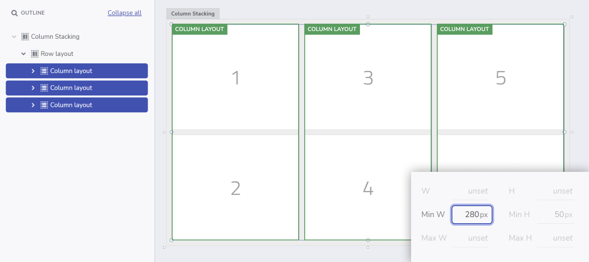
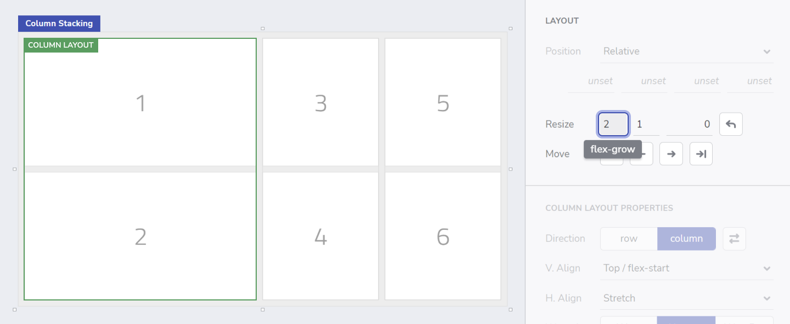
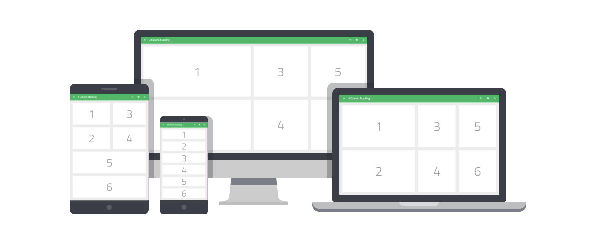

# Responsive fluid layouts
Fluid layouts are always a challenge to create. In this mini tutorial you will see how to quickly create a 3-column layout and then make it behave **responsive** when the screen size changes.

This tutorial will show you how to use the Layout properties in App Builder to achieve this dynamic stacking effect. 
 

## **Step 1:** Create the base layout

- Create a **New app** using a **Blank** template. 
- From the Components Toolbox, add a **Row layout** to the canvas and enable `Resize: Grow`.  
- Set **Appearance** for the **Row layout**:
  - `Padding: 24px`
  - `Gap: 24px`
  - `Bg.Fill: Gray-200`
- Inside the **Row layout**, add a **column layout**, enable `Resize: Grow`, and set`Gap: 24px`. 
- Inside the column, add two **row layouts**, and set both to `Resize:Grow`and `Bg. Fill: White`.
 

>**Pro-Tip:** Remember that you can always add a new component to the canvas by using `Ctrl + E` / `Cmd + E`, which will speed up your app creation process!
 

 

## **Step 2:** Create the 3-column structure

- Copy the **column layout** containing the child rows, and paste twice to create a **3-column layout**.
- To help identify each **row layout** easily:
  - Add inside each one a **Title** component and give them a number, in the same order as the picture shown below. 
  - Select all 6 **row layouts** with multiple-selection (shift + click) and change the alignment by setting `V.Align: center` and `H.Align: center`.
 

 

## **Step 3:** Preparing for stacking

- Select the parent **row layout** that contains those 3 **column layouts** and set `Wrapping: wrap`. 
- In the dropdown below, change the content alignment to `stretch`.
 

 

## **Step 4:** Make it stack!

In order for the stacking to happen, the three **Column layouts** inside that **Row layout** need to have minimum widths set. When previewing the app, as the Browser width is reduced, each column will shrink till they reach that min-width. When this happens, the child layouts will **stack** as a result of setting `Wrapping: wrap`.

- To achieve this, select the three columns and set `Min. W: 280px` for each.
- **Preview** your application to see how the columns stack vertically when you resize the browser. 
- You can also use the Breakpoint selector to switch to smaller devices.
- Click on **Edit** to continue editing your app.
 

 

## **Step 5:** Let’s take this one step further!

Finally, I would also like the first column to be wider than the other two. So what I need to do is change its Resize settings. 

- Select the first column and on the layout properties, click on the `edit` button next to `Grow` and `Shrink`, and set the `flex-grow:2`. 

This will make the first column to take twice as much available space (horizontally) than the other 2.
 

 

## And we're done!

Here's the end result of our application in 3 different screen sizes.
You can also check out the [live app here](https://my.appbuilder.dev//app/ihyry6j7gpq5/preview)

* [App Builder Components](../indigo-design-app-builder-components.md)
* [Flexbox](https://developer.mozilla.org/en-US/docs/Learn/CSS/CSS_layout/Flexbox)
* [A Guide to flexbox](<https://css-tricks.com/snippets/css/a-guide-to-flexbox/)
* [Flexbox Froggy](https://flexboxfroggy.com/)
* [Indigo.Design Getting Started](https://www.infragistics.com/products/indigo-design/help/getting-started)
* [Indigo.Design Styling Overview](https://www.infragistics.com/products/indigo-design/help/style/styling-overview)