# Master-detail style apps with variables & events 

Initially, this feature was planned to follow the basics of the Master-detail design interface. But it evolved into something much more. We are all familiar with the essence of the Master-detail pattern, it is a way to present a list of records and enable the user to manage them with ease. It usually comprises two views - One is the master list of records and the other is used to display extended data about a single record. 


<p style="text-align:center;">Master-detail example</p>

The new feature covers these key elements established by the Master-detail pattern:  

- Primary pane: As explained earlier, an area that contains a list of items or anything that can initiate loading of other parts of the app. 
- Details pane: This area shows the details of the item you select in the Primary pane area. It can consist of a variety of components that interact with each other aiming to show as much information as possible based on the data you have provided.  
- Interactions: This is about the interactions between the items in the master and their details. For example, if you select an item in the master, the details could be displayed in the pane next to the Master pane, or in a pop-up, or you could drill down more pages. You could broadly classify the interactions into context, drill-downs, and pop-ups.  

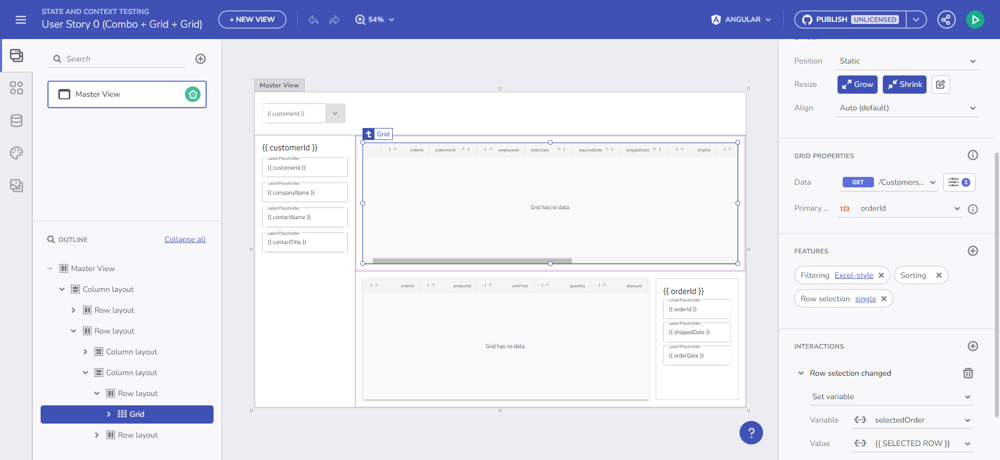
<p style="text-align:center;">Master-detail AB Preview</p>

**Let's dive into more details about each of these features.**

## Managing Variables  

Simply put, you can now pass data between components in your application through: 

- Global variables – used to pass data between views.  
- Local variables – used to pass data between components of the same View.  

Variables can be of type String, Number, Boolean, Date, Object, and Array. 

For any of the primitive types you can specify a Default value with a value editor, as for Array and Object, you can pick an endpoint or Schema type from the fly-out menu. We list those based on the available data source schemas in your app. 

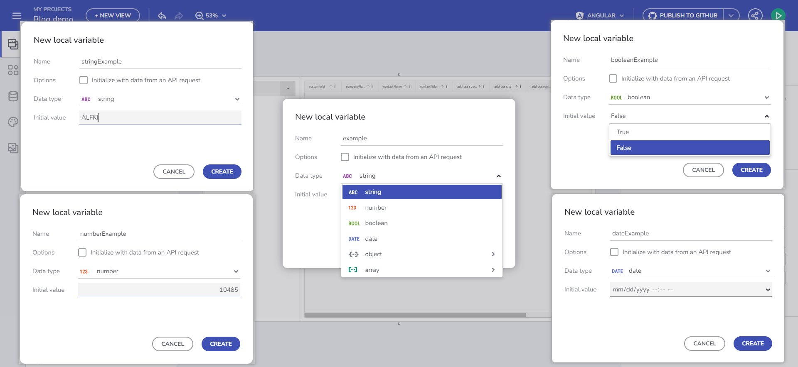
<p style="text-align:center;">Managing Variables</p>

How to:
- Create a Variable - through the Interactions section of the components or the Variables section in the Views properties panel. 
- Delete a variable – you can delete a variable if you click on it (in the Variables section) or by right-clicking on it and choosing delete from the context menu. 
- Editing a variable – simply click on the Variable and start modifying it, the same context menu is available here as well upon right-clicking on the chip. 

**There are two ways to start working with variables:** 

### Interactions section
You can now manage your variables through the Interactions section for the specific component event that will be using the Variable.

For example, if you add a Combo bound to the Financial -> Box Office Revenue table, and add a Selection Changed event handler, with Set Variable Action, you can pick the Variable field and use the “+ new variable” button.  

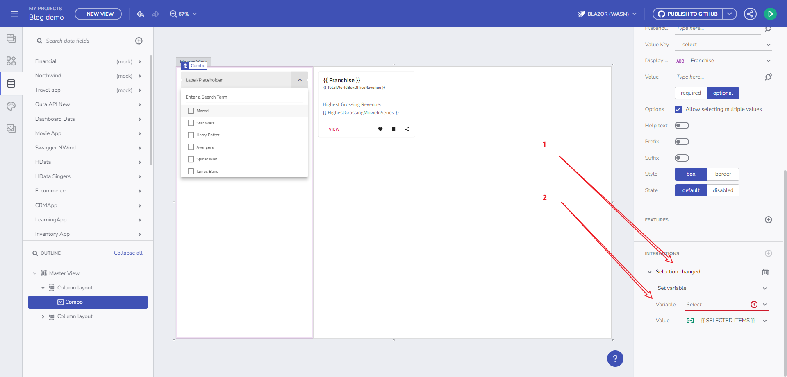
<p style="text-align:center;">Through component's event handler</p>


Clicking this will open the New Variable dialog with the Data type already pre-filled for you, based on the Combo Data source type (Box office revenue) and the Combo selection mode. Why? If Single-selection mode is specified, the variable is expected to use a single object (Box office revenue) and if multi-selection mode is used, it should use an array of objects (Array of Box office revenues), as it is in our case.  

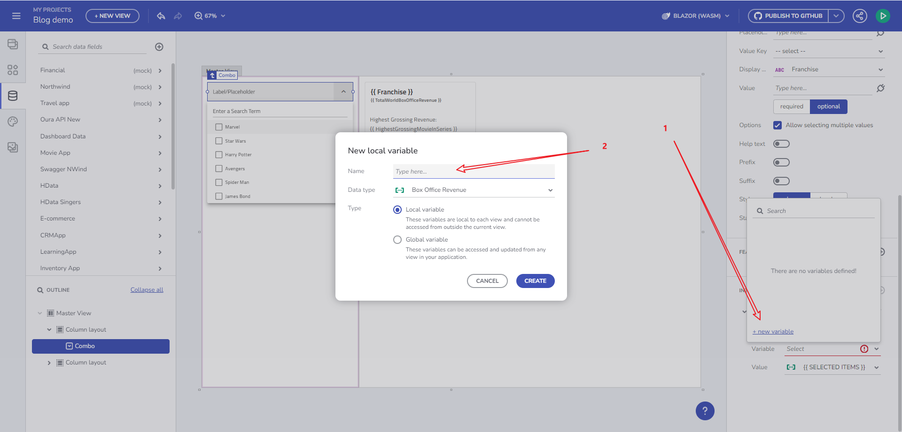
<p style="text-align:center;">New Variable dialog</p>

We consider this as the main flow of Variable creation as it is part of the application lifecycle creation: 

.. you start with a component

.. bind it to data

.. add an event

.. tight it to a certain action (Set Variable action)

.. create a variable to preserve the state

.. and use this variable later on within your app. 

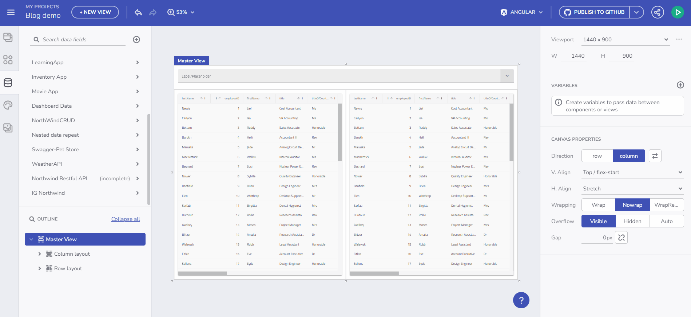
<p style="text-align:center;">User flow video</p>

### Create a variable through the Variables section. 

From there you can open a dialog to create and edit variables. There is a validation in place that will guide you through the naming process. There are two ways to set a variable type, whether by specifying it as a type from the predefined in the drop-down menu or through the automatic initialization from an API request (by selecting an endpoint). With that option, the Data Type will be automatically picked based on the Schema data type of the selected endpoint.  

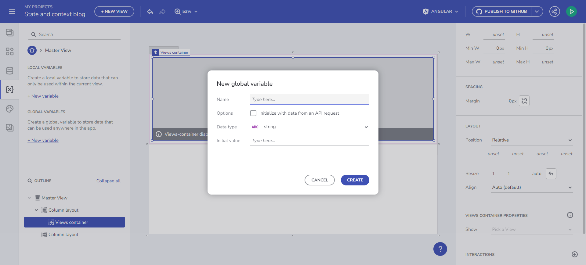
<p style="text-align:center;">Create Variable</p>

In the section below you will find more details on how to make use of the Variables. 

### Initialize data from an endpoint 

You can now store data in a Variable and use it in the data context for any of the existing components. It also detects automatically what the Variable type is, based on the endpoint that you picked. We get that information from the Data Schema. 

Let's look at a concrete example. If I want to get the data from a /Customers endpoint request and later bind it to a Combo component, this can now be easily achieved. While creating the Variable click on the checkbox “Initialize with data from an API request”. This will result in getting an Array of Customers. 

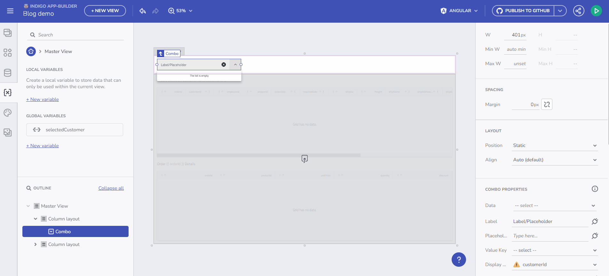
<p style="text-align:center;">Initialize data from and endpoint</p>

### Set a variable value through Component Event context or Data context.  

This functionality allows you to dynamically fill an empty variable with data. Start by creating an empty variable of type Customers Array. You can do that by opening the Data type dropdown from the Create/edit Variable dialog and pick the “array” item and then the data source. In the example’s case that would be /Customers. Let us name the variable `selectedCustomers`. The gif below shows you how to create such a variable and start filling it with data upon Combo value selection changing. The last step of this scenario would be to bind a Grid component, for example, to the `selectedCustomers` array. 

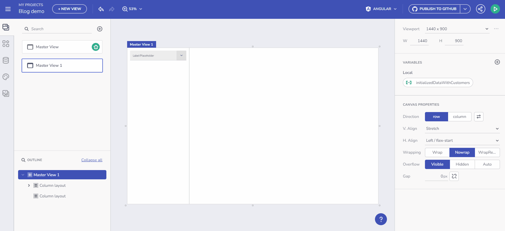
<p style="text-align:center;">Example with Event and Data contexts</p>

A similar scenario is listed as part of the next Binding to Components section although the focus there would be properties binding rather than setting a Variable value. 

## Expanded binding options 

When I talk about binding to components, I mean binding to the actual properties of the component configuration. The actual binding happens through a plug icon shown in each bindable component property. Let us look at the following example. Previously, to set a Title and Subtitle of a Card component, you had to iterate through an array of data and only then a data context will appear as a binding option which will allow you to set a specific data field. Now, the variables provide a context that enables any component to bind to it, not only to a data-repeated context, hence, you can create any type of variable and bind it to a simple Card without a data repeater.  

### Data repeating through a variable of type array 

Imagine that I have a collection of Movies and I want to show a list of details about the highest-grossing Box Office Movies based on a multiple selection that I perform. How can I do that?  

- Bind the Movies collection to a component with multiple selection capabilities (Combo) and follow the flow that we covered above, of adding an event handler and Set Variable action. 


<p style="text-align:center;">Array type variable</p>

- Create an empty Array variable of type Box Office Revenue. The Data Type will be pre-filled for me, based on the Data Source provided for the Combo component. 

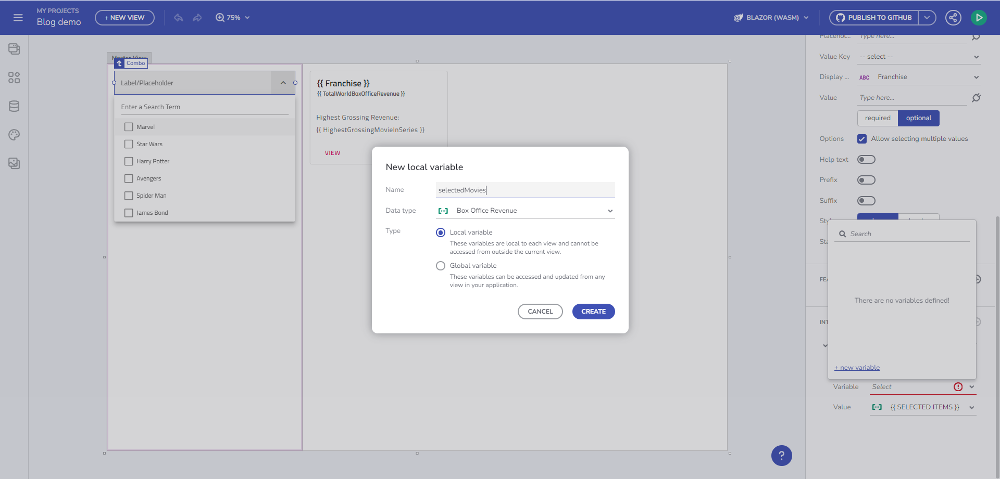
<p style="text-align:center;">New Variable dialog</p>

- Add a card component and bind it to the newly created variable "selectedMovies". Bind Title and Subtitle properties to data fields from the Data Context: 

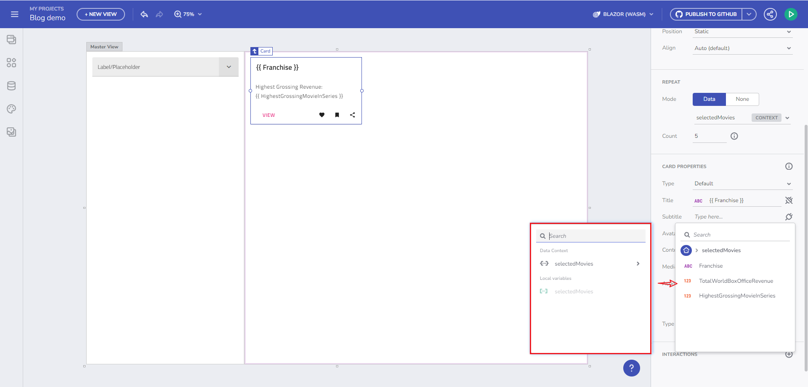
<p style="text-align:center;">Data context binding</p>

Here is the result of our changes: 

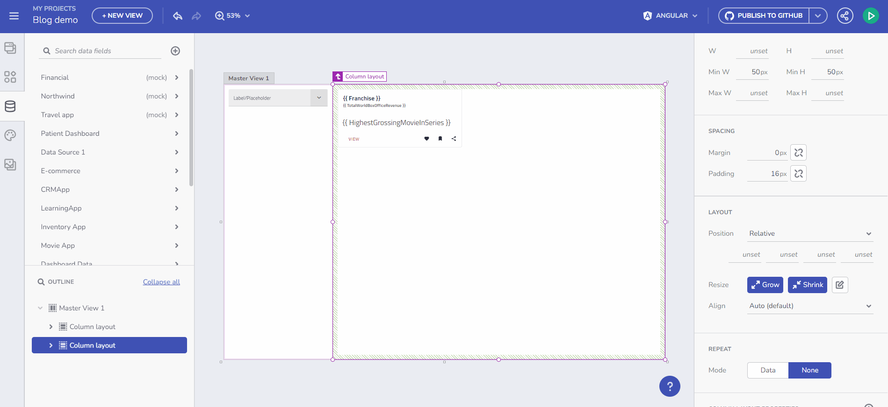
<p style="text-align:center;">Result</p>

### Cross-view communication with Global variables. 

So here is what we know: 

- Global variables are used to pass data between views.  
- Local variables are used to pass data between components of the same View.  

This means that you can use Global variables across different Master and Child views. If you create a global variable in one view it will be visible in all other views as well. 

## URL parameters binding for data requests and repeaters 

### Data Requests 

If you specify the data endpoint that expects path/query parameters, now you can specify them and once present a data request will be made fetching the data based on the provided parameter. Example with Grid bound to Customers Orders, based on “CustomerID” path parameter 

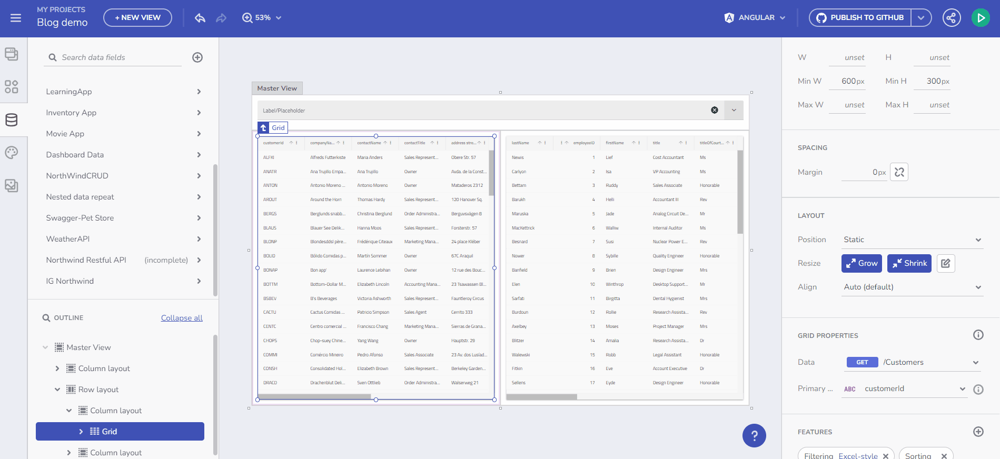
<p style="text-align:center;">Data requests</p>

### Data repeaters 

Another example would be repeating a Tree node component through Orders collection fetched based on selected Customer ID. Observe the difference, now we bind it to a Data repeat context. 

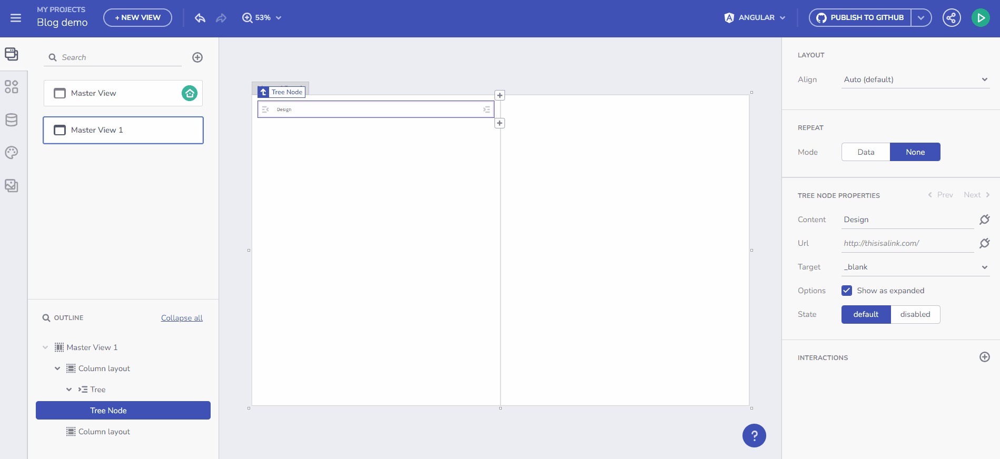
<p style="text-align:center;">Data repeaters</p>

## Working with events 

Currently, we expose component event handlers that can be used in the context of Variable management, such events are the: 

- Selection changed event - for the Combo component 
- Row selection changed event - for the Grid component.   
- Click event - Data context for Set Variable with Click event (all existing components in the toolbox). 

Grid and Combo components expose a way to set Selection modes, we dynamically change the Variable type based on the selection mode. 

Let us take an example, a Combo component bound to an Array of Customers with a Single selection mode will pass a Customer Object through the Event context for the selected Item. 

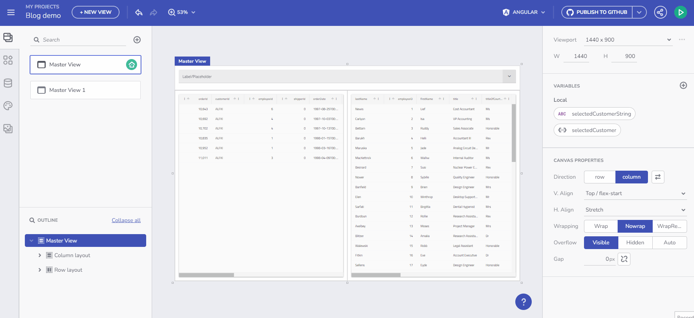
<p style="text-align:center;">Working with events</p>

Every component part of the App Builder has an OnClick event handler that can be used in the context of a Variable. In the case of the Select item, if there is repeated data bound to it, you can access the Data Context for a particular item through the On Click -> Set variable action and use it to modify a Variable value. Example with a tree below:  


<p style="text-align:center;">On click example</p>

A note for Combo usage with `valueKey` set. The way combo works is to pass a primitive value on the Selection changed event, if for example a CustomerID is set, it will pass a Number, if CustomerName is set it will pass a string. 

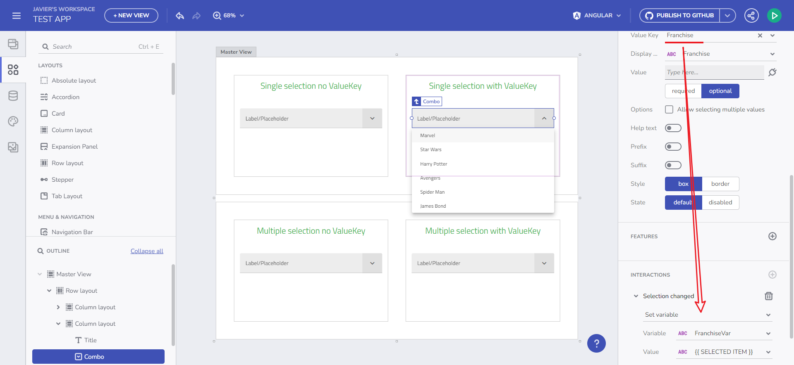
<p style="text-align:center;">Combo Value key note</p>

## Known issues and limitations

- Non-swagger URL/Query Params support - For the time being you won't be able to load data from query/path params:
```
GET   /posts/1/comments
GET   /comments?postId=1
```
- Using variables in Grid templating for Blazor and WC is currently not supported.
- Binding a component to repeated data of one object is not supported upon code generation.
- Combo component specifics:
   - Combo with multi-selection mode and specified `valueKey` property will require a Variable to handle an array of primitives, although this is currently not supported in App Builder nor the code generation. Upon Combo multi-selection the `SelectionChanged` event will receive an array of the `valueKey` type.
- Binding a component to an Array of primitives is currently not supported.
- Leaving a required parameter empty is allowed by the AppBuilder - Code generation will be possible by setting a default value. This will result in an Error state and you will be notified with a warning, although this won't stop you from generating the code for the app and may result in compilation errors.


## Additional Resources

<div class="divider--half"></div>

* [Step-by-step App Creation examples](step-by-step-examples.md)
* [App Builder Components](../indigo-design-app-builder-components.md)
* [Flex Layouts](../flex-layouts/flex-layouts.md)
* [Running Desktop App](../running-desktop-app.md)