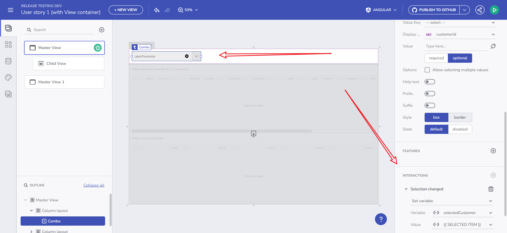
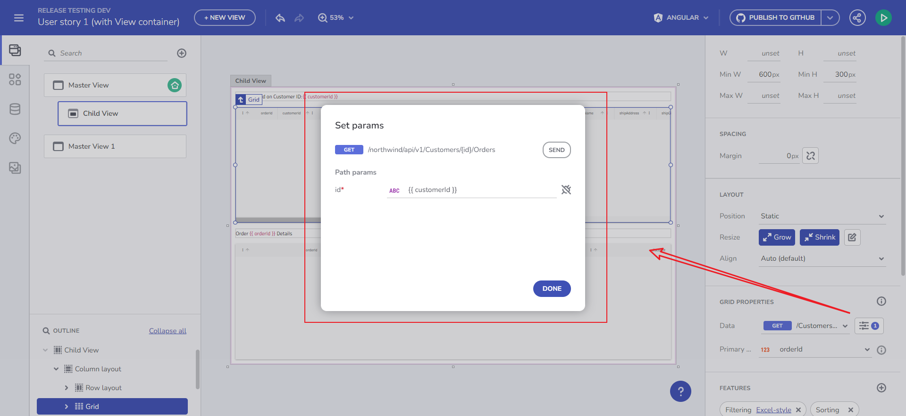
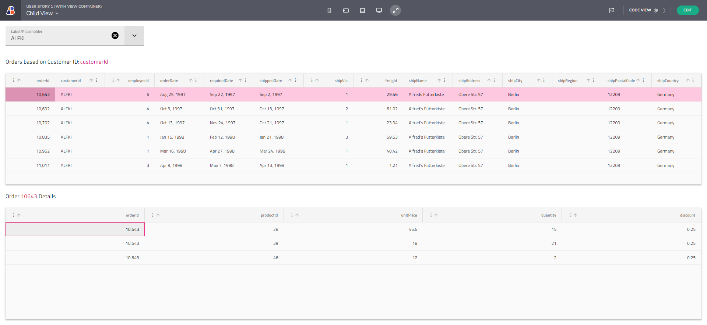
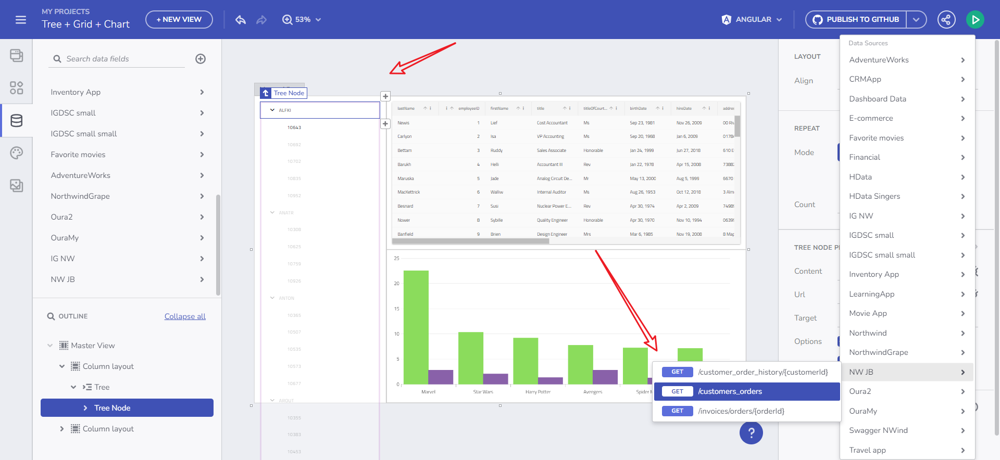
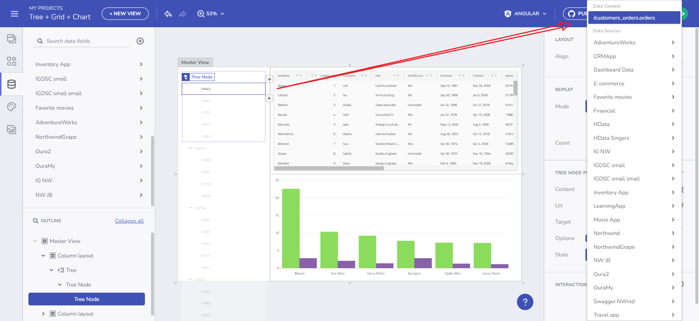
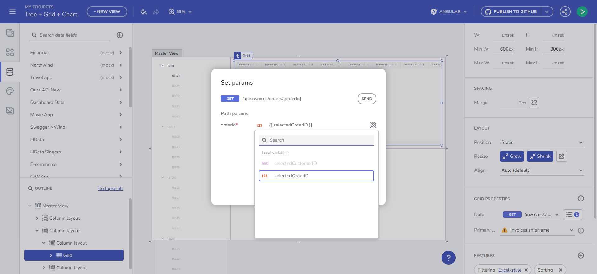
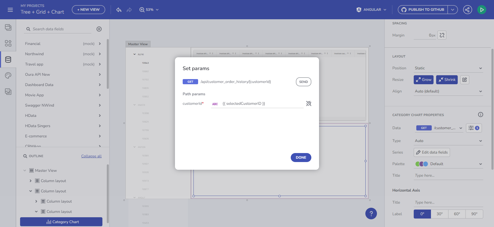
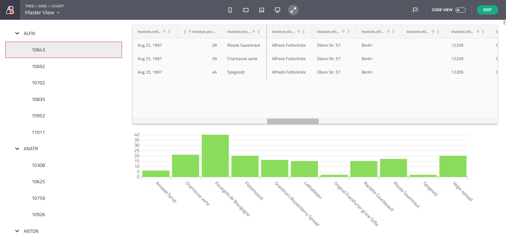

# Step-by-step App Creation Examples

Below you can find real use cases for two scenarios. These scenarios will cover everything that we’ve talked about in the main [State and context management feature set topic](master-detail.md).

## Example 1

**Global variable set from one View and Updating Grid request from another View through a Views container**

1. Add a Global variable which is set upon the Combo selection change event. The combo is bound to the Customer endpoint 
2. Pick a CustomerID from the Combo 
3. Go to the other view, where the Grid is bound to an API request fetching orders based on that CustomerID 
4. The Grid should be updated with the selected CustomerID (from the Combo) 

Selection Changed event

CustomerID Variable

5. Upon clicking on Order from the Orders grid, load another Grid with OrderDetails 
6. Result 

Result

  
## Example 2

**Tree bound to Hierarchical data source loading data for Grid and Chart** 

1. Add a Tree component and bind its parent to a Hierarchical data source (Repeated data context). 
2. Bind the parent tree node On Click event to a Set variable action that stores the CustomerID - String variable 

Tree node binding

3. Add a Tree child node and repeat to the Parent data context. Bind the child tree node On Click event to a Set variable action that stores the OrderID - Number variable 

Child node binding

4. Ensure the root tree element shows the Customer and the child tree node shows the Orders 
5. Bind a Grid to an endpoint that fetches Orders based on the OrderID variable as a query param 

Bind Grid to Orders data

6. Bind the Chart to an endpoint that fetches Customer orders history based on the CustomerID variable as a query param 

Bind Chart to Customer Orders History table

7. Result 

Tree + Grid + Chart Result

