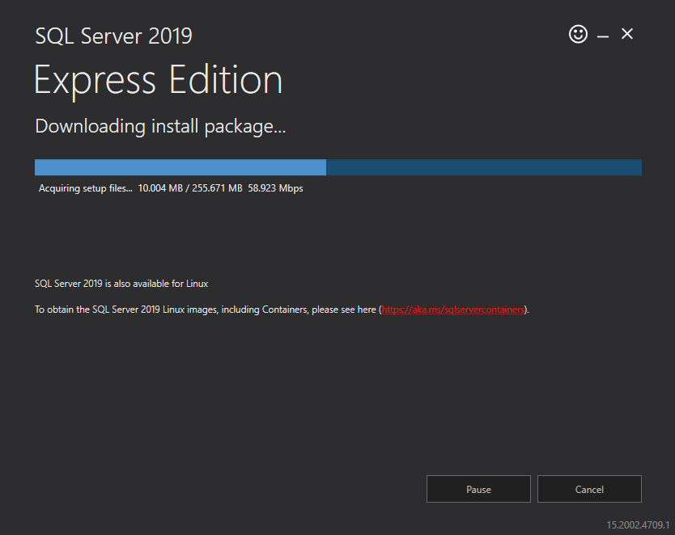
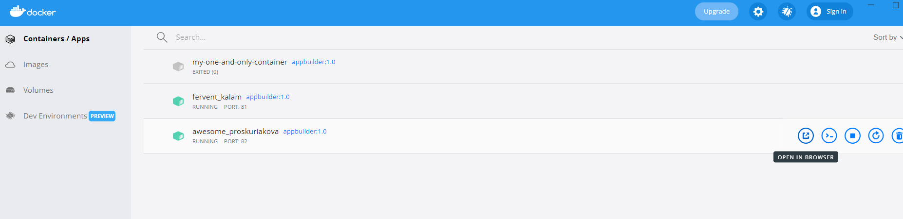

# App Builder On-premises Prerequisites and Installation

## Prerequisites

This topic lists the prerequisites to install the On-Prem version of App Builder and is intended for System Administrators who configure operational parameters that maintain and support Linux/Mac OS/Windows.

### Database Management
Based on your requirements you can decide to use either MySQL or MSSQL Server database management systems.

#### MySQL Installation

1 - Install [MySQL community edition](https://dev.mysql.com/doc/refman/8.0/en/installing.html) ([direct link for windows](https://dev.mysql.com/downloads/installer/))

   - Select:
      * Developer default, Next and Execute. 

        > Note: if you get a prompt saying "one or more products requirements have not been satisfied. Do you want to continue?" Just select Yes)
   - After installation ends:
     * Select next to configure the server, when prompted enter the root password you wish, then Execute.  
     * After the server configuration ends, select Cancel to exit the installer since the rest of the configuration is not needed.

2 - Allow container connection to MySQL.

Connect to MySQL with root user and password of step 1 and execute the following sql script (username and pasword will be the ones used from AppBuilder). 
> Note: you can use [MySQL Workbench tool](https://dev.mysql.com/downloads/workbench/) to execute sql scripts. 

```
CREATE USER 'username'@'%' IDENTIFIED BY 'password';
GRANT ALL PRIVILEGES ON *.* TO 'username'@'%' WITH GRANT OPTION;
```

#### MSSQL Server Installation

1 - Install [Sql Server](https://www.microsoft.com/en-us/sql-server/sql-server-downloads) ([direct link](https://go.microsoft.com/fwlink/?linkid=866658))


<p style="margin-top:-20px;width: 56%; text-align:center;">On-Premises Sql Express Installation</p>

> Note: An On-prem server should have a real Sql Server not an embedded Sql Server Express of VS

2 - Enable tcp/ip - detailed explanation [here](https://docs.microsoft.com/en-us/sql/database-engine/configure-windows/enable-or-disable-a-server-network-protocol?view=sql-server-ver15#to-enable-a-server-network-protocol).


<p style="margin-top:-20px;width:56%; text-align:center;">SqlServer Config Manager</p>

3 - Add a new App_Builder user part of Sql Express. You can [install Sql Server Management Studio](https://docs.microsoft.com/en-us/sql/ssms/download-sql-server-management-studio-ssms?view=sql-server-ver15) and use it for that purpose.


<p style="margin-top:-20px;width: 57%; text-align:center;">Login Parameters Dialog</p>


> Note: Create database permissions might be denied for the newly added user. You should consider giving them a Server Roles that will give them credentials to create database like `dbcreator`.

> Note: Based on administrator decision a change of [authentication mode with SSMS](https://learn.microsoft.com/en-us/sql/database-engine/configure-windows/change-server-authentication-mode?view=sql-server-ver16#change-authentication-mode-with-ssms) might be required. SQL Server Database Engine is set to either Windows Authentication mode or SQL Server and Windows Authentication mode.

### Install Docker

Windows guide -> [docs.microsoft.com guide](https://docs.microsoft.com/en-us/virtualization/windowscontainers/quick-start/set-up-environment?tabs=Windows-10-and-11#tabpanel_1_Windows-10-and-11)

## Installation
This section assumes that you already have docker and an MySQL database installed.

### First time installation

1 - Download the appbuilder.zip part of your Download section under the Infragistics Customer Portal.<br/>
2 - Extract the appbuilder.tar contained in the appbuilder.zip file. <br/>
3 - Open a terminal or command prompt window at the extracted location.<br/>
4 - Load and verify the image.<br/>

Run:

```
docker load --input appbuilder.tar
```

In order to verify that the _image_ is correctly loaded, see the example with the table below:

```
docker images
```

| REPOSITORY    | TAG               | IMAGE ID          | CREATED                                   |SIZE   |
| --------:     | ----------------  | ----------------- | ---------------------------------------   |-----  |
| appbuilder    | 1.0               | 2a05977e039b      |12 days ago                                |854MB  |

5 - Run the container:

```
docker run --restart always -p 80:5000 -e "ConnectionStrings:AppBuilderMySqlConnection=server=<your-mysql-database-ip>;database=<your-mysql-schema>;user=<your-mysql-database-user>;password=<your-mysql-database-password>;oldguids=false" -v <external-folder-for-logs>:/appbuilder/logs -v <external-folder-for-storage>:/appbuilder/storage --name appbuilder appbuilder:1.0
```

- **MySQL example** - This would be the command assuming your MySql instance is running a schema named IndigoAppBuilderOnPrem on 192.168.2.5 with username=appbuilder and password=appbuilder and that you have selected C:/AppBuilder as the external folder to store the logs and storage. 

```
docker run --restart always -p 80:5000 -e "ConnectionStrings:AppBuilderMySqlConnection=server=192.168.2.5;database=IndigoAppBuilderOnPrem;user=appbuilder;password=appbuilder;oldguids=false" -v C:/AppBuilder/logs:/appbuilder/logs -v C:/AppBuilder/storage:/appbuilder/storage --name appbuilder appbuilder:1.0
```

- **MSSQL Server example** - This would be the command assuming your Sql Server instance is running a schema named IndigoAppBuilderOnPrem with SQLEXPRESS server, with USER ID=APP_BUILDER and password=Appbuilder2023! and that you have selected C:/AppBuilder as the external folder to store the logs and storage.

```
docker run --restart always -p 80:5000 -e "ConnectionStrings:Provider=SqlServer" -e "ConnectionStrings:AppBuilderSqlServerConnection=Data Source=DEV-ZKOLEV\SQLEXPRESS,1433;Database=IndigoAppBuilderOnPrem;User ID=APP_BUILDER;Password=Appbuilder2023!;Connect Timeout=15;Encrypt=False;TrustServerCertificate=False;ApplicationIntent=ReadWrite;MultiSubnetFailover=False" -v C:/AppBuilder/logs:/appbuilder/logs -v C:/AppBuilder/storage:/appbuilder/storage --name appbuilder appbuilder:1.0
```

6 - Open your browser and type `http://localhost/`

> Note: If you are using Docker Desktop, go to Containers/Apps, find your container and click `Open in browser` 


<p style="margin-top:-20px;text-align:center;">Docker Containers/Apps</p>

### Updates

1 - Follow the first 4 steps of the first time installation with the newly published zip file

2 - Verify that the new image has loaded correctly (the old image should be tagged as <none>)

```
docker images
```


| REPOSITORY        | TAG       | IMAGE ID          | CREATED       |SIZE   |
| --------:         | --------- | ----------------- | ------------- |-----  |
| appbuilder        | 1.0       | 27ff4c1079ac      | 43 hours ago  |932MB  |
| <none>            | <none>    | 2a05977e039b      | 12 days ago   |854MB  |
        
3 - Stop the container

```
docker stop appbuilder
```

4 - Remove the container

```
docker rm appbuilder
```

5 - Run the container with the same command as the one used in step 5. of the first time installation


## Activation
This section assumes that you already installed the On-Prem instance and it is now up and running.

When the server is first started, a prompt dialog will provide you with _Installation ID_ and a _Authentication key_ will be requested. Send this _Installation ID_ to our [Sales department](https://www.infragistics.com/about-us/contact-us#sales) based on your region and we will provide you with _Authentication key_ to activate the server.


<p style="margin-top:-20px;width:36%;text-align:center;">Activate App Builder</p>

> Note: You will receive a warning message directly through the UI thirty days before your key expires.

## Troubleshooting
### Docker Desktop on Windows
[Docker Desktop on Windows is not starting automatically without Login to Windows machine](https://github.com/docker/for-win/issues/6670) - Docker team doesn't recommend Docker Desktop for production workloads. You should use Docker on a Linux box or Docker for Windows Server if you want Windows containers.

## Additional Resources
<div class="divider--half"></div>

* [App Builder Interface Overview](interface-overview.md)
* [Single Page And Navigation](single-page-apps-and-navigation.md)
* [App Builder Components](indigo-design-app-builder-components.md)
* [Flex Layouts](flex-layouts/flex-layouts.md)
* [Running Desktop App](running-desktop-app.md)
* [Generate app](generate-app/generate-app-overview.md)
* [Indigo.Design Getting Started](https://www.infragistics.com/products/indigo-design/help/getting-started)

