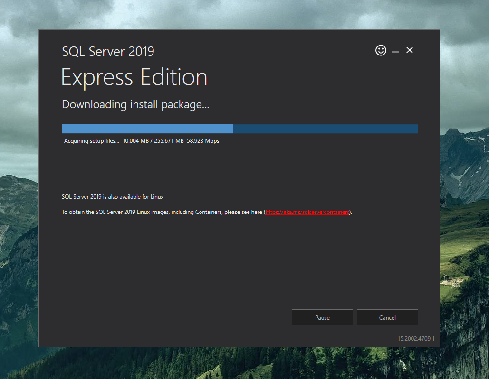
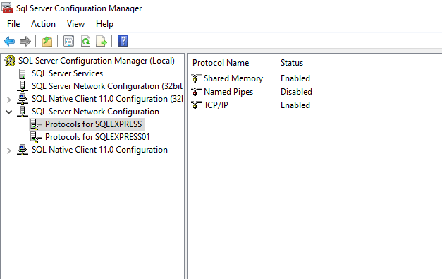
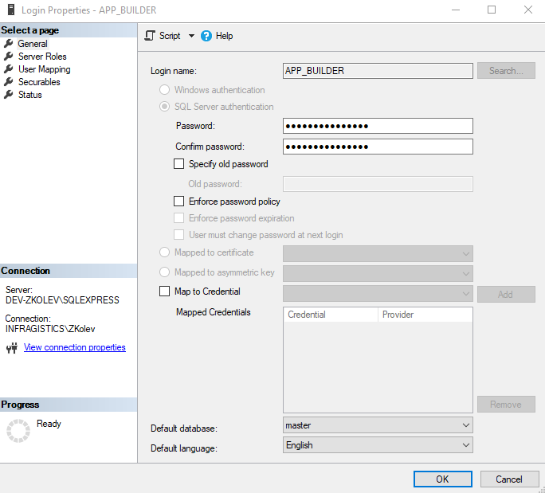
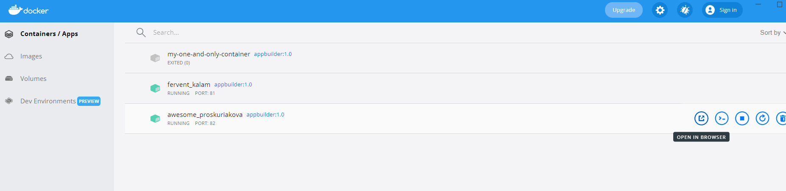

# App Builder On-premise Prerequisites and Installation

## On-premise Prerequisites

This section lists the prerequisites to install the On-Prem version of AppBuilder and is intended for System Administrators who configure operational parameters that maintains and supports Linux/Mac OS/Windows.

### Install SQL Server

1. Install [Sql Server](https://www.microsoft.com/en-us/sql-server/sql-server-downloads) ([direct link](https://go.microsoft.com/fwlink/?linkid=866658))


<p style="text-align:center;">On-Premise Sql Express Installation</p>

> Note: An On-prem server should have a real Sql Server not an embedded Sql Server Express of VS

2. Enable tcp/ip - detailed explanation [here](https://docs.microsoft.com/en-us/sql/database-engine/configure-windows/enable-or-disable-a-server-network-protocol?view=sql-server-ver15#to-enable-a-server-network-protocol).


<p style="text-align:center;">SqlServer Config Manager</p>

3. Add a new App_Builder user part of Sql Express. You can [install Sql Server Management Studio](https://docs.microsoft.com/en-us/sql/ssms/download-sql-server-management-studio-ssms?view=sql-server-ver15) and use it for that purpose.


<p style="text-align:center;">Login Parameters Dialog</p>

### Install Docker

Windows guide -> [docs.microsoft.com guide](https://docs.microsoft.com/en-us/virtualization/windowscontainers/quick-start/set-up-environment?tabs=Windows-10-and-11#tabpanel_1_Windows-10-and-11)

## On-premise Installation
This section assumes that you already have docker and a sql server database installed.

### First time installation

1. Download the appbuilder.zip file located here (public URL)
2. Extract the appbuilder.tar contained in the appbuilder.zip file. 
3. Open a terminal or command prompt window at the extracted location.
4. Load and verify the image.

Run:

```
docker load --input appbuilder.tar
```

In order to verify that the image is correctly loaded, example with the table below

```
docker images
```

| REPOSITORY| TAG               | IMAGE ID          | CREATED                                   |SIZE   |
| --------:     | ----------------  | ----------------- | ---------------------------------------   |-----  |
| appbuilder    | 1.0               | 2a05977e039b      |12 days ago                                |854MB  |

5. Run the container:

```
docker run --restart always -p 80:5000 -e "ConnectionStrings:AppBuilderConnection=Data Source=<your-sql-database-ip>,<your-sql-database-port>;Database=<your-sql-database-name>;User ID=<your-sql-database-user>;Password=<your-sql-database-password>;Connect Timeout=15;Encrypt=False;TrustServerCertificate=False;ApplicationIntent=ReadWrite;MultiSubnetFailover=False" -v <external-folder-for-logs>:/appbuilder/logs -v <external-folder-for-storage>:/appbuilder/storage --name appbuilder appbuilder:1.0
```

6. Open your browser and type `http://localhost/`

Note: or if you are using Docker Desktop, go to Containers/Apps, find your container and click `Open in browser` 



<p style="text-align:center;">Docker Containers/Apps</p>

### Updates


1. Follow the first 4 steps of the first time installation  with the newly published zip file.

2. Verify that the new image has loaded correctly (the old image should be tagged as <none>)

   -     docker images

    | REPOSITORY| TAG       | IMAGE ID| CREATED        |SIZE
    | --------: | ---------------- | ----------------- | --------------------------------------- |----- |
    | appbuilder          | 1.0          | 27ff4c1079ac |43 hours ago       |932MB
    | <none> | <none>           | 2a05977e039b      |12 days ago      |854MB                    
        
3. Stop the container

```
docker stop appbuilder
```

4. Remove the container

```
docker rm appbuilder
```

5. Run the container with the same command as the one used in step 5. of the first time installation.


## Additional Resources
<div class="divider--half"></div>

* [App Builder Interface Overview](interface-overview.md)
* [Single Page And Navigation](single-page-apps-and-navigation.md)
* [App Builder Components](indigo-design-app-builder-components.md)
* [Flex Layouts](flex-layouts/flex-layouts.md)
* [Running Desktop App](running-desktop-app.md)
* [Generate app](generate-app/generate-app-overview.md)

