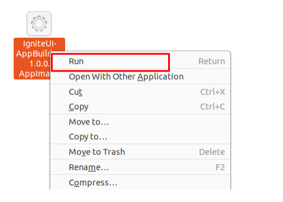
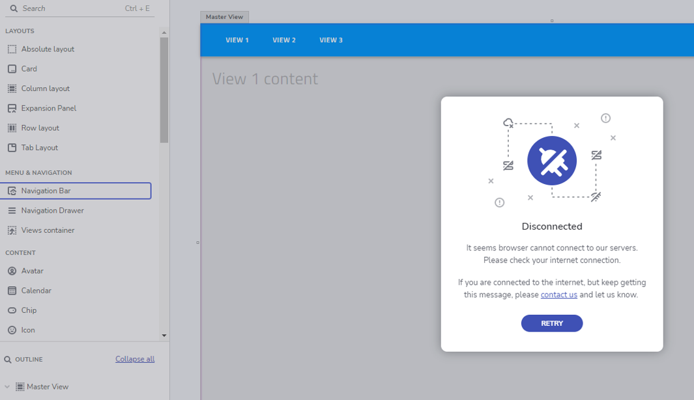

## Running Desktop app

Stay connected to your apps on any device. Everyone needs instant access to their work no matter where they are – we’ve got you covered! Mobile, desktop, or web, App Builder is designed, so you can empower your team to reach its full potential from any device, even on the go.

- [Windows installer](https://github.com/IgniteUI/app-builder-client/releases/latest/download/AppBuilder.exe)
- [MacOS installer](https://github.com/IgniteUI/app-builder-client/releases/latest/download/AppBuilder.dmg)
- [Linux installer](https://github.com/IgniteUI/app-builder-client/releases/latest/download/AppBuilder.AppImage)

## Troubleshooting

### Linux installer

Have in mind that when you download the <b>AppBuilder.AppImage</b> file on Linux it may not be executable by default. So in order to be able to run it you should do the following things:

1. Navigate to its folder
2. Open terminal and write the following command <b>chmod +x AppBuilder.AppImage</b>.
3. Right click on the file, click on the <i> Run button</i> and the app will start.

### Proxy server limitations (Disconnected error)

The following error might be thrown while using the Desktop application _"Disconnected - it seems browser cannot connect to our servers."_

Possible reason for the error could be that the proxy server is blocking some requests (company policy limitations).

A resolution for that problem would be whitelisting **"*.indigo.design"** and **"*.infragistics.com"** for both **https** and **secure websocket**.

_The detailed list is as follows:_

- https://my.appbuilder.dev (https 443)
- wss://my.appbuilder.dev (websocket 443)
- https://cloud.indigo.design (https 443)
- https://igniteuithemingwidget-previous.infragistics.com (https 443)
- https://igniteuithemingwidget-prod.infragistics.com (https 443)
- https://iam.infragistics.com (https 443)

Disconnected error

## Additional Resources

- [App Builder Interface Overview](interface-overview.md)
- [Single Page And Navigation](single-page-apps-and-navigation.md)
- [App Builder Components](indigo-design-app-builder-components.md)
- [Flex Layouts](flex-layouts/flex-layouts.md)
- [Running Desktop App](running-desktop-app.md)
- [Generate app](generate-app/generate-app-overview.md)
- [Indigo.Design Getting Started](https://www.infragistics.com/products/indigo-design/help/getting-started)

