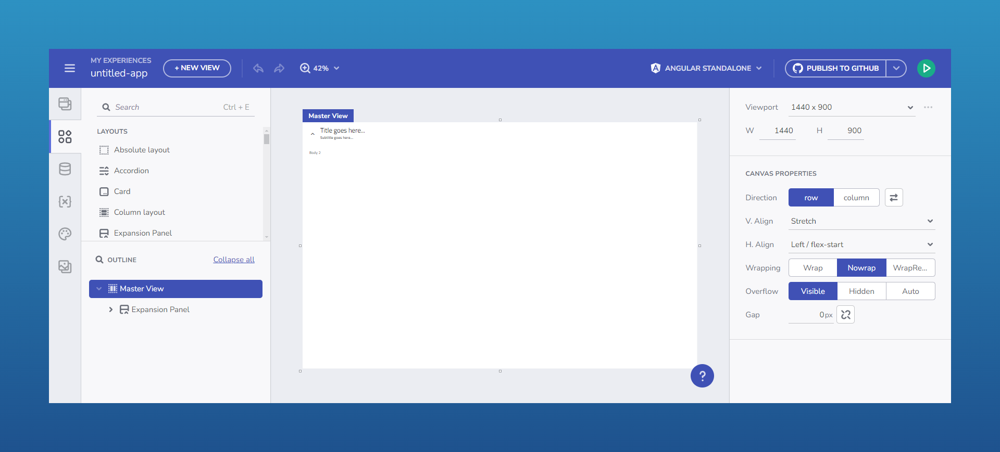

# Getting Started with the App Builder SDK

## SDK Overview

The App Builder SDK provides a comprehensive toolkit for integrating both front-end and back-end capabilities into your applications. To begin, [you can use the Help Documentation](https://github.com/IgniteUI/appbuilder-sdk-sample/blob/main/Documentation/Consuming-AB-SDK-all-in-one-doc.md) and create an Angular host application that consumes the front-end SDK package, enabling seamless UI integration. On the server side, you can build a custom backend using the App Builder Backend SDK, with support for development environments like Visual Studio Code and Visual Studio. These foundational steps ensure that your application is fully equipped to leverage the SDK’s capabilities from both ends.

Running the SDK

The documentation further covers the Authentication and authorization key components of the SDK setup. You can configure [OpenID authentication](../on-premises/auth-with-openid-connect-o-auth.md) to allow users to log in using external identity providers, offering flexibility beyond the default IAM provider. Additionally, the SDK supports external authentication flows such as Authorization Code + PKCE, and allows the host application to manage authentication directly. For more advanced scenarios, you can customize the IAuthUserService and IPermissionsService interfaces to implement tailored logic for user roles and permissions. Optional guides are available to help configure backend endpoints that enforce role-based access control, ensuring secure and scalable integration.

## Additional Resources

- [App Builder Interface Overview](../interface-overview.md)
- [Single Page And Navigation](../single-page-apps-and-navigation.md)
- [App Builder Components](../indigo-design-app-builder-components.md)
- [Running Desktop App](../running-desktop-app.md)
