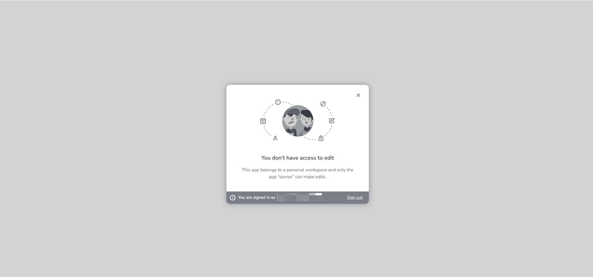
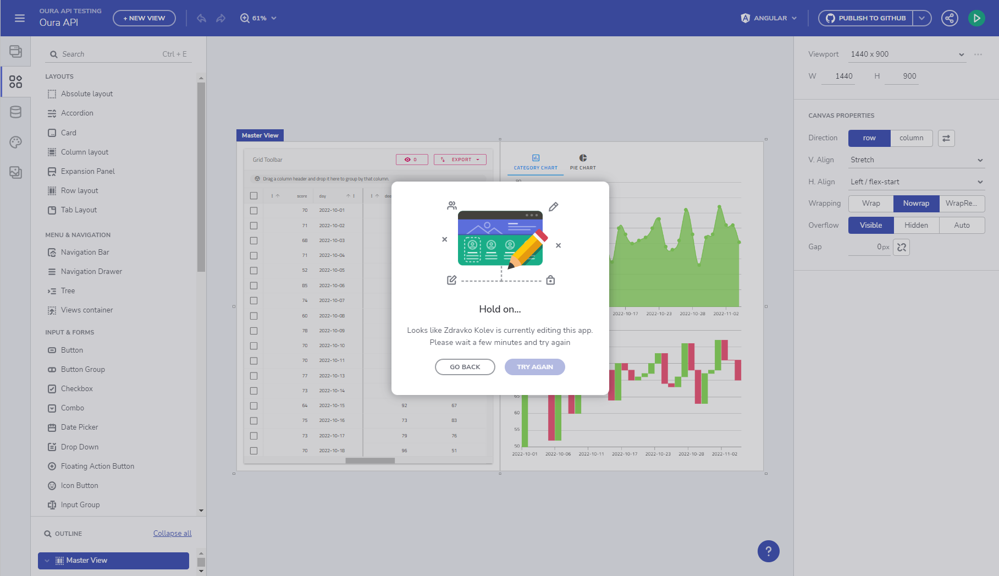
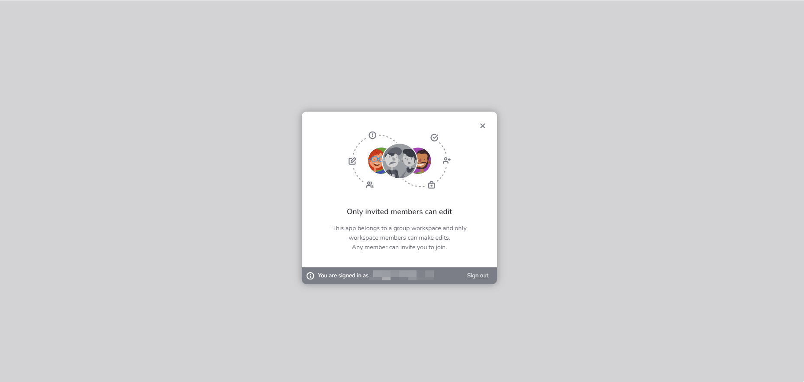

# Share, Preview and Edit Applications
This topic provides detailed explanation on how to share application with other users, how to grant them with editing capabilities and how to set different App Preview settings and app description for more meaningful social platform sharing.

## Share application
A share button has been added in Design mode to make friendlier experience for the [Desktop App](https://github.com/IgniteUI/app-builder-client/releases/tag/1.0.1) and also customize permissions if needed. 

You can customize the sharing experience with a toggle "Allow anyone to preview using this link". There is a a warning icon that hints how to disable the app link in order to stop the access to the app.

There are also copy and direct share capabilities with the "copy link" and "twitter" buttons.

Share button

Share button is also available from the workspace view through the "more actions" icon of the application.

Share button from Workspace

## Preview and Edit application

### Signed-in user accessing app from your personal workspace
#### App preview link
If you share **app preview link** from your personal workspace with a **signed-in user**, the latter will have access to **preview the app** but will see it with **mock data**. The same applies for Anonymous (not signed-in) users.

> [!NOTE]
> Mock data will always be used for non-workspace member

#### Edit link
If you share **app edit link** from your personal workspace with a **signed-in user**, the latter wont have access to edit and will receive _You don't have access to edit_ message.

You don't have access to edit

### Signed-in user part of the app's workspace
#### App preview link
If you share **app preview link** with a **signed-in user** that is **part of the app's workspace**, the latter will have access to **preview and edit the app**. He will be able to also see **real data** if configured, not **mock data**. Data requests will be made with the encrypted token and the real data will be fetched.

Shared workspace with real data

#### Edit link
If you share **app edit link** with a **signed-in user** that is **part of the app's workspace** he will have access to edit the application if no one is currently editing it.

Someone else is editing the app, hold on

If the user is not part of the workspace he will get _Only invited members can edit_ message.

Only invited members can edit the app

### Signed-in user with disabled link preview
You can always stop sharing an app by disabling the link share with the switch. If you **stop sharing** an app from your personal workspace with a **signed-in user** the following "Access is restricted" dialog will appear.

A "contact us" redirect button will be shown and "Sign out" button if you want to sign out from the App Builder.

Access is restricted

### Anonymous user app preview
Application preview is available for Anonymous  users. Keep in mind that all edit operations will be disabled. Main menu is not loaded and only **Code view** is available. Anonymous users will always see **mock data** if REST API calls are configured within the app.

Anonymous access preview

### Anonymous user accessing application from a personal workspace
If Anonymous (not signed in) user is accessing the application he will be able to **preview** it. Anonymous users will always see **mock data** if REST API calls are configured within the app.

### Anonymous user with disabled link preview
Anonymous users won't have access to restricted applications. You can always use the "Get started for free" button and create a trial account to try out all  the other available App Builder features.

Access is restricted, anonymous users

## Additional Resources

* [Using data in your app](./using-data-in-your-app.md)
* [Open API/Swagger support](open-api-swagger-support.md)
* [Running Desktop App](running-desktop-app.md)
* [Indigo.Design Getting Started](https://www.infragistics.com/products/indigo-design/help/getting-started)
* [Indigo.Design Components](https://www.infragistics.com/products/indigo-design/help/components/components-overview)

