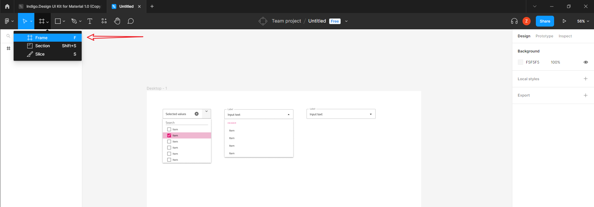
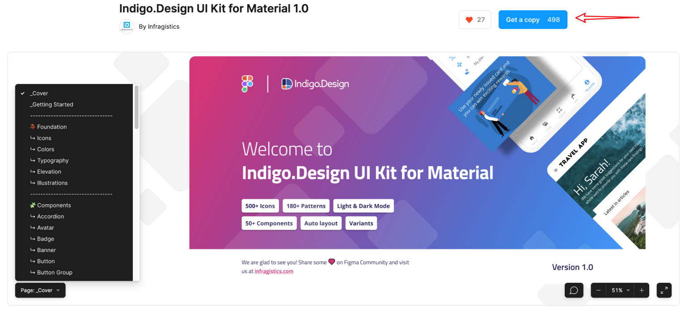
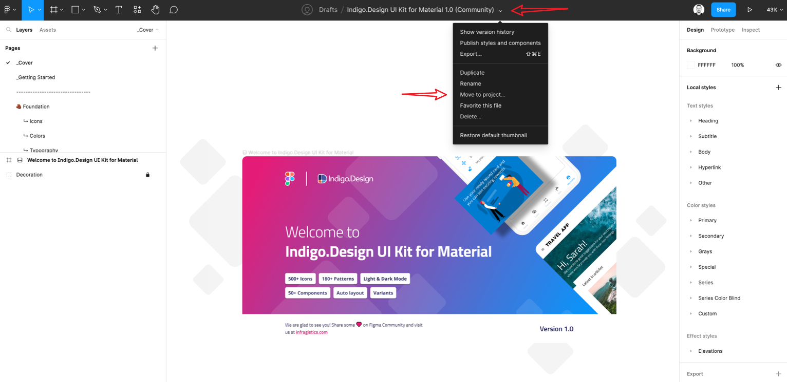
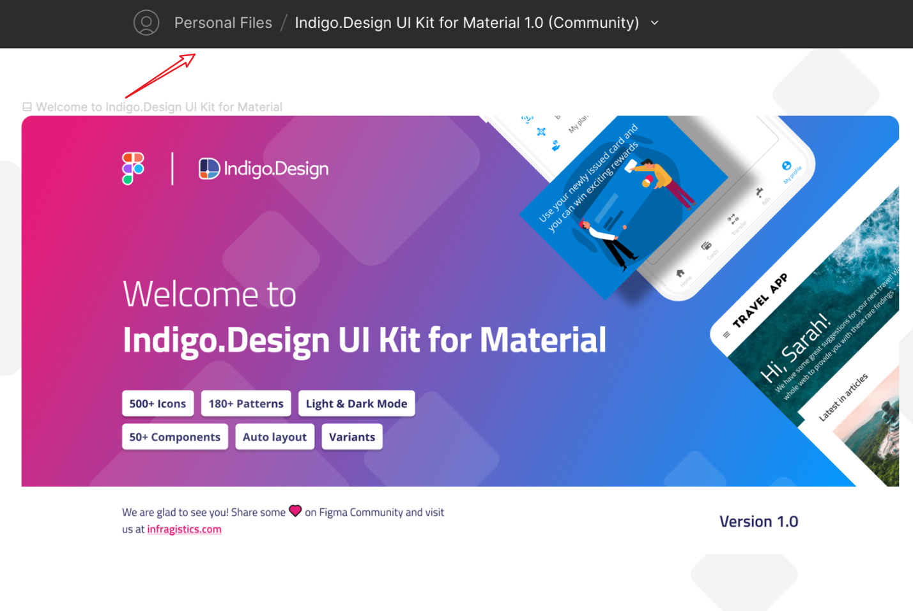
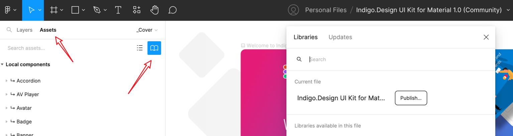
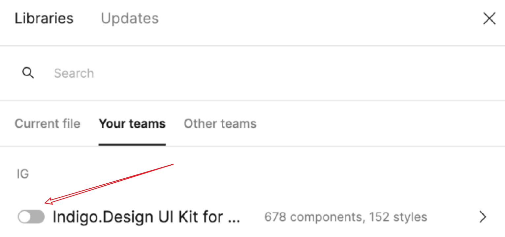
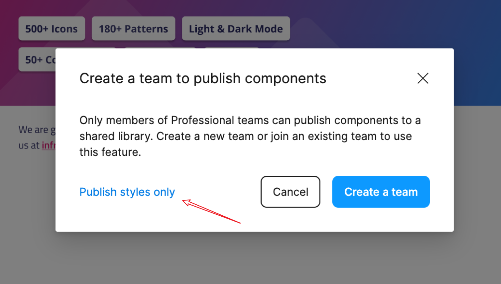
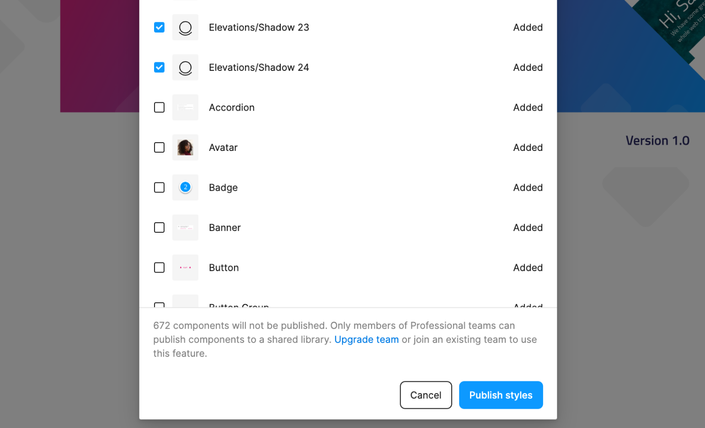

# Figma UI Kit
The brand-new Figma Indigo.Design UI Kit for Material maps to our Ignite UI for Angular, Blazor and Web Components UI toolset to completely redefine design-development processes. You now get a robust set of components, patterns, styling, and customization options, enabling you to import prototypes or any type of screen designed in Figma and transform it clean code. The best part is that all static designs become interactive, responsive apps with real UI components, branding, and styling – in a single click.

> [!NOTE]
> Download [Figma UI Kit](https://www.figma.com/@infragistics), [Plugin for Figma](https://www.figma.com/community/plugin/1170035114372031474) and [Sample Apps](https://download.infragistics.com/products/Infragistics/Indigo.Design/Samples/Infragistics_IndigoDesign_Sample_Apps_Figma.zip)

Figma UI Kit

## Using the kit as a free Figma user vs Pro user
The Indigo.Design UI Kit for Material can be used by everyone, regardless of the user's chosen Figma plan. However, there are certain limitations that you should be aware of.

If you're designing for a specific device or screen size, you may want to create a container for your designs. This is where frames come in. Frames allow you to choose an area of the canvas to create your designs in.

Add a frame

### Figma Pro User Account 
In case you are a user, signed with a Professional Figma account, then the way to use the Indigo.Design UI Kit for Material is by simply creating a duplicate of the UI Kit from the Figma community. Once you have duplicated (Get a copy) the file, it will be placed in “Recent files”.

Indigo.Design UI Kit

Now you need to open the file and use the chevron arrow right next to the file’s name, in order to move the file into your team space.

Move to project

You can see that right next to the file's name now is displayed the name of the team, to which you have moved the file to, e.g. Personal Files

Personal Files

Once the file is moved, open the file and go to the Assets panel. Click on the Team library icon, and you should be able to publish this file as a library, which will distribute all the styles, typography, and components to the rest of your team. From now on, every time you start a project or continue to work on an existing one within your team space, you will be able to activate this library and use it directly inside your project.

Publish

The activation is from _Assets > Team library icon > use the switch to activate the library_.

Your teams

### Figma Free User Account

For users with a “Free account”, the way to use the UI Kit is quite similar. Once you duplicate the file from the Figma community, you need to move it from **Recent files** to your team space. Open the file and use the chevron arrow, placed right next to the file's name, in order to move the file into your team space. Keep in mind that using the **Free Figma plan**, allows you to have a maximum of three projects, each of which can contain only three files. Once the file is moved, the following step is to open the file and go to the Assets panel. Click on the Team library icon, and you should be able to publish this file as a library, which will distribute only the color styles and typography to the rest of your team. 

From now on, every time you start a project or continue to work on an existing one within your team space, you will be able to activate this library and use it directly inside your project. The activation is from _Assets > Team library icon > use the switch button to activate the library_.

Publish styles only

Publish styles

Here is the difference with the Professional plan. You, as a **Free account user**, cannot use the library’s components directly from the Assets panel, therefore you need to copy all the needed components from the UI Kit file and paste them into your project file. This will break the link between the UI Kit library and the components you have copied, so any updates you make inside the UI Kit will not be applied directly to the components you have copied and pasted inside your project file. Only color styles and typography styles can be updated automatically. In case you have copied a button from the UI Kit and you have pasted it inside your project and want to make a change of its appearance over time, you can either detach the button and apply that change locally in your project file, or apply that change inside the UI Kit file and copy the button component again and paste it inside your project file. Then you should delete the old button, so there is no duplication of components with the same name. 

## Figma Download assets

You can download the Figma Plugin, UI kit and sample apps from the [Download Assets page.](https://appbuilder.indigo.design/resources/figma)

Or through the direct links below:
- [Figma UI Kit](https://www.figma.com/@infragistics)
- [Plugin for Figma](https://www.figma.com/community/plugin/1170035114372031474) 
- [Sample Apps](https://download.infragistics.com/products/Infragistics/Indigo.Design/Samples/Infragistics_IndigoDesign_Sample_Apps_Figma.zip)
 
## Known issues and limitations
- Dark mode will not be parsed upon import into the App Builder, currently we don't provide definitions or options for it.
- The file model in Figma is closed. The content of the file itself is binary and the App Builder cannot read directly from a `.fig` file. In order to achieve the `import story` you will have to open the Figma app and use the plugin API ([Indigo.Design plugin](https://www.figma.com/community/plugin/1170035114372031474)) to read the file model and its content. From here on the internal heuristics can build an input model for the AppBuilder and complete the import story.
- [The difference when using the kit as a free Figma user vs Pro user](#using-the-kit-as-a-free-figma-user-vs-pro-user).

## Additional Resources

* [Design to code story](../design-to-code-story.md)
* [Adobe XD UI Kit](adobe-xd.md)
* [Sketch UI Kit](sketch.md)
