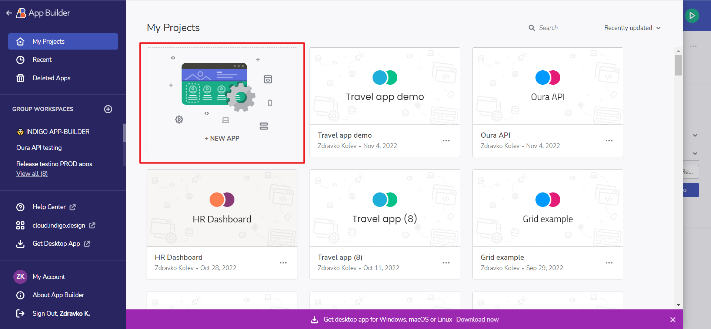
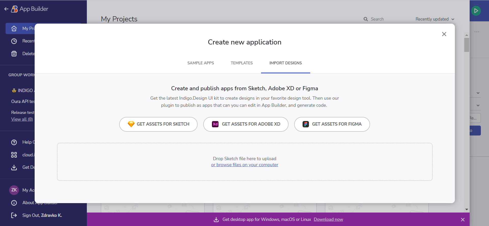
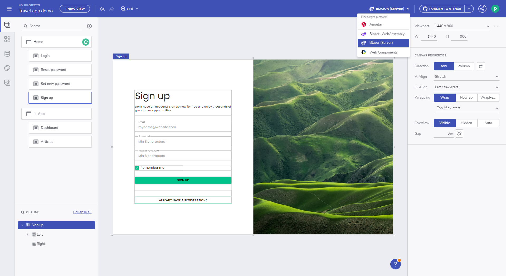

## Sketch UI Kit

A strong design-to-code movement emerged in the last few years to pick up where Sketch left off – the goal being to create a seamless, consistent, easy-to-use process that ensures Sketch designs can be easily transformed into usable code.

## App Builder Sketch Importer
Here are the 4 simple steps to get from Design to Code with the App Builder with a drag & drop.

Step 1: Click New App from the Indigo.Design Apps Home Screen
Create New Angular App from Sketch Design

New app dialog

Step 2: Drag your Sketch file into the "Create from existing design" Drop Area
Sketch to Angular Drag and Drop

Import designs dialog

Step 3: Review the Design in the Cloud IDE
App in Web App Builder from Sketch

Code generation

Step 4: Review or Download your Angular code
You can choose to use the buttons in the upper right of the IDE to Generate App or Preview your app and see code. Here you can see the Preview option with your running app and your code of HTML, CSS or TypeScript.

Code generation

Just like that, a design or a developer can go from sketch to code with a web-based WYSIWYG tool. Teams can design and build real apps blazing in a cloud-based WYSIWYG drag & drop and get code - complete with web layout, CSS and even data.

## Sketch Download assets

You can download the Sketch Plugin, UI kit and sample apps from the [Download Assets page.](https://cloud.indigo.design/resources/sketch)
 

## Additional Resources

* [Design to code story](../design-to-code-story.md)
* [Figma UI Kit](figma.md)
* [Adobe XD UI kit](adobe-xd.md)
