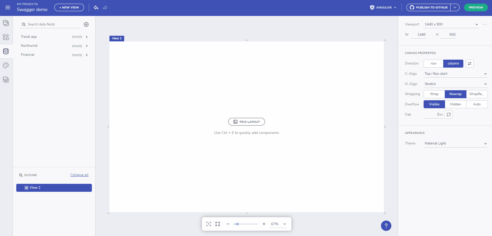
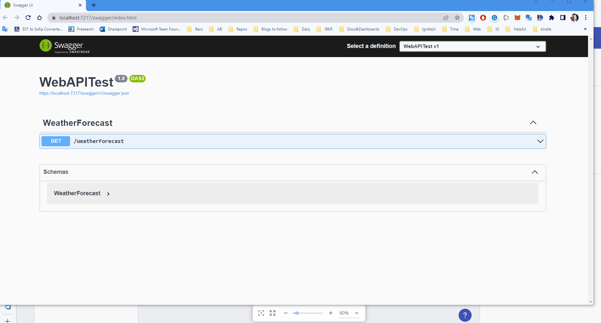
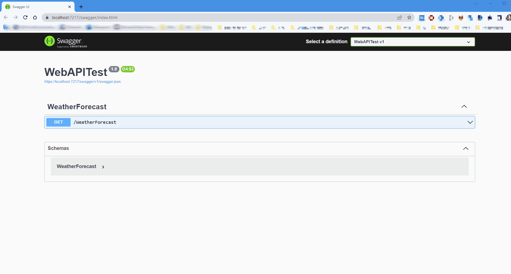
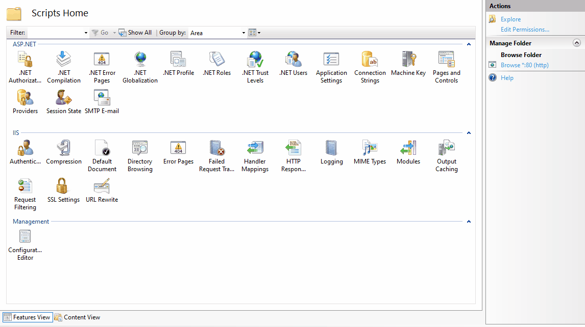
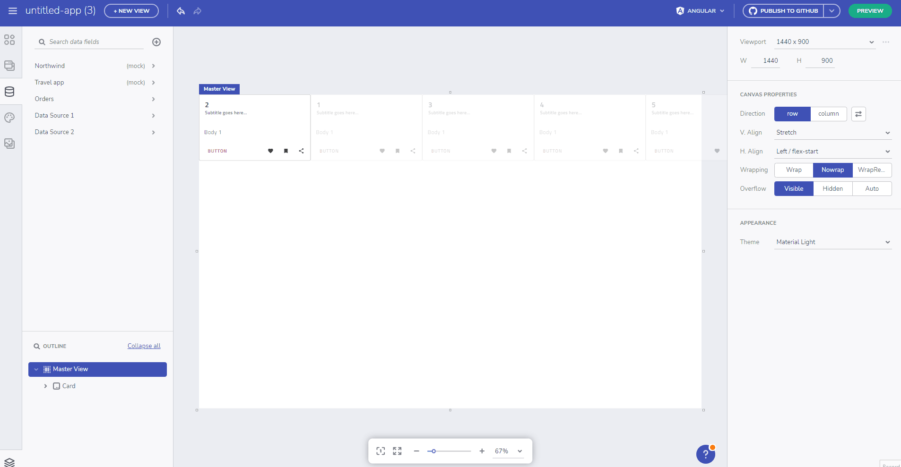

# Data Feature overview 
The App Builder Data features let users add, edit and use external data source in the application they are developing. By default, the App Builder comes with a mock Northwind data source which users can use for reference. Below you can find different ways to set up Rest API data sources:
- By using a Rest API URL with the data source.
- By using a Swagger URL or file definition (json/yaml).

> [!WARNING]
> Using a JSON type data source with file upload is now deprecated

If you have uploaded data sources in your application prior the removal of the 'Upload .json file' functionality, you will be notified that the request "Failed to retrieve from 'X' and is now switching to mock data response".


<p style="text-align:center;">Failed to retrieve data from previously uploaded file</p>

All added data sources are placed in the data toolbox and users can expand/collapse each data source in order to see the included tables and selected fields.

The App Builder also supports **nested collection inside a response object**. You can now bring in APIs that wrap the return collection in a metadata object (e.g. oData and others) and use the nested collection for data-binding components such as the Grid or to perform repeat operations based on it.


<p style="text-align:center;">Nested Collection Demo</p>

## Adding a data source
The App Builder Data feature enables users to link to external publicly available source(Rest API)

> [!NOTE]
> Data sources added to the App Builder are restricted to the user space and are visible only to the user that added them, or to their team space (when the teams feature is available).


<p style="text-align:center;">Adding data source from a URL</p>

## Adding a Swagger data source
The power of Swagger tools starts with the OpenAPI Specification — the industry standard for RESTful API design. 

You can now specify a Swagger definition (by providing a file URL or simply upload it) and an intuitive design will help you pick an endpoint an data fields, with ease. You can later on bind this data source to a component like Grid, Card, List or any other bindable component.

Check out the [full article on how to add a Swagger definition](open-api-swagger-support.md) and bind your data to it.


<p style="text-align:center;">Swagger demo</p>

## Using data source from local network sources
You can now make requests to a localhost or private networks. This includes regular REST endpoints and Swagger endpoints. 


<p style="text-align:center;">Local network sources usage</p>

<div style="font-size: 2em; margin-top: 0.83em; margin-bottom: 0.83em; margin-left: 0; margin-right: 0; font-weight: bold;">Troubleshooting</div>

If you get an error dialog while using a private network this section can help resolve the problem. If the problems aren't resolved, follow the [report and issue or send us feedback](getting-started.md#report-an-issue-or-send-feedback) section.
### Request failed error dialog
Due to the essence of working with local networks this type of error requires additional work in order to identify if the local/private service fails due to CORS problems (Cross-Origin Requests) or else.


If `Request failed` dialog appears while you add a local service, open the `dev tools` of your browser (Hit `F12`) and check the console/network tab for errors. The most probable reason would be CORS restrictions.


<p style="text-align:center;">Request failed error</p>

Based on the local service configuration, there are some ways to overcome the Cross-Origin Requests problem that we discuss with more details below.

### Enable Cross-Origin Requests (CORS) in ASP.NET Core

[This article](https://docs.microsoft.com/en-us/aspnet/core/security/cors?view=aspnetcore-6.0) shows how to enable CORS in an ASP.NET Core app. You can ensure that the Web App builder adds CORS policy that Allows `all` or `specific` origins:

```
var builder = WebApplication.CreateBuilder(args);
var MyAllowSpecificOrigins = "_myAllowSpecificOrigins";

// Add services to the container.
builder.Services.AddControllers();

builder.Services.AddEndpointsApiExplorer();
builder.Services.AddSwaggerGen();
builder.Services.AddCors(options =>
{
    options.AddPolicy(name: MyAllowSpecificOrigins,
                      policy =>
                      {
                          policy.AllowAnyOrigin();
                      });
});
```

Set .UseCors() right after the `app` initialization.

```
var app = builder.Build();

app.UseCors(MyAllowSpecificOrigins);

// Configure the HTTP request pipeline.
if (app.Environment.IsDevelopment())
{
    app.UseSwagger();
    app.UseSwaggerUI();
}
```

### Enable CORS Using IIS Manager, web.config or C#

Follow the steps below in order to enable access to your internally hosted data source using IIS.

1. Open IIS manager on your server or on your local PC.
2. Navigate to the website you need to edit the response headers for.
3. From the list or Icons related to the site you are editing, select "HTTP Response Headers" from the middle-pane, as shown in the image below
4. Double click "HTTP Repsonse Header"
5. Now, click "Add" from right hand side pane
6. A dialog box will open. For name enter "Access-Control-Allow-Origin" and for Value enter an asterisk (*).
7. Click Ok, you are done.


<p style="text-align:center;">IIS Configuration</p>

You can simply enable CORS by adding configuration in your asp.net website's web.config file or adding some code in your global.asax file. Detailed information [here](https://qawithexperts.com/article/asp-net/enabling-cors-in-iis-various-possible-methods/291).

## Selecting data fields and changing fields type
When a data source has been added, users can connect a particular data field to a component section. In order for this to be done, first select the component (a card component is used in the example below), then change Repeat mode to Data and scroll down the menu to locate and select the table from the Data Source that you want to connect to. Finally, connect the card section with the selected table field.


<p style="text-align:center;">Selecting data fields</p>


<p style="text-align:center;">Changing a data source table field type</p>

## Connecting Data Source to a repeated component
When a data source has been added, users can connect a particular data field to a component section. In order for this to be done, first select the component (a card component is used in the example below), then change Repeat mode to Data and scroll down the menu to locate and select the table from the Data Source that you want to connect to. Finally, connect the card section with the selected table field.


<p style="text-align:center;">Connect a data source table field to a component section</p>


## Additional Resources
<div class="divider--half"></div>

* [App Builder Components](indigo-design-app-builder-components.md)
* [App Builder Interface Overview](interface-overview.md)
* [Single Page And Navigation](single-page-apps-and-navigation.md)
* [App Builder Components](indigo-design-app-builder-components.md)
* [Flex Layouts](flex-layouts/flex-layouts.md)
* [Running Desktop App](running-desktop-app.md)
* [Generate app](generate-app/generate-app-overview.md)