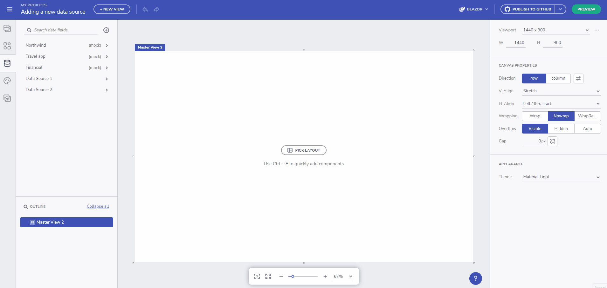

# Data Feature overview 
The App Builder Data features let users add, edit and use external data source in the application they are developing. By default, the App Builder comes with a mock Northwind data source which users can use for reference. Below you can find different ways to set up Rest API data sources:
- By using a JSON type data source, enabling users to upload their own JSON file or provide a Rest API URL with the data source.
- By using a Swagger URL or file definition (json/yaml).

All added data sources are placed in the data toolbox and users can expand/collapse each data source in order to see the included tables and selected fields.

The App Builder also supports **nested collection inside a response object**. You can now bring in APIs that wrap the return collection in a metadata object (e.g. oData and others) and use the nested collection for data-binding components such as the Grid or to perform repeat operations based on it.

Nested Collection Demo

## Adding a data source
The App Builder Data feature enables users to add external data sources, such as JSON (Rest API), Excel or CSV file, either by uploading a file, or linking to external publicly available source. Only Rest API option is available in the initial release of this feature.

> [!NOTE]
> Data sources added to the App Builder are restricted to the user space and are visible only to the user that added them, or to their team space (when the teams feature is available).

Adding data source from a URL

Adding data source by uploading a file

## Adding a Swagger data source
### What is Swagger?

**Swagger** is a set of open-source tools built around the OpenAPI Specification that can help you design, build, document and consume REST APIs.
### What is OpenAPI?

**OpenAPI Specification** (formerly Swagger Specification) is an API description format for REST APIs. An OpenAPI file allows you to describe your entire API, including:

- Available endpoints (/users) and operations on each endpoint (GET /users, POST /users)

Configure Endpoints

- Operation parameters Input and output for each operation

Set Endpoints Parameters/Apps

- Authentication methods
- Contact information, license, terms of use and other information

API specifications can be written in YAML or JSON. The format is easy to learn and readable to both humans and machines. The complete OpenAPI Specification can be found on GitHub: [OpenAPI 3.0 Specification](https://github.com/OAI/OpenAPI-Specification/blob/master/versions/3.0.3.md). More about OpenAPI [here](https://swagger.io/docs/specification/about/).

Swagger demo

### Specify Swagger definition

At this point you can either specify a _Swagger file URL_ (json/yaml) or _Upload a definition_. Once loaded a _Configure endpoints_ will appear.

The left-side of the _Configure endpoints_ dialog consists of:
- Base URL - can be automatically populated if value for it is present in the file definition
- Authorization - provide auth key if needed
- Endpoints tree view - All available endpoints will be loaded here along with its type (GET, PUT, POST and etc.)

The right-side of the _Configure endpoints_ dialog consists of:
- Request url with _Send_ button that can be used to test the connection before selecting it
- Tab elements for authorization, parameters and headers - if one is required, it will be marked as such.
- Tab content section showing _info_ messages or required fields. Example image:

Configure Endpoints Dialog

## Selecting data fields and changing fields type
When a data source has been added, users can connect a particular data field to a component section. In order for this to be done, first select the component (a card component is used in the example below), then change Repeat mode to Data and scroll down the menu to locate and select the table from the Data Source that you want to connect to. Finally, connect the card section with the selected table field.

Selecting data fields

Changing a data source table field type

## Connecting Data Source to a repeated component
When a data source has been added, users can connect a particular data field to a component section. In order for this to be done, first select the component (a card component is used in the example below), then change Repeat mode to Data and scroll down the menu to locate and select the table from the Data Source that you want to connect to. Finally, connect the card section with the selected table field.

Connect a data source table field to a component section

## Additional Resources

* [App Builder Components](indigo-design-app-builder-components.md)## Additional Resources
* [App Builder Interface Overview](interface-overview.md)
* [Single Page And Navigation](single-page-apps-and-navigation.md)
* [App Builder Components](indigo-design-app-builder-components.md)
* [Flex Layouts](flex-layouts/flex-layouts.md)
* [Running Desktop App](running-desktop-app.md)
* [Generate app](generate-app/generate-app-overview.md)