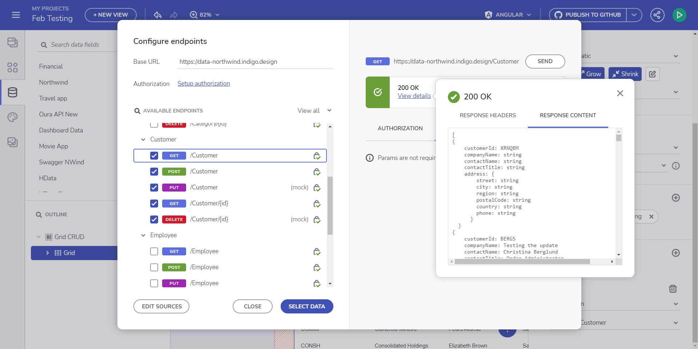
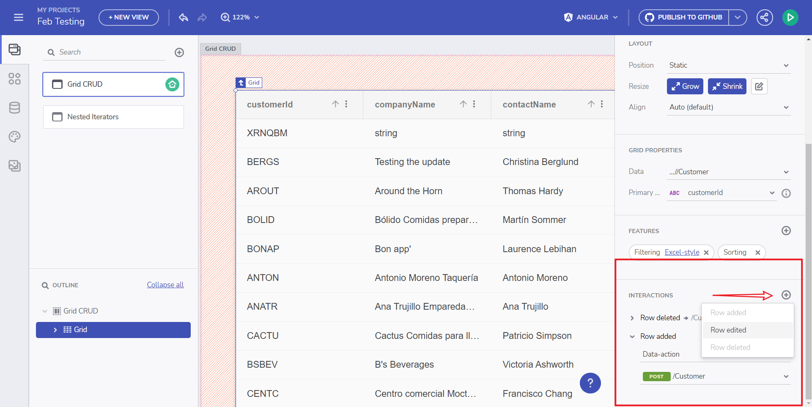
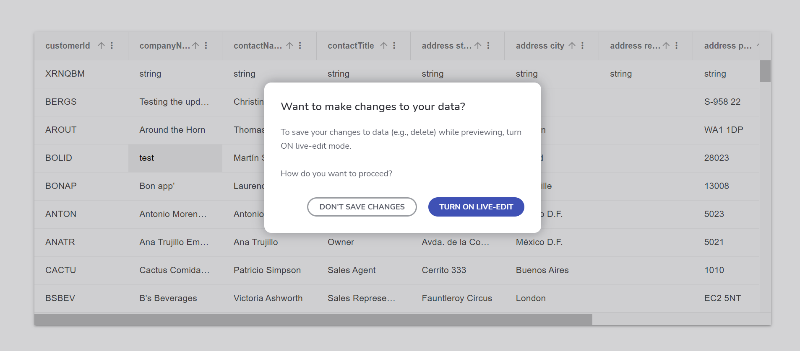
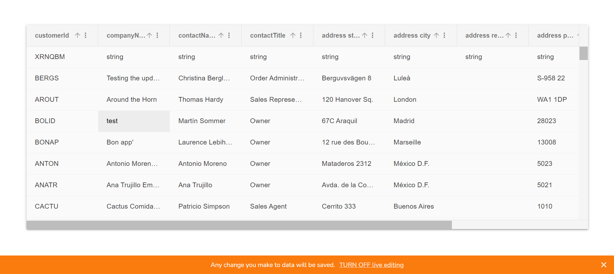

# Grid CRUD

In this topic we'll show how to start using CRUD operations in the Grid as part of App Builder.

App Builder is now providing a UI for the users to perform CRUD operations from within the grid. This is quite easy as the Grid provides Cell Editing, Row Editing, Row Adding and Row Deleting UI out of the box. We are going to use custom [Northwind CRUD API swagger definition](https://data-northwind.indigo.design/swagger/v1/swagger.json) and [UI](https://data-northwind.indigo.design/swagger/index.html) ([more examples here](https://github.com/IgniteUI/app-builder-docfx/wiki/CRUD-API-Examples#northwind-crud-api)).

If the Grid is bound to a Customers table (Swagger path Image 1) the Data Interactions section will be loaded with the methods available for Customers, upon adding such interaction (Image 2).


<p style="text-align:center;">Image 1: Swagger Configure Endpoints</p>


<p style="text-align:center;">Image 2: Properties Panel -> Interactions</p>

In the example below you will see how we use a Northwind Web API service to actually get all customers, pick a specific customer with **CustomerID** "BERGS" and update its **CompanyName** to "Testing the update". App Builder can make actual data request to alter the remote data if the end-user allows it through the prompt window (Turn on live-edit). Keep in mind there are two data access states upon App Preview. **Editor/authenticated user** part of the workspace will directly be prompted with the real-time changes states (image below). **Viewer/not part of the workspace user** will be notified that he doesn't have access to the real Web API and will be using mock data instead.


<p style="text-align:center;">Turn on live-edit</p>

A notification bar will be displayed at the bottom of the page warning the end-user that any change that is made would actually update the remote data. You can turn-off that feature by using the **Turn off live edit** action button.



<p style="text-align:center;">Turn off live-edit</p>

## Grid CRUD Demo

This is the whole CRUD process in action:


<p style="text-align:center;">Grid CRUD operations</p>

And what the generated code for the application would look like. This is how the application will directly access the data layer through a Web API calls that will be set for each of the CRUD operations.

Notice that the CRUD operations also map conceptually to the HTTP methods that are used to communicate with APIs over HTTP.

```ts
export class SwaggerNWindService {
  constructor(private http: HttpClient) { }

  public postCustomer(data: any): Observable<any> {
    const options = {
      headers: {
        Authorization: 'Bearer <auth_value>',
      },
    };
    const body = data;
    return this.http.post(`${API_ENDPOINT}/Customer`, body, options);
  }
  public putCustomer(data: any): Observable<any> {
    const options = {
      headers: {
        Authorization: 'Bearer <auth_value>',
      },
    };
    const body = data;
    return this.http.put(`${API_ENDPOINT}/Customer`, body, options);
  }
  public deleteCustomer(id: string): Observable<any> {
    const options = {
      headers: {
        Authorization: 'Bearer <auth_value>',
      },
    };
    return this.http.delete(`${API_ENDPOINT}/Customer/${id}`, options);
  }
  public getCustomer(): Observable<any> {
    const options = {
      headers: {
        Authorization: 'Bearer <auth_value>',
      },
    };
    return this.http.get(`${API_ENDPOINT}/Customer`, options);
  }
}
```

We generate a service that can be reused by any component that needs to perform CRUD operations against the same database. A good practice is to write such service as generic as possible, thus making it suitable to be reused in many components, and against different servers as well.

## Known issues and limitations

- It only works with Open API endpoints.
- The data-actions supports at most 1 parameter.
- For `RowDeleted` event, the parameter value will be the `PrimaryKey` value of the chosen grid row.
- For `RowAdded` and `RowUpdated` events, the parameter value will be the object bound to the chosen grid row.

## Additional Resources

<div class="divider--half"></div>

- [App Builder Components](../indigo-design-app-builder-components.md)
- [App Builder Interface Overview](../interface-overview.md)
- [Single Page And Navigation](../single-page-apps-and-navigation.md)
- [App Builder Components](../indigo-design-app-builder-components.md)
- [Flex Layouts](../flex-layouts/flex-layouts.md)
- [Running Desktop App](../running-desktop-app.md)
