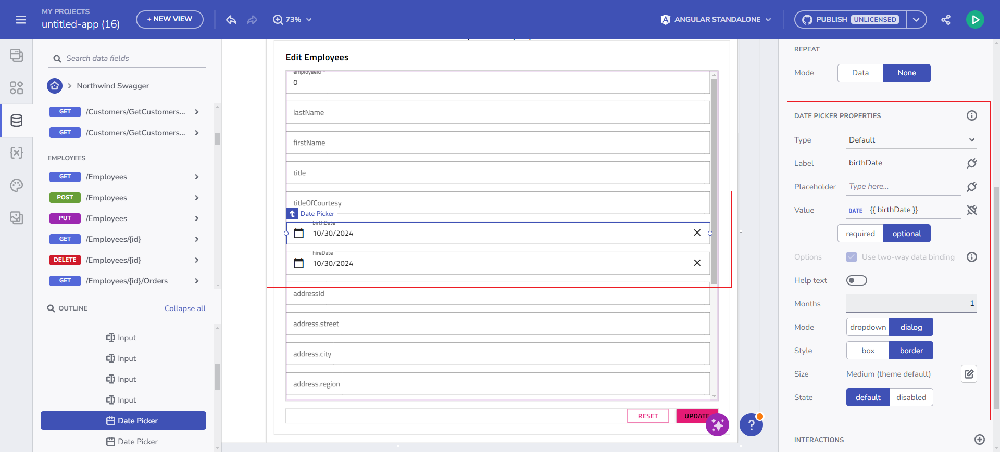
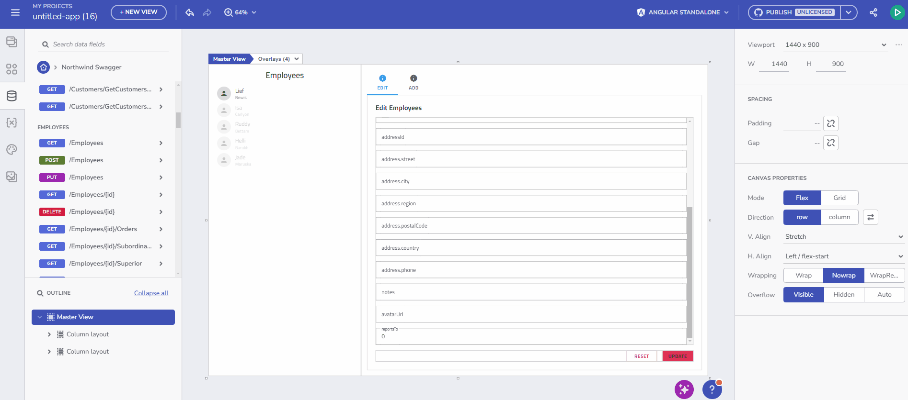
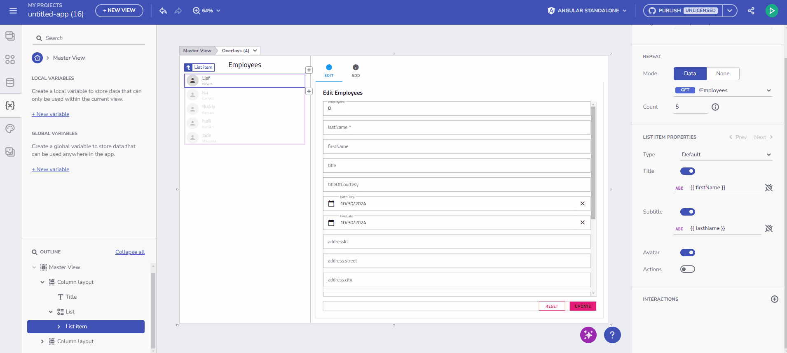
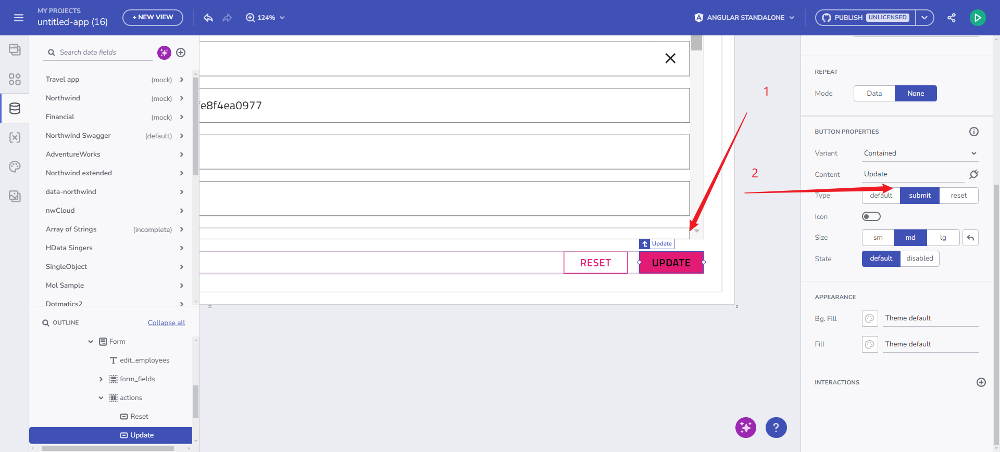

# Form Builder Overview
App Builder’s Form Builder functionality enables developers to design HTML forms through a drag-and-drop experience. It emphasizes auto-generating form structures directly from API endpoints, simplifying the creation process and allowing seamless data connections with backend sources. This feature offers extensive flexibility in form layout, component customization, and includes options for displaying notifications for submissions, errors, and server-side validations.

## Key Features of Form Builder
### Automatic Form generation from data endpoints
When a developer drags a data endpoint onto the design surface, a set of form components is automatically generated based on the endpoint’s properties.
- `POST` and `PUT` methods create input fields for data submission.
- Basic event handling, like `OnSuccess` and `OnError` interactions, is automatically configured.

Automatic Form creation

### Automatic Form controls creation and mapping
Form controls are created based on each field’s data type and metadata, ensuring intuitive inputs and labels (e.g., date fields use *date pickers*, boolean fields use *switches*). Developers retain full control to modify components, add validations, or adjust labels directly in the properties panel.

Automatic Form control creation

### Form modification
Once generated, the form can be edited to include or exclude fields, customize labels, and set input validations, offering an intuitive design experience. App Builder allows developers to tailor both form layout and components:
- Easily add or remove elements within the form.
- Adjust control properties such as *Required* and *Disabled* validations, label customization, and mapping.

Form modifications

### Live interaction with Forms
In App Builder’s Preview mode, users can interact with forms to see:
- Real-time input validation.
- Form submission, with notifications indicating success or validation errors.

Setting up variables and Form initial state

> [!NOTE]
> Upon form submission in Preview mode, the `Post/Put` action is executed, adding or updating the record through the specified endpoint.

### Configurable Action Buttons
Action buttons (`Submit`, `Reset`) offer full customization, supporting both in-form and external placements. This flexibility is essential for developers needing precise control over form behavior in more complex layouts.

Configuring action buttons

### Submit Action notifications
Success and error messages are displayed via Snackbars, offering non-intrusive feedback on form submissions. These notifications are hardcoded for the initial release, with plans to support flexible interaction handling in future iterations.

## Form Controls Support
The Form Builder supports a variety of UI controls mapped to specific data types, ensuring developers can create accessible, responsive forms efficiently. Below is a summary of supported controls and current limitations.

| Form Control  | Default Type  | Notes                                    |
|---------------|---------------|------------------------------------------|
| Radio Group   | Boolean       | Lacks required field validation          |
| Checkbox      | Boolean       | Lacks required field validation          |
| Switch        | Boolean       | -                                        |
| Slider        | Number        | -                                        |
| Select        | Enum          | -                                        |
| Combo Box     | Enum          | -                                        |
| Date Picker   | Date          | -                                        |
| Calendar      | Date          | May not refresh selected date accurately |
| Input Field   | String, Number| -                                        |

> [!NOTE]
> Form controls currently support basic validation properties (`Required`, `Disabled`). 

All Form controls support two-way binding and are bound to the form context.

## Future Enhancements
The roadmap for App Builder’s Form Builder includes advancements in manual form creation, validation options, extended metadata support, and enhanced notification and interaction handling.

Future validation enhancements will include:
- Range validation (`min`, `max`).
- String length validation (`min length`, `max length`).
- Pattern validation (regex).
- Enum validation for select and combo box controls

## Known issues and Limitations
The following known issues and limitations apply to the initial release of Form Builder, launched on October 28:

- **Form Reset behavior** discrepancy between App Builder runtime experience and generated application runtime:
    - In App Builder, the Reset button click reverts to the initial values when editing a record, and clears the form when adding a new record.
    - In the generated application, the Reset button click clears the form by setting all form controls to empty values.
- **Form Copy-Pasting**: Copying and pasting a form currently results in the original form losing its data bindings, which transfer to the newly pasted form instance.
- **Boolean Required Flag**: There is ambiguity in implementing a required Boolean field, particularly for cases like “accept terms of service.”
- **Submit/Reset Behavior**: The Submit/Reset functionality has been adapted to work within both template and reactive forms but may still experience inconsistencies.
- **Code Generation**:
    - **Typing Issues with Form Models**: Typing inconsistencies may arise, especially when working with nested structures or arrays, complicating accurate form model generation in the output code.
    - **`igx-hint` Element in Preview**: The `igx-hint` element is currently excluded from preview as it is not generated in the final code. Future updates may add support for message display functionality.
    - Disabled property will not be rendered for input in an angular generated form. 

## Additional Resources

* [App Builder Components](../indigo-design-app-builder-components.md)
* [App Builder Interface Overview](../interface-overview.md)
* [Single Page and Navigation](../single-page-apps-and-navigation.md)
* [Flex Layouts](../flex-layouts/flex-layouts.md)
* [Running Desktop App](../running-desktop-app.md)
