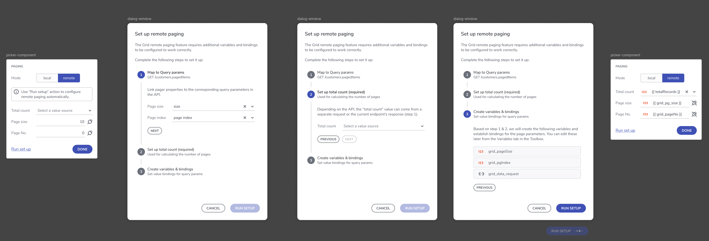

# Grid Remote Paging

Remote paging is a feature that allows the grid to load and display data dynamically, fetching only a portion of the data from the server as needed. This results in improved performance, particularly for large datasets, by avoiding the need to fetch all records at once.

## Key Benefits of Remote Paging

- **Improved performance:** Only loads necessary data, reducing load times.
- **Scalable:** Handles large datasets efficiently.
- **User control:** Offers flexibility to developers and users in how data is presented.

## How Remote Paging Works

Remote paging divides the data into "pages" that are requested individually from a remote server. This ensures that only the necessary slice of data is loaded at a time. It can be configured for both **Grid** and **Tree Grid** components using built-in properties in the tool.

Users use a Configurator to set up everything required for remote paging to work. What is needed?

- `pageIndex` - The index of the page, which data will be fetched. If this parameter is not provided, page index defaults to 0, which fetches the first page of data.
- `pageSize` - The maximum number of records to fetch and display per page. If this parameter is not provided, all records are fetched, and total number of pages will be 1.
- `totalRecords` - Returns the total number of records available at the server. This number is required for the Paginator to calculate the total number of pages.

**User flow:**

<a href="https://www.appbuilder.dev/help/images/using-data-in-your-app/remote-paging-configurator-flow.png" target="_blank">
    
</a>
<p style="text-align:center;">Configurator user flow</p>

## User Configuration

Remote paging can be implemented by developers following two approaches, depending on how the API handles data and total records count.

1. **Using a Combined Endpoint for Data and Total Record Count**  
In this case, the API returns both the paged data and the total number of records in a single response.

2. **Using Separate Endpoints for Data and Total Record Count**  
In this setup, two API calls are made: one to retrieve the paged data and another to get the total records count.

### Single endpoint

This is an example of supported data structure:

```
{
  "items": [
    {
      "categoryId": 0,
      "description": "string",
      "name": "string"
    }
  ],
  "totalRecordsCount": 0,
  "pageSize": 0,
  "pageNumber": 0,
  "totalPages": 0
}

```

**Steps:**

1. Hook the Grid to an endpoint that returns an Object with Items collection and Total Records Count field. Object that provides a collection of items and the Total Records Count.
2. Add Remote paging feature and select the **Remote** paging mode to load the Configuration dialog.
3. Through the Paging Configuration Dialog, select the field property that corresponds to the Total Records Count. In the example above, that would be "totalRecordsCount".
4. Through the **Paging Configuration Dialog**, specify the query param that will be used for **Page Index** and the one used for **Page Size**.
5. Click Save

**Result:**

- Two variables of type number for storing both **Page Index** and **Page Size** values are created.
- Third variable for storing of the **Grid data context** will be created. **Object type**, initialized from data request. The request Query params will be bound to the Page index and Page size variables.
- The Grid will be bound to the third variable data context result -> _result.items_ collection.
- Total records count will be bound to _result.totalRecordsCount_ field.
- Two interaction for **PerPageChanged** and **PageChange** will be automatically created.
  - **PerPageChange** will have **Source** (value) set to the Page size coming from the Event context provided by the igx-paginator. **Target** variable will be the **Page Size**.
  - **PageChange** will have Source (value) set to the Page index (current page) coming from the Event context provided by the igx-paginator.  **Target** variable will be the **Page Index**.

**Behaviour:**
On Preview, initial load will perform only one request. Upon page change or per page value change, a new request will be made to fetch the data based on the new Page and Size values.

### Two different endpoints

**Steps:**

1. Bind the `Data` property the grid to an endpoint that expects Page and Size query params.
2. Add Remote paging feature and select the **Remote** paging mode to load the Configuration dialog.
3. Hook the totalRecordsCount to a different endpoint (different than the grid `Data` property) that returns the total records count only.
4. Through the **Paging Configuration Dialog**, specify the query param that will be used for **Page Index** and the one used for **Page Size**.
5. Click Save

**Result:**

- Two variables of type number for storing both **Page Index** and **Page Size** values are created.
- Grid data source will have query params bound to the two newly created variables.
- Third variable for storing the **Total records count** will be created. **Object type**, initialized from data request. (Note, currently AB does not support primitive result types)
- Two interaction for **PerPageChanged** and **PageChange** will be automatically created.
  - **PerPageChange** will have **Source** (value) set to the Page size coming from the Event context provided by the igx-paginator. **Target** variable will be the **Page Size**.
  - **PageChange** will have Source (value) set to the Page index (current page) coming from the Event context provided by the igx-paginator.  **Target** variable will be the **Page Index**.

**Behaviour:**

- Upon going to Preview, initial load will perform two requests, one for the grid sliced data, and one for the total records count. After that, upon page change or per page change, only one request will be made for the Grid sliced data.

## Known limitations

When user sets up remote paging with the configurator and runs it again, the redundant variable, which is initialized from API endpoint, will remain existing.

## Additional Resources

<div class="divider--half"></div>

- [App Builder Components](../indigo-design-app-builder-components.md)
- [App Builder Interface Overview](../interface-overview.md)
- [Single Page And Navigation](../single-page-apps-and-navigation.md)
- [App Builder Components](../indigo-design-app-builder-components.md)
- [Flex Layouts](../flex-layouts/flex-layouts.md)
- [Running Desktop App](../running-desktop-app.md)

