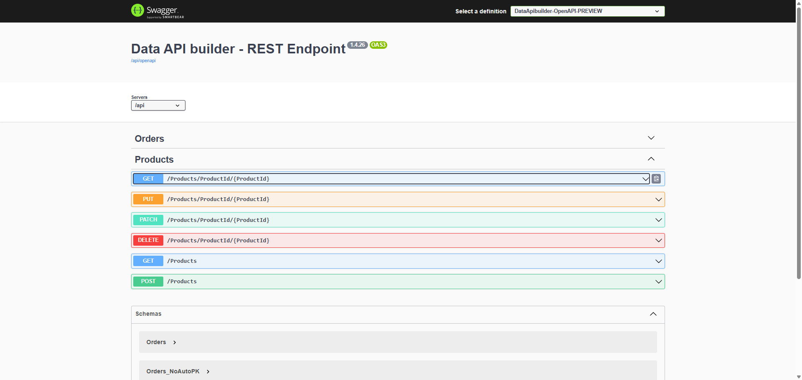

# Quickstart: Use App Builder with Microsoft's Data API Builder for Any Database

This guide provides a step-by-step process to set up and use the Data API Builder with any database, [full list](https://learn.microsoft.com/en-us/azure/data-api-builder/overview) of the supported databases - SQL Server, MySQL and PostgreSQL to name a few. Follow these instructions to create native OpenAPI, Swagger for REST endpoints and manage your database effectively.

Key Features

- Support for relational tables, views, and stored procedures
- Support multiple, simultaneous data sources
- REST endpoints
  - POST, GET, PUT, PATCH, DELETE
  - Filtering, sorting, and pagination
  - In-memory cache
  - Support for OpenAPI
- Easy development via dedicated CLI
- Open Source & free

This diagram breaks down the relationship between all of the components of the Data API builder's Architecture.


<p style="text-align:center;">DAB Architecture</p>

---

## 1. Install the Microsoft.DataApiBuilder package from NuGet as a .NET tool

To get started, Use dotnet tool install to install the latest version of the Microsoft.DataApiBuilder with the --global argument:

```bash
dotnet tool install -g Microsoft.DataApiBuilder
```

> [!NOTE]
> If the package is already installed, you will update the package instead using dotnet tool update

```bash
dotnet tool update --global Microsoft.DataApiBuilder
```

For more details, refer to the official documentation: [.](https://learn.microsoft.com/en-us/azure/data-api-builder/how-to-install-cli)

## 2. Database Configuration

Make sure you have a database set-up. You can use tools like SQL Server Management Studio, MySQL Workbench, or any other database management tool to create and configure your database. For this guide, we’ll provide examples for MSSQL database.

## 3. REST Endpoints in Data API Builder created through a Configuration file

Data API builder provides a RESTful web API that enables you to access tables, views, and stored procedures from a connected database. Entities represent a database object in Data API builder's runtime configuration. An entity must be set in the runtime configuration in order for it to be available on the REST API endpoint.

Let's now Create a baseline configuration file using the DAB CLI. [Official docs](https://learn.microsoft.com/en-us/azure/data-api-builder/quickstart-sql). This configuration file is needed to define how Data API Builder interacts with your database.

Run the following command to initialize a configuration file based on MSSQL connection string.

```
dab init --database-type "mssql" --host-mode "Development" --connection-string "Server=DEV-ZKOLEV4\SQLEXPRESS;User Id=INFRAGISTICS/ZKolev;Database=NorthwindCRUD;Integrated Security=True;TrustServerCertificate=True;Encrypt=False;"
```

### Add the entities that your REST API will work with

Add an entity (e.g., Products) to the configuration file:

```bash
dab add Products --source "Products" --permissions "anonymous:*"
```

### Observe your current dab-config.json configuration file

The file should include a baseline implementation of your API with a single entity, a REST API endpoint:

> [!NOTE]
> Enable CORS if needed (Optional). To allow cross-origin requests, enable CORS in your configuration by adding the following to your custom-config.json:

```
"origins": ["*"]
```

```
{
  "$schema": "https://github.com/Azure/data-api-builder/releases/download/v1.4.26/dab.draft.schema.json",
  "data-source": {
    "database-type": "mssql",
    "connection-string": "Server=DEV-ZKOLEV4\\SQLEXPRESS;User Id=INFRAGISTICS/ZKolev;Database=NorthwindCRUD;Integrated Security=True;TrustServerCertificate=True;Encrypt=False;",
    "options": {
      "set-session-context": false
    }
  },
  "runtime": {
    "rest": {
      "enabled": true,
      "path": "/api",
      "request-body-strict": true
    },
    "graphql": { ... },
    "host": {
      "cors": {
        "origins": [
          "*"
        ],
        "allow-credentials": false
      },
      "authentication": {
        "provider": "StaticWebApps"
      },
      "mode": "development"
    }
  },
  "entities": {
    ...
    "Products": {
      "source": {
        "object": "Products",
        "type": "table"
      },
      "graphql": {
        "enabled": true,
        "type": {
          "singular": "Products",
          "plural": "Products"
        }
      },
      "rest": {
        "enabled": true
      },
      "permissions": [
        {
          "role": "anonymous",
          "actions": [
            {
              "action": "*"
            }
          ]
        }
      ]
    }
  }
}
```

## 4. Test the REST API

Now, start the Data API builder tool to validate that everything is set-up correctly.

```
dab start
```

Output.Once the API is running, you can access it at http://localhost:5000/swagger/index.html

```
Successfully completed runtime initialization.
info: Microsoft.Hosting.Lifetime[14]
      Now listening on: <http://localhost:5000>
info: Microsoft.Hosting.Lifetime[0]

```

This URL will open the Swagger UI, where you can test your API endpoints.


<p style="text-align:center;">Swagger DAB Example</p>

## 6. Start using App Builder with the newly created REST API

For [step-by-step walkthrough](https://www.appbuilder.dev/help/using-data-in-your-app#adding-a-swagger-data-source) follow [this](https://www.appbuilder.dev/help/using-data-in-your-app#adding-a-swagger-data-source) topic.


<p style="text-align:center;">DAB in AB</p>

## 6. Troubleshooting Common Problems

Here are some common issues and their solutions:

- In App Builder the CRUD is working only for Grid, for the Form component there are some missing peaces from the OpenAPI specification that are currently in progress.

- CORS problems. How to enable CORS if needed:

```
"host": {
    "cors": {
    "origins": [
        "*"
    ],
    "allow-credentials": false
    },
    "authentication": {
    "provider": "StaticWebApps"
    },
    "mode": "development"
}
```

- OpenID Connect Support Proposal - [Issue in data-api-builder GitHub](https://github.com/Azure/data-api-builder/issues/2226).

- DELETE endpoint not working?
Ensure the DELETE operation is enabled in the permissions for the entity (e.g., "anonymous:*" includes DELETE).

- Connection string problems?
Double-check the username, password, and authentication method (e.g., Windows Authentication or SQL Authentication) in your connection string.


## Additional Resources

<div class="divider--half"></div>

- [Query Builder Support for API Projects](api-project-query-builder-support.md)
- [App Builder Components](../indigo-design-app-builder-components.md)
- [App Builder Interface Overview](../interface-overview.md)
- [Form Builder](form-builder.md)
- [Grid Remote Paging](grid-remote-paging.md)
- [Crud Operations](crud-operations.md)
- [Remote Data Operations](remote-data-operations.md)
- [Flex Layouts](../flex-layouts/flex-layouts.md)
- [Running Desktop App](../running-desktop-app.md)
