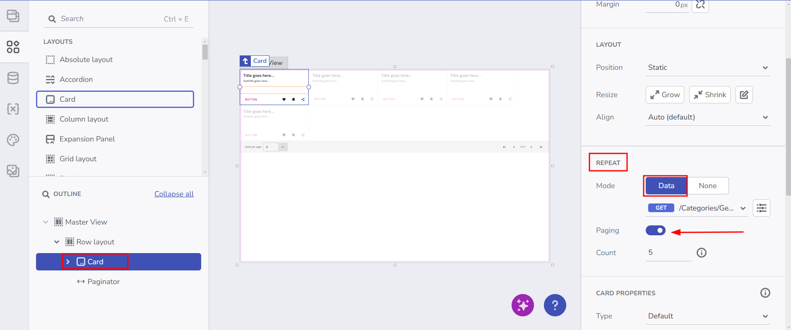

# Remote Data Operations

This functionality allows users to iterate over data using the **Card**, **Column Layout**, **Absolute Layout**, and **Row Layout** components while leveraging the Paginator component to configure and execute requests that fetch only a specific page of the data.

## Key Benefits
- **Improved performance**: Fetch only the required subset (page) of data from the server, avoiding large payloads.
- **Scalable**: Handles large datasets by loading data in smaller chunks.
- **Flexible UI**: Allows the user to place repeated items, like Cards, in a custom layout while benefiting from paging features.

## How Component-first Remote Data Works

When a user repeats a component over data (e.g., a **Card** iterating over a JSON array) and selects an endpoint (table) from a data source, they can configure remote paging if the API provides such an endpoint.

When **Paging** is enabled, a **Paginator** component is automatically added. After that, the user can open the Remote Paging Configurator by selecting the newly created **Paginator** to set up everything else.

During setup, internal variables such as **pageIndex** and **pageSize** are created. Changing pages triggers new server requests to retrieve only the corresponding page of data.

**User flow**:

Component-first user flow

## Setting Up Remote Data

### **1. Repeat a component over data**
- From the **Toolbox**, drag a **Card**, **Column Layout**, **Absolute Layout**, **Grid Layout** or **Row Layout** (these support paging so far).
- Select the component and open its **Properties** panel, which will appear on the right hand side.

### **2. Select Data**
- Under **Repeat**, select **Data**.
- Choose a REST endpoint or a Swagger definition that provides the JSON response.
- If paging is needed, ensure your API supports parameters like `pageIndex` and `pageSize` so you can page effectivelly.

### **3. Enable Pagination**
- Toggle **Paging** on.
- App Builder will wrap your component in a **Row Layout** to ensure the Paginator is placed correctly with your host component together (**Card/Layout**).
- A **Paginator** is added, so you will need to set it up by clicking on it and opening it's own properties panel. Check out how to set it up here: [Grid Remote Paging](../using-data-in-your-app/grid-remote-paging.md)

### **4. Preview the Setup**
- Once you've completed the setup and your local variables and actions have been generated, congratulations—you have successfully configured remote paging for your component!
- Click **Preview** to load the first page of data.
- Changing pages or page sizes triggers new requests, fetching only that portion of data.

**Expected Result:**
- The component (**Card/Column Layout/Row Layout/Grid Layout/Absolute Layout**) paginates like a Grid, dynamically fetching only the data for the current page.

## Known Limitations

### **1. Row Layout Enforcement**
- To ensure proper alignment of the **Paginator** along with the repeated component, App Builder will wrap those inside a **Row Layout** with **Wrap**, **Grow** and "Shrink" rules enabled.

### **2. Variable-first Approach Not Yet Supported**
- Currently, the user must start with repeating a component over data, in order to enable Paging. Next version might expose the **Paginator** as a standalone component, which configures data requests on its own, allowing any component be bound to the corresponding data.

## Additional Resources

* [App Builder Components](../indigo-design-app-builder-components.md)
* [App Builder Interface Overview](../interface-overview.md)
* [App Builder Components](../indigo-design-app-builder-components.md)
* [Grid Remote Paging](../using-data-in-your-app/grid-remote-paging.md)