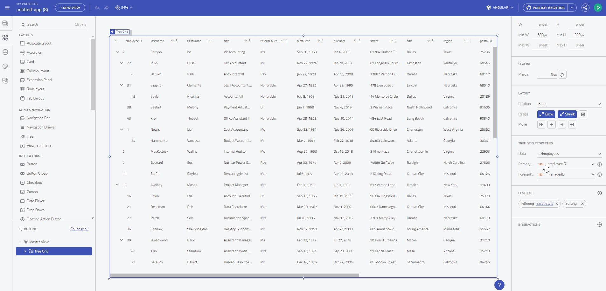

# Web Components Code Generation with App Builder

The family of supported frameworks of the App Builder has grown even more. The newest member - [Web Components](https://www.infragistics.com/products/ignite-ui-web-components). Now you can both download or upload to GitHub your Web Components application.

Web Components Code Generation from AppBuilder

> [!NOTE]
><b>Trying to generate code for components not available yet will put a placeholder informing that such a component is not yet supported. This makes it possible for you not to refrain from developing more complex UI in the designer.

### In this article:
* <a href="#introduction">Introduction of the feature</a>
* <a href="#web-components-code-generation">Web Components Code generation</a>
* <a href="#uploading-an-application-to-github">Uploading an application to GitHub</a>
* <a href="#known-issues-and-limitations">Known issues and limitations</a>

## Introduction
You can now kickstart your next Web App with the App Builder for the fastest way to deliver high performance Web Components apps.

With the idea to deliver cutting-edge development tools for modern web apps, we now have not only the [Ignite UI for Web Components library](https://www.infragistics.com/products/ignite-ui-web-components) but also the ability to generate Web Apps built with App Builder. 

Wondering what exactly Web Components are? A set of web platform APIs that allow you to create new custom, reusable, encapsulated HTML tags to use in web pages and web apps. Custom components and widgets build on the Web Component standards, will work across modern browsers, and can be used with any JavaScript library or framework that works with HTML.

But do not confuse Web Components with a framework or a rendering library because Web Components doesn’t fall into these technical categories. It’s more appropriate to see it as:

 - Low Level Browser APIs
 - Standard Component Interfaces
 - Framework-agnostic rich user experience

## Web Components Code Generation

Using the App Builder, you can now generate advanced Web Apps that benefit from using dependency-free components in a future-proof app dev strategy. When you are ready with your application go ahead and set the desired framework. Once the Web Components drop-down item is selected, you can hit "Download zip" in order to generate and download it.

Download button

If you want to have a quick look at the generated code, go to App Preview and toggle the Code View switch.

Code preview

## Uploading an application to GitHub
In addition to see your application in Preview mode or download it locally on the machine, there is the option for generating the full app code repository. In order to do that, simply go to the Generate app button and then connect your GitHub account to the App Builder.

## Known issues and limitations

For a list of all supported components see [Generate App](generate-app/generate-app-overview.md#supported-components)

## Additional Resources

* [Generate App](./generate-app/generate-app-overview.md)
* [App Builder Components](indigo-design-app-builder-components.md)
* [Flex Layouts](flex-layouts/flex-layouts.md)
* [Running Desktop App](running-desktop-app.md)
* [Indigo.Design Getting Started](https://www.infragistics.com/products/indigo-design/help/getting-started)
* [Indigo.Design Components](https://www.infragistics.com/products/indigo-design/help/components/components-overview)