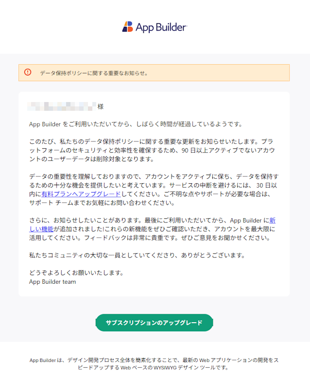

# App Builder におけるアカウントの非アクティブとデータ保持ポリシー

このヘルプ トピックでは、App Builder をご利用中のアカウントに適用される公式なデータ保持ポリシーについて説明します。特に、サブスクリプションの有効期限後や一定期間アクティビティがない場合の扱い、および共有プレビュー リンクやユーザーデータの削除 (GDPR 準拠) について取り上げます。

## データ保持のタイムライン

ユーザーの **App Builder サブスクリプションが有効期限を迎えた**場合、以下のポリシーが適用されます:

| サブスクリプションの有効期限からの経過日数 | 実施される対応 |
|-------------------------------|--------------|
| 90 日                       | アカウントが削除対象としてマークされ、最初の通知メールが送信されます。 |
| 90 ～ 120 日                    | 合計 **4 通の警告メール**が送信され、30 日前および 10 日前のリマインダーが含まれます。 |
| 120 日                      | **すべての App Builder ユーザー データが完全に削除されます。** |

> [!NOTE]
> このデータ削除ポリシーは、**App Builder ユーザー データにのみ**適用されます。Infragistics の一般アカウント情報は、ユーザーからの明示的な削除依頼がない限り保持されます。

## 削除対象のデータ

サブスクリプションの有効期限から 120 日が経過し、かつ非アクティブであった場合、以下のデータが削除されます:

- **プロジェクト**、**アプリ**、**データ ソース**、**アセット**、**ビューポート**
- **個人用ワークスペース**
- **共有プレビュー リンク** (アクセスすると 404 エラーなどが表示されます)
- 共有ワークスペースからユーザーが削除されます
- メンバーがいないワークスペースは削除されます

## 共有プレビューリンクについて

共有 (匿名) プレビュー リンクは、ソース プロジェクトの可用性に関連付けられています。  
プロジェクトが削除されると、リンクは無効になります。

- 共有リンクはサブスクリプションの有効期限から**最大 120 日間有効**です。
- 関連プロジェクトが削除されると、リンクは利用できなくなり、**「404 Not Found」** や同様のエラー メッセージが表示される可能性があります。

## 削除警告メールの例

削除警告メールの例

## 削除タイマーのリセット方法

**データ削除を回避する**には、**120 日以内**に**以下のいずれか**を実行してください:

* App Builder サブスクリプションを**更新またはアップグレードする**
* App Builder に **ログインしてアクセスする** (アクティビティがあればタイマーはリセットされます)

## まとめ

| 状況                      | 結果                                  |
| ------------------------------ | ---------------------------------------- |
| サブスクリプションの有効期限から 90 日未満 | 対応なし                                |
| 有効期限から 90 日経過            | 削除プロセスが開始、通知メール送信      |
| 有効期限から 120 日経過           | App Builder のデータがすべて削除される          |
| サブスクリプションを更新した場合           | タイマーがリセットされ、削除は行われない              |
| GDPR に基づく削除依頼を行った場合        | 個人情報とワークスペースデータが削除される |

---

## よくある質問

**質問: プレビュー リンクを共有した後に、元のアプリを削除した場合はどうなりますか？**
答え: 共有リンクは無効となり、404 エラーが返されます。

**質問:  Infragistics のアカウント自体も削除されますか？**
答え: いいえ。Infragistics の一般アカウントは、明示的な削除依頼がない限り保持されます。

**質問: 削除されたプロジェクトを復元できますか？**
答え: できません。120 日を経過して削除が完了したデータは復元できません。

ご不明な点やご質問がある場合は、[こちらからお問い合わせください](https://jp.infragistics.com/about-us/contact-us)。
