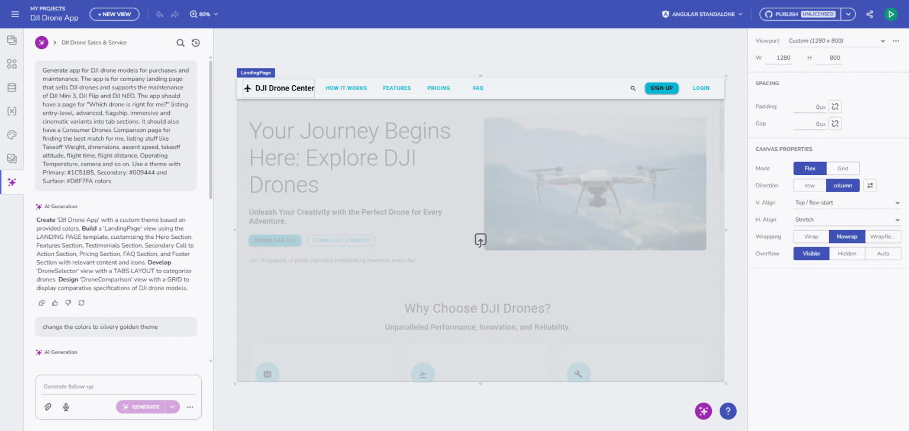
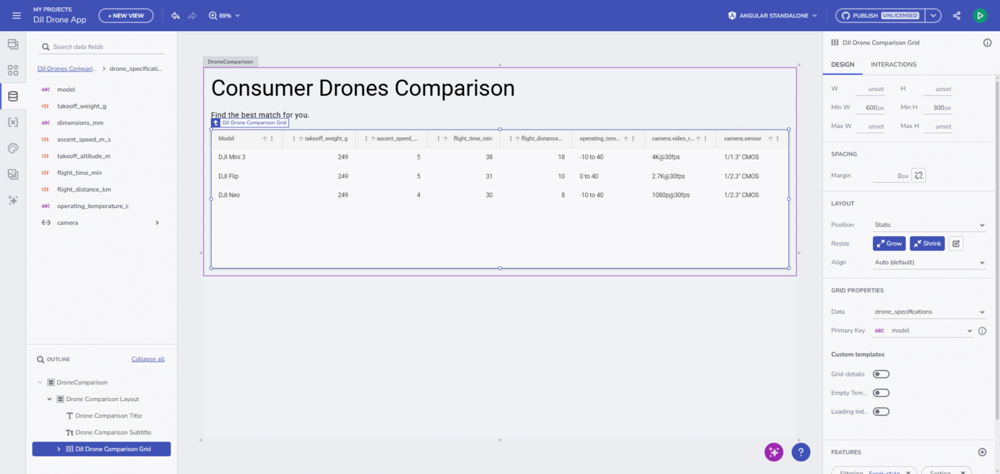
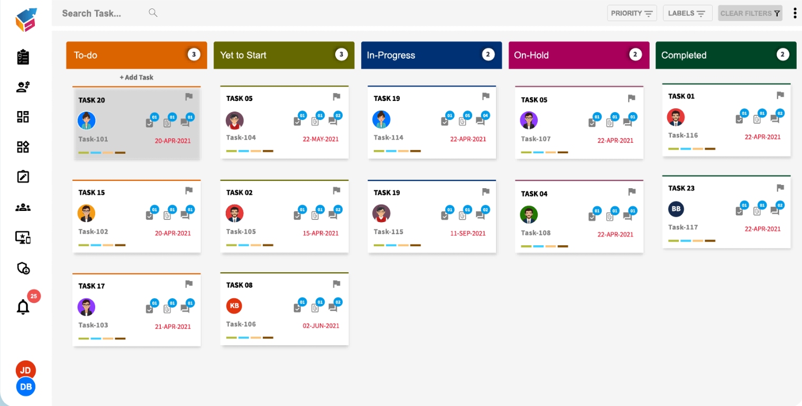
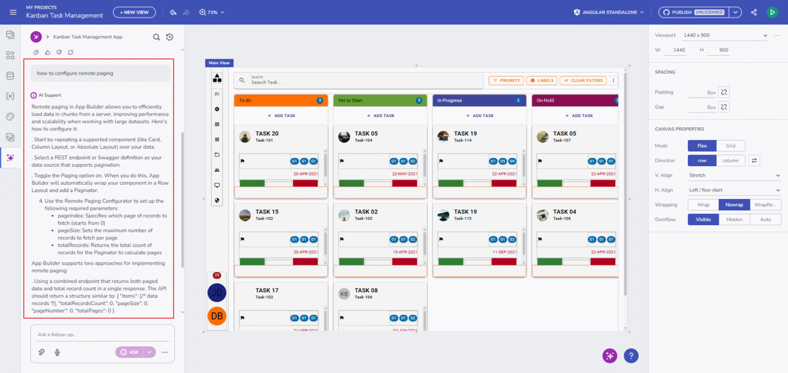
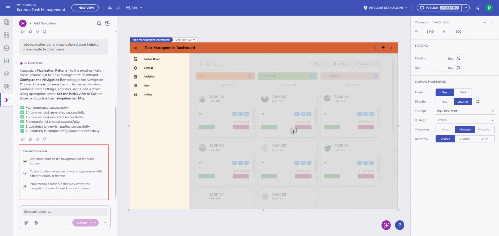
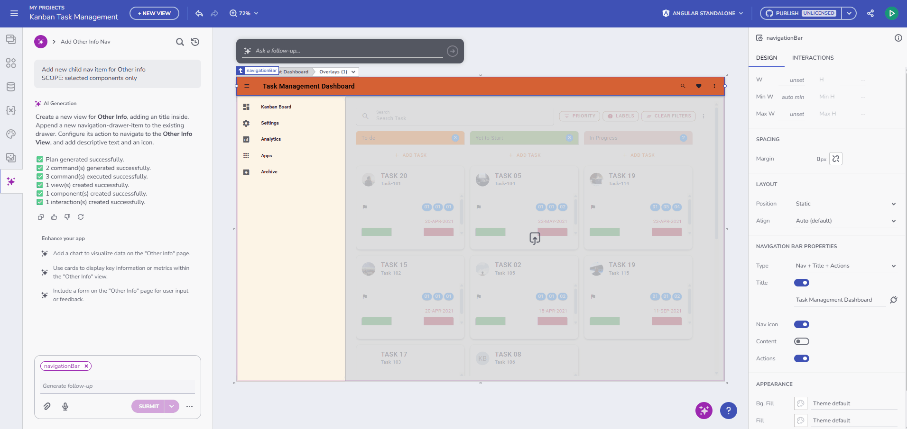

# App Builder AI を使用した作業の開始

App Builder の AI チャット機能は、ナビゲーション付きのマルチ ビュー アプリの構築を支援します。既存の UI をコンテキスト内で簡単に反復編集でき、アプリの他の部分を壊すことなく作業可能です。画像やスクリーンショットをアップロードして、カスタム テーマを適用した完全な UI を作成できます。

AI チャット パネルは、App Builder 内のすべての AI 駆動型の生成とアシストの中心的なハブです。

## 主要機能

### 1. エンドツーエンドのアプリケーションと UI の生成

AI 機能は、自然言語から完全なアプリケーションを生成できるようになりました。これにはマルチ ページ構造、ビューポート、ナビゲーション、テーマなどが含まれます。ダッシュボード、ランディング ページ、製品リスト、e コマース、またはログイン/登録画面などの完全な画面を構築します。すべての出力は、一貫性のある高品質な UI のために Ignite UI のエンタープライズ グレードのコンポーネントを使用して作成されます。

### 2. スマートなコマンドと構造化された実行

精度と一貫性を保証する強力なコマンド エンジンです。

- **CREATE**: アプリ、ビュー、コンポーネント、テーマ、ビューポート、データ ソース、画像を作成します。
- **UPDATE**: コンポーネント、テーマ、画像、プロパティを変更します。
- **DELETE**: キャンバスから要素を安全に削除します (ビューとテーマは除く)。

このプロセスには、プレビュー、ステップ バイ ステップの実行、およびエラーが発生した場合の明確な診断が含まれます。

### 3. AI は実際の動作するデータを理解して生成

自然言語の説明から、実際の動作するデータを理解して生成します。データ ソースを自動的に作成し、JSON を生成し、スキーマを検出し、手動設定なしでコンポーネントにデータをバインドします。また、フィールドをマッピングし、変数を作成し、バインディングをインテリジェントに構成して、すべてがすぐに使える状態にします。

### 4. テーマの生成とビジュアル スタイリング

AI は、シンプルなテキスト プロンプトから一貫性のある美しいテーマを生成します。アップロードされたデザイン参照または明示的な色の値から、完全なテーマ パレットを生成することもできます。すべての色とトークンが正しくマッピングされ、アプリケーション全体で統一されたビジュアル スタイルが実現されます。

### 5. 画像からアプリケーションへの生成

AI のコンテキスト認識解釈により、アップロードされた画像から完全なアプリケーションを生成できます。また、プロンプトから画像を作成し、必要に応じてデザインに自動的に配置することもできます。これにより、ビジュアルの探索と最終的な UI の作成の両方がより速く、より直感的になります。

## マルチ モード AI チャット

AI チャットはインテント分類を実行し、プロンプトがコンテンツの生成 (コンポーネントの作成や編集など) を目的としているか、製品関連のヘルプを求めているかを判断します。

- **Analyze モード (Submit)**: ユーザーの意図を検出し、リクエストをルーティングします (サポート vs. 生成)。
- **Generate モード (Generate)**: アプリケーション、ビュー、レイアウト、コンポーネント、テーマ、データを作成します。
- **Support モード (Ask)**: ドキュメントとヘルプ コンテンツに基づいて質問に回答します。

この機能強化により、App Builder はコンテキストに応じて応答し、コンテンツ生成とアプリ内サポートの間でシームレスに切り替えることができます。

## リッチな会話エクスペリエンス

会話型ワークスペースは、アプリを構築するための柔軟でインタラクティブな環境を提供します。

- **Chat コンポーネント**: Ignite UI Chat コンポーネントは、テキスト、音声認識、画像生成とアップロードの両方をサポートします。
- **セッション管理**: セッションは名前変更、検索、ピン固定、削除が可能で、長いワークフロー全体で整理された状態を保つことができます。
- **ピン固定されたチャット履歴**: 重要なセッションにすばやく戻ることができます。
- **画像アップロード**: ドラッグ アンド ドロップ、貼り付け、または従来の選択コピー -> 貼り付けのサポートにより簡単です。
- **ガイダンス**: AI は、構築時に役立つフォローアップの提案、プロンプト、次のステップを推奨します。すべてのアクションには、コマンド プレビュー、実行の進行状況、実用的なエラーの説明が付属しています。何かを改良する必要がある場合、再試行オプションによりプロセスが簡単で許容的になります。

### 音声認識

音声認識サポートにより、AI との対話がさらに直感的になります。プロンプト エリアのマイク ボタンをクリックし、指示を話すと、テキスト フィールドに直接文字起こしされるのを確認できます。ハンズフリー ワークフローや迅速なアイデアのキャプチャに最適です。

## コンテキスト編集とライブ デザイン コントロール

より簡単な対話のために、AI チャットとデザイン サーフェスの間に深い統合があります。

- **コンテキスト ポップアップ**: 任意の UI 要素をクリックして、AI コンテキスト ポップアップを通じて変更できます。
- **コンポーネント インジケーター**: 選択されているものを常に表示します。
- **リアルタイム フィードバック**: デザイン エリア処理インジケーターを介したリアルタイム フィードバックにより、生成または更新中に情報を提供し続けます。

## AI 駆動型の「新しいアプリの作成」ダイアログ

AI 駆動型の「新しいアプリの作成」ダイアログでプロジェクトを開始します。パーソナライズされたエクスペリエンス、改善されたフィルタリング、発見のためのプロンプト カードを備えた、より豊富なプロンプト ギャラリーを備えています。

## その他のリソース

- [App Builder インターフェイスの概要](../interface-overview.md)
- [App Builder コンポーネント](../indigo-design-app-builder-components.md)
- [アプリの生成](../generate-app/generate-app-overview.md)
