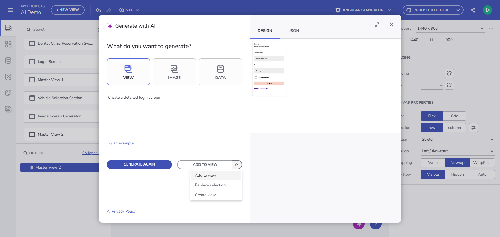
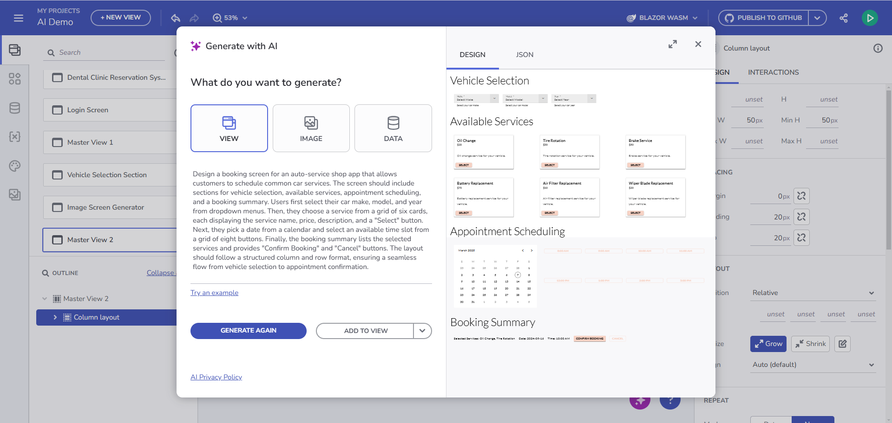

# App Builder AI を使用した作業の開始
このガイドでは、App Builder で新しく導入された AI を活用したコンテンツ生成について説明します。

AI 機能は現在**プレビュー**としてのみ利用可能であり、まだ最終的なデザインではありません。これらの AI 機能は現在も改善中であり、フィードバックを収集することを目的としています。そのため、完全に洗練されておらず、ユーザーの入力に基づいて進化する可能性があります。**プレビュー**機能にはここからアクセスできます: https://preview.appbuilder.dev/

## ビューの生成
App Builder の AI を活用したビューの生成機能は、従来のレイアウト ピッカーに代わる強力な選択肢を提供します。フリーテキストのユーザー プロンプトと複数のプロンプト パターンを活用することで、ユーザーは高度にカスタマイズされたビューを生成し、それを完全に機能するアプリケーションに自動的に変換できます。このアプローチは、アプリ ビューの作成を加速するだけでなく、UI デザインを簡素化し、さまざまなレベルの技術レベルのユーザーがインターフェースを生成できるようにします。


<p style="text-align:center;">ログイン画面</p>

### プロンプト ベースの生成
**手順 1**: GenAI ダイアログにフリーテキスト プロンプトを入力します。

**手順 2**: 生成された結果を **[プレビュー]** セクションで表示します。

**手順 3**: [プレビュー] セクションのプラス ボタンを使用して操作を適用します。
- **コンテンツの追加** – 現在のビューの最後にコンテンツを追加します。
- **新しいビューの作成** – 新しく生成されたコンテンツを別のビュー ページに追加します。
- **コンテンツの置換** – 現在のビューで選択されたコンポーネントを生成された出力に置き換えます。別のものに変換したいセクション/レイアウト/コンポーネントを選択し、もう一度 GenAI ダイアログを開いてプロンプトを配置し、[追加] ボタン -> [コンテンツの置換] オプションをクリックします。

**プレースホルダー値と幅 200px を指定して、要素を「検索」タイプの入力に置き換える例:**


<p style="text-align:center;">コンテンツの置換の置換</p>

ユーザーは、さまざまなコンテキスト メニュー オプションを使用して、ビューを繰り返し生成および調整できます。動作は**現在のビューの状態**と**選択されたコンポーネント**に依存します。

| コンテキスト             | コンポーネントが選択されていません                    | レイアウト コンテナーが選択されています                       | コンテナー以外のコンポーネントが選択されています                   |
| ------------------- | ----------------------------------------- | ----------------------------------------------- | --------------------------------------------------- |
| **コンテンツの追加**     | ビューの末尾にコンテンツを追加します    | 選択したコンテナーにコンテンツを追加します       | 最初に選択されたコンポーネントの前にコンテンツを挿入します |
| **コンテンツの置換** | 現在のビューのコンテンツを完全に置き換えます | 選択されたコンテナーの内容を完全に置き換えます | 選択されたすべてのコンポーネントを置き換えます                    |
| **新しいビューの作成** | 新しいマスター ビューを作成します             | 新しいマスター ビューを作成します                   | 新しいマスター ビューを作成します                       |

> [!NOTE]
> **元に戻す/やり直し**は、**追加**および**置換**アクションではサポートされていますが、新しいビューの作成では**サポートされていません**。
> 生成されたコンテンツにビュー コンテナーが含まれる場合は、**子ビューを作成できます**。
> **AI によって生成されたビュー**と**手動で作成されたビュー**の両方を売り返し改良できます。

### 画像ベースの生成

GenAI ダイアログの [表示] タブのボタンを使用して画像をアップロードします。


<p style="text-align:center;">画像アップロード ビューの生成</p>

> [!NOTE] 
> 画像ベースの生成では、参照に完全に準拠することが保証されるわけではなく、AI によって一部のコンポーネントまたはレイアウトは異なる解釈をされる場合があります。

### ユース ケースの例

#### 例 1: ログイン画面

プロンプト:
```
Create a detailed login screen
```


<p style="text-align:center;">ログイン画面</p>

AI 出力 - Angular テンプレート:

```html
<div class="column-layout group">
	 <h1 class="content">Login</h1>
	 <p class="content">Enter your username and password to log in.</p>
	 <form class="column-layout form">
		  <igx-input-group type="box" class="input">
				<input type="text" placeholder="Enter your username" required igxInput />
				<label igxLabel>Username</label>
				<igx-hint>Username</igx-hint>
		  </igx-input-group>
		  <igx-input-group type="box" class="input">
				<input type="password" placeholder="Enter your password" required igxInput />
				<label igxLabel>Password</label>
				<igx-hint>Password</igx-hint>
		  </igx-input-group>
		  <igx-checkbox labelPosition="after" class="checkbox">Remember me</igx-checkbox>
		  <button igxButton="contained" type="button" igxRipple class="button">Login</button>
		  <a href="#" target="_self" class="ig-typography__body-1 hyperlink">Forgot password?</a>
		  <a href="#" target="_self" class="ig-typography__body-1 hyperlink">Create an account</a>
	 </form>
</div>
```


<p style="text-align:center;">Blazor コードを使用したログイン画面</p>

#### 例 2: カーサービス ビュー

プロンプト:

```
Design a booking screen for an auto-service shop app that allows customers to schedule common car services. The screen should include sections for vehicle selection, available services, appointment scheduling, and a booking summary. Users first select their car make, model, and year from dropdown menus. Then, they choose a service from a grid of six cards, each displaying the service name, price, description, and a "Select" button. Next, they pick a date from a calendar and select an available time slot from a grid of eight buttons. Finally, the booking summary lists the selected services and provides "Confirm Booking" and "Cancel" buttons. The layout should follow a structured column and row format, ensuring a seamless flow from vehicle selection to appointment confirmation.
```


<p style="text-align:center;">自動車整備工場</p>

AI 出力 - Angular テンプレート:

```html
<div class="row-layout group">
		<h2 class="content">
			Vehicle Selection
		</h2>
		<igx-select type="border" placeholder="Select Make" required class="select">
			<igx-select-item value="Toyota">
				Toyota
			</igx-select-item>
			<igx-select-item value="Honda">
				Honda
			</igx-select-item>
			<igx-select-item value="Ford">
				Ford
			</igx-select-item>
			<label igxLabel>Make</label>
			<igx-hint>Select your car's make</igx-hint>
		</igx-select>
		<igx-select type="border" placeholder="Select Model" required class="select">
			<igx-select-item value="Corolla">
				Corolla
			</igx-select-item>
			<igx-select-item value="Civic">
				Civic
			</igx-select-item>
			<igx-select-item value="Mustang">
				Mustang
			</igx-select-item>
			<label igxLabel>Model</label>
			<igx-hint>Select your car's model</igx-hint>
		</igx-select>
```

アプリのプレビューは次のとおりです。


<p style="text-align:center;">自動車整備工場のプレビュー</p>

### より正確な結果を得るための便利なパターン

> [!NOTE]
> これらのパターンを推奨事項として考慮し、通常のプロンプトの説明のフレーズをいつでも使用できます。

#### パターン 1: レイアウトとコンポーネントの組み合わせプロンプト
レイアウトと詳細なコンポーネント構成を組み合わせた、より構造化された出力の場合、複数のセクションを含む全体的な画面デザインを指定できます。次に例を示します。

```
A login screen with:
row layout
	col layout
		title: Login
		text: Please enter your email and password to sign in
		form:
			input: email
			input: password
			switch: remember me
			button: login
			row layout
				text: Dont have an account?
				link: sign up
	image
```

結果:


<p style="text-align:center;">ログイン画面</p>

#### プロンプト 2:

構造化された同等のプロンプト

```
Generate a view with this layout:
nav bar
horizontal group
	nav drawer (isOpen=true, pin=true)
		5 items
	vertical group
		title (color=red)
		horizontal group
			4 cards with media

```
結果:


<p style="text-align:center;">複合ビュー</p>

## 追加の AI 機能

### テーマの生成

**手順:**
1. **AIGen** ダイアログを開き、**[Theme]** タブに移動します。
2. テーマを説明するプロンプトを入力します。
3. インスピレーションを得るには、**[プロンプトの例]** ボタンをクリックしてください。
4. 結果を生成して確認します。
5. **[追加]** をクリックして、テーマを**テーマ ライブラリ**に保存します。
6. プロジェクトにテーマを適用します。


<p style="text-align:center;">アプリ テーマの生成</p>

### 画像の生成

**手順:**
1. **AIGen** ダイアログを開き、**[Image]** タブに移動します。
2. 画像を説明するプロンプトを入力するか、**プロンプトの例**を使用します。
3. 結果に満足したら、**[追加]** をクリックして**画像ライブラリ**に保存します。
これで、プロジェクト内で使用できます。


<p style="text-align:center;">画像の生成</p>

### データ ソースの生成

**手順:**
1. **AIGen** ダイアログを開き、**[Data]** タブに移動します。
2. 必要なデータを説明するプロンプトを入力します。
3. インスピレーションを得るには、**[プロンプトの例]** ボタンをクリックしてください。
4. **[追加]** をクリックして、新しいデータ ソースを作成するか、既存のデータ ソースに追加します。


<p style="text-align:center;">データ ソースの生成</p>

## ご意見の送信

**[ご意見の送信]** フォームを使用して、ご提案、問題の報告、または直面している課題を共有してください。


<p style="text-align:center;">ご意見の送信</p>

## その他のリソース
<div class="divider--half"></div>

* [App Builder インターフェイスの概要](../interface-overview.md)
* [単一ページとナビゲーション](../single-page-apps-and-navigation.md)
* [App Builder コンポーネント](../indigo-design-app-builder-components.md)
* [Flex レイアウト](../flex-layouts/flex-layouts.md)
* [Desktop アプリの実行方法](../running-desktop-app.md)
* [アプリの生成](../generate-app/generate-app-overview.md)
* [Indigo.Design はじめに]({environment:infragisticsBaseUrl}/products/indigo-design/help/getting-started)
