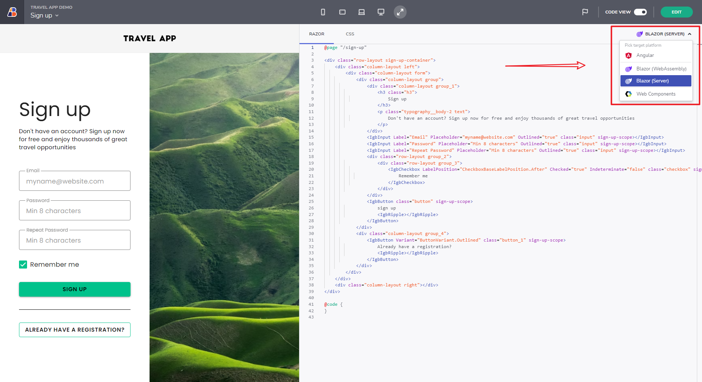

# App Builder による Blazor コード生成

.NET 6 では、Blazor WASM とサーバー コード生成オプションを備えた App Builder のバージョンを公式にサポートしています。このベータ版は、Blazor サポートに関する多数の機能リクエストに続いて公開されます。

つまり、簡単なドラッグアンドドロップで任意の Blazor UI を作成し、次のコンポーネントのすべてのリリース可能な Razor、C#、CSS コードをシングルクリックで取得できます。

Blazor コンポーネントの可用性の一覧については、[アプリの生成](generate-app/generate-app-overview.md#されているコンポーネント)でサポートされているコンポーネントのセクションを参照してください。

好みや要件に基づいて、Blazor Web Assembly アプリまたは Blazor Server アプリの両方を生成できます。

App Builder からの Blazor コード生成

> [!NOTE]
><b>まだ利用できないコンポーネントのコードを生成しようとすると、そのようなコンポーネントがまだサポートされていないことを示すプレースホルダーが表示されます。これにより、デザイナーでより複雑な UI を開発することを控える必要はありません。

### この記事の内容:
* <a href="#introduction">機能の概要</a>
* <a href="#blazor-code-generation">Blazor コード生成</a>
* <a href="#uploading-an-application-to-github">アプリケーションを Github にアップロードする</a>
* <a href="#known-issues-and-limitations">既知の問題点および制限事項</a>

## 概要
好みや要件に基づいて、Blazor Web Assembly アプリまたは Blazor Server アプリの両方を生成できます。前述のように、Blazor コード生成機能は多数のコンポーネントをサポートしますが、多くのコンポーネントをサポートする予定です。グリッドおよびツリー グリッドのコード作成をお見逃しなく - Ignite UI for Blazor のネイティブ グリッド コンポーネントを使用して Blazor アプリケーションを実行できるようにするデータ バインディングなど、ほとんどのグリッド機能がサポートされるようになりました。Excel スタイル フィルタリング、ページング、行編集、セル選択などの機能を利用できます。

## Blazor コード生成
アプリケーションのデザインを完了し、コードをプレビューする前に、`[GitHub に公開]` と `[プレビュー]` アクション ボタンの隣のナビゲーション バーにあるプラットフォーム ピッカー ドロップダウンに注意してください。アプリに適したフレームワークは `[Blazor WASM]` または `[Blazor Server]` オプションを選択して Blazor のコードを生成します。Angular の場合は `[Angular]` または `[Web Components]` を選択します。ピッカーで選択した内容が保存され、次回 App Builder にアクセスしたときにフレームワークが事前に選択されています。

## アプリケーションを Github にアップロードする
アプリケーションをプレビュー モードで表示したり、ローカルにダウンロードしたりする以外に、完全なアプリコード リポジトリを生成するオプションがあります。これを行うには、[アプリの生成] ボタンに移動し、GitHub アカウントを App Builder に接続します。

## 既知の問題点および制限事項
Blazor アプリケーションの生成には、次の制限があります:
- 生成されたアプリケーションでは、Bootstrap はオフになっています。

生成されたコンポーネントには、次の制限があります:

- Card:
    - 逆のアクションは、生成されたコードには反映されません。
    - Actions-column タイプのデバイダーは、生成されたコードに反映されません。
- Navigation Drawer
    - ピン固定のしきい値はサポートしていません。
- Avatar:
    - Initials タイプは、コンテンツを最初の 2 文字に制限しません。
- Icon
    - 生成されたコードで `IgbIcon` を使用しません。アイコンを使用するすべてのコンポーネントも、`IgbIcon` で生成されるわけではありません。
- Date Picker:
    - ダイアログ モードはサポートしていません。
    - 複数の月の表示はサポートしていません。
    - アクション ボタンはサポートしていません。
- Icon Button
    - `IgbIconButton` を生成しませんが、代わりにアイコン付きの `IgbButton` を生成します。
- Input Group - タイプが Date に設定されている場合:
    - 入力形式はサポートしていません。
    - 表示形式を完全にはサポートしていません。
    - ヘルプ テキストはサポートしていません。
    - カスタム プレフィックスとサフィックスはサポートしていません。
    - 最小値と最大値はサポートしていません。
    - 値ループをサポートしていません。
- Radio Group
    - 必須をサポートしていません。
- Grid/Tree Gird:
    - 列の選択はサポートしていません。
    - 行操作はサポートしていません。(アクション ストリップ)
- Rating:
    - `readonly` および `disabled` 入力の [ngModel] バインディングをサポートしていません (Angular の場合)。
    - エクスポートされたコードの評価要素の繰り返しはサポートされていません。
    - Angular と WC にのみ含まれており、Blazor の Rating はありません。

サポートされているすべてのコンポーネントのリストについては、[「アプリを生成」](generate-app/generate-app-overview.md#サポートされているコンポーネント)を参照してください。

## その他のリソース

* [アプリを生成する](./generate-app/generate-app-overview.md)
* [App Builder コンポーネント](indigo-design-app-builder-components.md)
* [Flex レイアウト](flex-layouts/flex-layouts.md)
* [Desktop アプリの実行方法](running-desktop-app.md)
* [はじめに]({environment:appbuilderBaseUrl}/help/getting-started)
* [コンポーネント]({environment:appbuilderBaseUrl}/components)