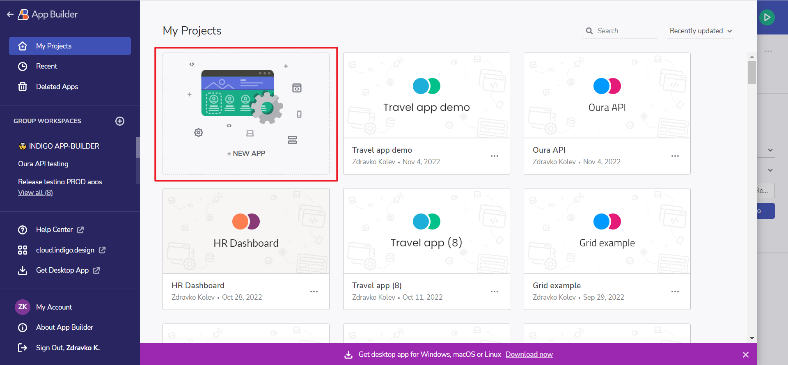
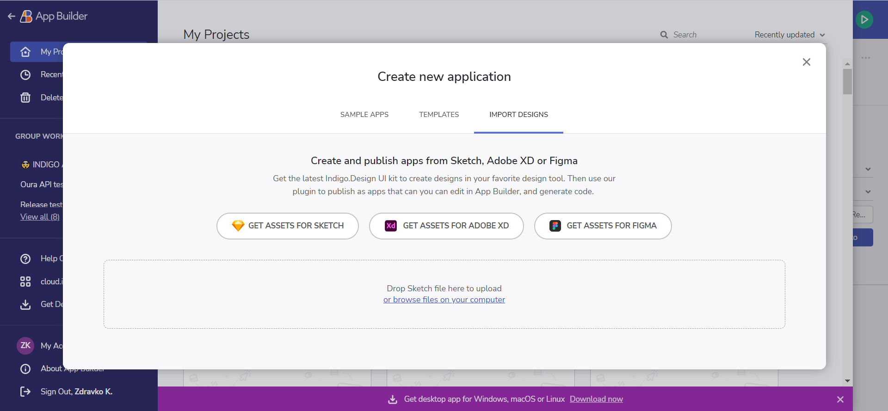
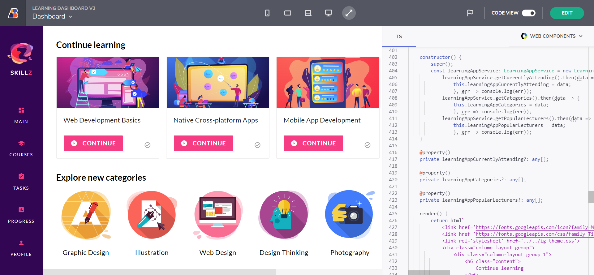
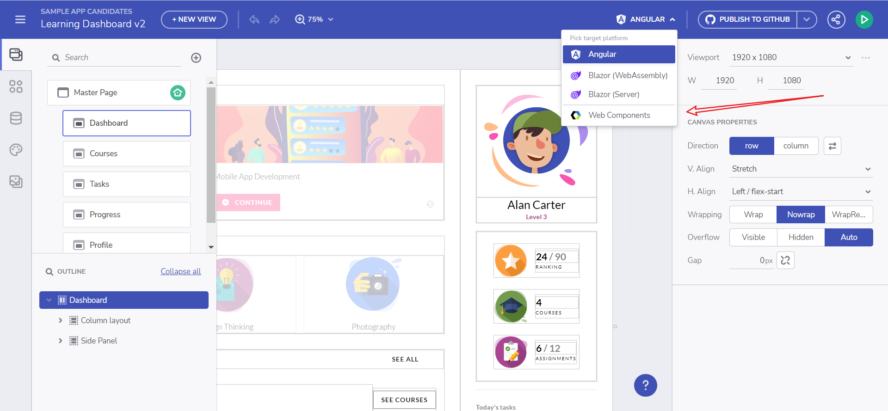
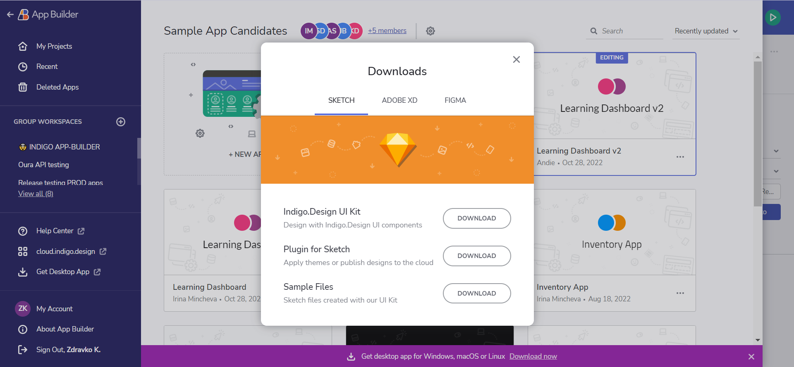
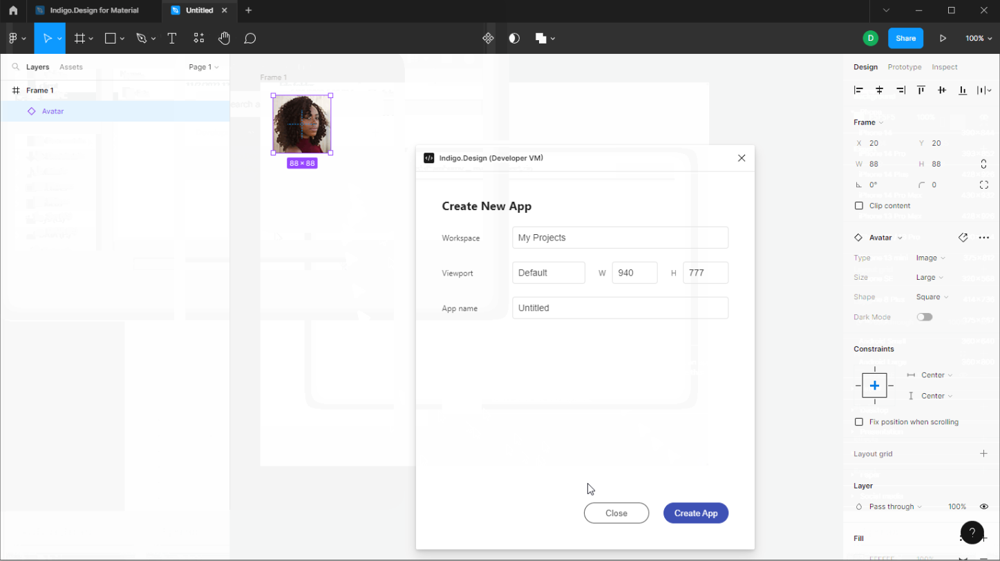

# デザインからコード作成の App Builder ストーリー

App Builder を使用して、ワンク リックでデザインからコードを作成できます。まず、Figma または Sketch 用の [Indigo.Design システム](https://jp.infragistics.com/products/appbuilder/ui-toolkit) を使用してデザインを作成します。その後、Figma プラグインを使用して、App Builder でアプリとして公開できます。Sketch の場合、新しいアプリを作成するときに、Sketch ファイルを App Builder に直接インポートできます。インポートすると、UI キット コンポーネントがツールボックスで使用可能なコンポーネントにマップされます。これにより、データと変数を使用してアプリを拡張し、動的なアプリ エクスペリエンスを作成できます。

Indigo.Design UI キット

> [!NOTE]
> UI キット、プラグイン、サンプル アプリは、[アセットのダウンロード ページ](https://cloud.indigo.design/resources/figma)または[直接リンク](#アセットのダウンロード)からダウンロードできます。

## Indigo.Design システム

[Indigo.Design システム](https://jp.infragistics.com/products/appbuilder/ui-toolkit)は、実際の UI コントロールおよびコンポーネントにマップする UI キットと、これまでにない生産性を提供するツールを独自に組み合わせており、デジタル製品チームがピクセル パーフェクトなデザインからプロダクション対応のコードに移行するのを支援します。デザインしたものはすべて実際の使用可能なコードに変換できるため、デザイナーと開発者間のハンドオフが簡単になります。
### デザイン システムの概要

通常、デザイン システムは、ユーザー インターフェイスの構築方法に一貫性を持たせるための一連のデザイン原則と資産のセットとして説明されます。デザイン システムを使用する 3 つの主な利点:

- 特定の使用状況およびアプリケーションのドメインに合わせることができます。
- UX デザインパターンおよびブランド スタイル ガイダンスの目録として機能します。
- デザイン プロセスを高速化し、一貫性を大幅に向上します。

### デザインをコードに変換
ファイルのインポートまたはお気に入りのデザイン ツールを使用します。
#### ファイルのインポート

以下は、App Builder を使ってドラッグアンドドロップでデザインからコードを作成する 4 つの簡単な手順です。

##### 手順 1: Indigo Cloud または App Builder のホーム画面で [新しいアプリ] をクリックします。

新しいアプリケーション

##### 手順 2: Sketch ファイルを [既存のデザインから作成] ドロップ領域にドラッグします。

デザインのインポート

##### 手順 3: Cloud IDE でデザインを確認します。

アプリケーションのプレビュー

##### 手順 4: Angular コードを確認またはダウンロードします。

アプリケーションのダウンロード

#### プラグインによる公開

このプラグインは、デザインを App Builder に公開します。以下の手順でダウンロードできます。
1. App Builder を開きます。
2. [新しいアプリケーションの作成] をクリックします。
3. [… のアセットを取得する] をクリックします。

利用可能なアセット

これでプラグインの使用を開始できます。

##### Figma プラグイン

Figma プラグイン

## アセットのダウンロード

プラグイン、UI キット、サンプル アプリは[アセットのダウンロード ページ](https://cloud.indigo.design/resources/figma)からダウンロードできます。

または、以下の直接リンクから:
- [Figma UI キット](https://www.figma.com/@infragistics)
- [Figma 用プラグイン](https://www.figma.com/community/plugin/1170035114372031474) 
- [サンプル アプリ](https://download.infragistics.com/products/Infragistics/Indigo.Design/Samples/Infragistics_IndigoDesign_Sample_Apps_Figma.zip)
- [Sketch UI キット](https://dl.infragistics.com/products/Infragistics/Indigo.Design/ABECAC7231EE434C8CD3DC619BE6F75B/Infragistics_IndigoDesign_UI_Kit.zip)
- [サンプル アプリ](https://dl.infragistics.com/products/Infragistics/Indigo.Design/Samples/Infragistics_IndigoDesign_Sample_Apps.zip)
 
## その他のリソース

* [Figma UI キット](ui-kits/figma.md)
* [Sketch UI キット](ui-kits/sketch.md)
