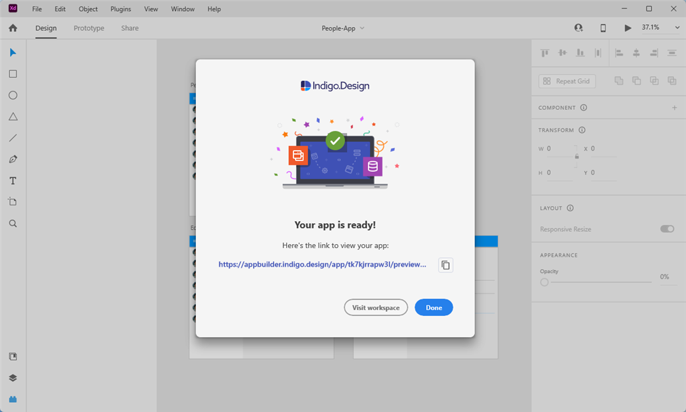

# デザインからコード作成の App Builder ストーリー

App Builder を使用して、ワンク リックでデザインからコードを作成できます。Figma、Sketch、Adobe XD ファイルをインポートしてアプリを簡単に作成できます。[Indigo.Design システム](https://jp.infragistics.com/products/appbuilder/ui-toolkit) プラグインを Figma、Sketch、Adobe XD 内で直接使用して、カスタム テーマの提供、画像アセットのインポート、そしてすべてのコンポーネントが App Builder ツールボックスのコントロールで 1 対 1 でマッピングされるようにします。

Indigo.Design UI キット

## Indigo.Design システム

[Indigo.Design システム](https://jp.infragistics.com/products/appbuilder/ui-toolkit)は、実際の UI コントロールおよびコンポーネントにマップする UI キットと、これまでにない生産性を提供するツールを独自に組み合わせており、デジタル製品チームがピクセル パーフェクトなデザインからプロダクション対応のコードに移行するのを支援します。デザインしたものはすべて実際の使用可能なコードに変換できるため、デザイナーと開発者間のハンドオフが簡単になります。
### デザイン システムの概要

通常、デザイン システムは、ユーザー インターフェイスの構築方法に一貫性を持たせるための一連のデザイン原則と資産のセットとして説明されます。デザイン システムを使用する 3 つの主な利点:

- 特定の使用状況およびアプリケーションのドメインに合わせることができます。
- UX デザインパターンおよびブランド スタイル ガイダンスの目録として機能します。
- デザイン プロセスを高速化し、一貫性を大幅に向上します。

### デザインをコードに変換
ファイルのインポートまたはお気に入りのデザイン ツールを使用します。
#### ファイルのインポート

以下は、App Builder を使ってドラッグアンドドロップでデザインからコードを作成する 4 つの簡単な手順です。

##### 手順 1: Indigo Cloud または App Builder のホーム画面で [新しいアプリ] をクリックします。

新しいアプリケーション

##### 手順 2: Sketch ファイルを [既存のデザインから作成] ドロップ領域にドラッグします。

デザインのインポート

##### 手順 3: Cloud IDE でデザインを確認します。

アプリケーションのプレビュー

##### 手順 4: Angular コードを確認またはダウンロードします。

アプリケーションのダウンロード

#### プラグインによる公開

このプラグインは、デザインを App Builder に公開します。以下の手順でダウンロードできます。
1. App Builder を開きます。
2. [新しいアプリケーションの作成] をクリックします。
3. [… のアセットを取得する] をクリックします。

利用可能なアセット

これでプラグインの使用を開始できます。

##### Figma プラグイン

Figma プラグイン

##### Adobe XD プラグイン

Adobe XD プラグイン アプリの作成

##### Sketch プラグイン

Sketch プラグイン アプリの作成

## Figma UI キット
Sketch と Adobe XD のサポートはすでに利用可能であり、最新の App Builder 22.2 でそのリリースの一部として Figma が追加されたことで、UX と UI 設計のすべての主要なツールをカバーする、デザインからコードへのストーリーにおける新しいマイルストーンに到達しました。 

Figma UI キット

最新の Figma Material Light UI キットは、Ignite UI for Angular、Blazor、および Web Components の UI ツールセットに対応し、デザイン開発プロセスを完全に再定義します。コンポーネント、パターン、スタイリング、およびカスタマイズ オプションの強力なセットを利用できるようになり、プロトタイプまたは Figma で設計された任意のタイプの画面をインポートして、クリーンなコードに変換できるようになりました。最も素晴らしい点は、すべての静的なデザインが、シングル クリックで実際の UI コンポーネント、ブランディング、およびスタイリングを備えたインタラクティブでレスポンシブなアプリになることです。 

以下では、Figma UI キットの追加でもたらせる新しいコントロール、コンポーネント、および品質改善を紹介します。

- Accordion
- Avatar
- Badge
- Banner
- Button
- Button Group
- Calendar
- Card
- Carousel
- Chart - Category および Pie Chart
- Checkbox
- Chip および Chips Area
- Combo
- Date Picker
- Dialog
- Divider
- Drop Down
- Expansion Panel
- Gauge - Linear および Radial Gauge
- Grid - Data Grid、Tree Grid、Hierarchical Grid、Pivot Grid
- Hyperlink
- Icon
- Input
- List
- Navigation Drawer
- Progress Bar
- Radio Group
- Select
- Slider
- Snackbar
- Splitter
- Stepper
- Switch
- Tabs
- Text Area
- Time Picker
- Toast
- Tree
- Tooltip

## Adobe XD UI キット

Adobe XD は、デザイナーがワイヤーフレームやアプリをデザインできる最新の使いやすいツールを提供するためにゼロから作成されたもので、今日の市場で人気のあるベクター グラフィック デザイン プラットフォームの 1 つです。ワイヤーフレーム機能に加えて、デザイナーは忠実度の高いプロトタイプを作成し、デザイン プロセスを通じてチーム間で協力し、アニメーションを構成し、フィードバックを収集することができます。

Adobe XD プラグイン

**App Builder を使用して Adobe XD を HTML コードに変換する方法**

開始するための前提条件がいくつかあります。

1. アカウントにログイン、または App Builder の無料トライアルを開始します。 
2. アカウントにログイン、または Adobe XD の無料トライアルを開始します。 

Adobe XD をインストールしたら、デザインからコード作成を可能にする Indigo.Design App Builder プラグインをインストールする必要があります。  これには、Creative Cloud アプリの Stock＆Marketplace-> Plugins にアクセスし、Indigo.Design を検索します。

Indigo.Design App Builder プラグインをインストールした後、Infragistics の UI キットに基づくデザインが必要です。デザインからコードへのデザインが App Builder で機能する方法は、Adobe XD でのデザインを UI キットを使用して作成する必要があるということです。UI キットは、デザイン フェーズを加速する UI コンポーネントと UI パターンのフル機能で拡張可能でカスタマイズ可能なライブラリです。

デザインの準備ができたら、App Builder に公開できます。

Adobe XD デザインを App Builder にインポートする方法の詳細については、 [この詳細な説明のブログ記事 (英語) を参照してください。](https://www.infragistics.com/community/blogs/b/jason_beres/posts/adobe-xd-to-html-code)

## Sketch UI キット

ここ数年で、デザインからコードへの強力な動きが生まれ、Sketch が中断したところから再開しました。目標は、Sketch のデザインを使用可能なコードに簡単に変換できるようにする、シームレスで一貫性のある使いやすいプロセスを作成することです。
