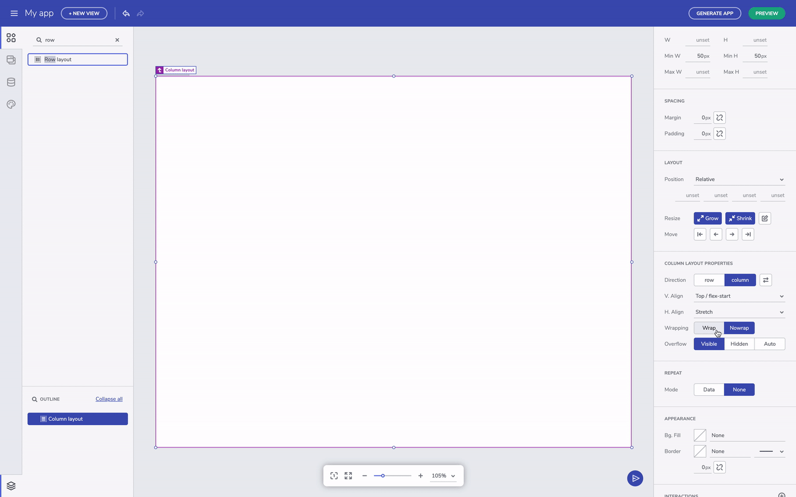
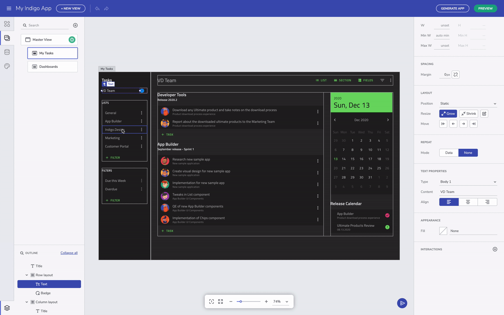

# Flex レイアウト (および配置) 
### Flex レイアウトとは? 
Flex レイアウトは、コンポーネントの配置、項目間のスペースの配置、サイズ変更に使用されます。強力な配置機能を提供し、列または行に要素をレイアウトし、あらゆる画面サイズに簡単に適応するレスポンシブ ページ レイアウトを構築します。

### Flex レイアウトの使用方法
Flex レイアウトは、レイアウト コンテナーのサイズを簡単に指定し、可視性とビューポート サイズを定義し、利用可能なスペースに合わせて項目をそれぞれ縮小または展開できるように設計されています。

このすべてを実現するために、Flex レイアウトを使用する際に最初に行う必要があるのは、コンテナーまたは親要素を対象にし、コンテナー要素の CSS を調整することです。

### App Builder で Flex レイアウトを作成する方法
App Builderで Flex レイアウトを使用するには、コンテナー (ビデオではキャンパスと呼ばれます) を定義する必要があります。display プロパティは自動的に Flex に設定されます。[ビュー] に移動し、新しいコンテナーを追加し、Flex レイアウト行または Flex レイアウト列を選択します。

さまざまな Flex レイアウト プロパティから選択して配置を定義したり、flex 項目のデフォルトの動作、その他の値を設定したりできます。

<section class="video-container">
    

        

            <iframe width="800" height="450" src="https://www.youtube.com/embed/BRkaSYr7qHU?si=74eY9-rqm90A8kmh&list=UULF8cj8_eJROxAXsOjhbvduLw" frameborder="0" allowfullscreen></iframe>
        

        
 アプリのレイアウトを作成する

    

</section>

App Builder と通常の製品デザイン ツールの最大の違いの 1 つは、デザインからコードまでのツールで使用される Flex に基づくレイアウトです。App Builder は Web アプリを対象としているため、レイアウトを作成するアプローチの 1 つとして Flex を提供しています。ツールボックスの行または列のレイアウト ンポーネントとして利用できます。ここに表示されている最も外側のコンテナはキャンバスであり、flex 設定がすでに適用されています。プロパティ パネルで Viewport のサイズを編集することにより、キャンバス サイズを変更できます。

キャンバス サイズの変更

## 行と列のレイアウト 

Flex レイアウト コンテナには、ネストされた UI 要素の位置を変更できる設定があります。H.align プロパティと V.Aalign プロパティには、それぞれのドロップダウンから簡単に適用できる flex プロパティがあります。キャンバスのデフォルトは行レイアウトで、水平方向に左揃えになり、垂直方向に引き伸ばされます。何から始めたかに関係なく、いつでも行と列のレイアウトを切り替えることができます。レイアウト コンテナのサイズはコンテンツに基づいていますが、高さと幅はいつでも指定できます。Padding プロパティをコンテナに追加し、マージンを追加して子 UI 要素のスペースを空けることもできます。これは、特定のコンポーネントを選択し、画面右側のプロパティ パネルでパディングまたはマージンを編集した後に実行できます。

レイアウト プロパティ

子要素のラベルをクリックすると、いつでも親 UI 要素を選択できます。これは、ネストされたレイアウト コンテナがある場合に役立ちます。一方、左下隅の [アウトライン] メニューから必要なコンポーネントを直接選択することもできます。

親コンポーネントを選択する

## 流動的なサイズ変更と折り返し 

他の注目に値するプロパティは、拡大と縮小に関連しています。これらは、Viewport のサイズが変更されたときにコンポーネントのサイズ変更に影響します。コンポーネントを `grow` に設定すると、コンテナが行レイアウトの場合は行方向に、列レイアウトの場合は列方向に展開されます。
 

列/行のレイアウト オプションを拡大する

## コンテキスト メニューからレイアウトに追加 

既存のコンポーネントを新しいレイアウトに追加する必要がある場合は、非常に便利なオプションがあります。選択したコンポーネントを右クリックすると、コンテキスト メニューがトリガーされ、要素を行または列のレイアウトに追加できます。

コンテキスト メニューからレイアウトにコンポーネントを追加する

## その他のリソース

簡単にまとめると、Flex レイアウトについて学んだことはすべて、エディターでそのまま使用できます。Flex と CSS を初めて使用する人にとっては、慣れるまでに少し時間がかかりますが、時間の経過とともに、レイアウトを行と列として考えることがはるかに簡単になります。最も重要なのは、Flex レイアウトは、画面サイズに適応するアプリケーションを構築し、レイアウト内のコンポーネントの動作を定義するのに役立ちますが、絶対レイアウトでは、1 つの画面サイズのみに対して特定のデザインを行うことができます。

* [App Builder コンポーネント](../indigo-design-app-builder-components.md)
* [Flexbox](https://developer.mozilla.org/ja-JP/docs/Learn/CSS/CSS_layout/Flexbox)
* [Flexbox のガイド (英語)](https://css-tricks.com/snippets/css/a-guide-to-flexbox/)
* [Flexbox Froggy (英語)](https://flexboxfroggy.com/)
* [Indigo.Design はじめに](https://jp.infragistics.com/products/indigo-design/help/getting-started)
* [Indigo.Design スタイル設定の概要](https://jp.infragistics.com/products/indigo-design/help/style/styling-overview)
