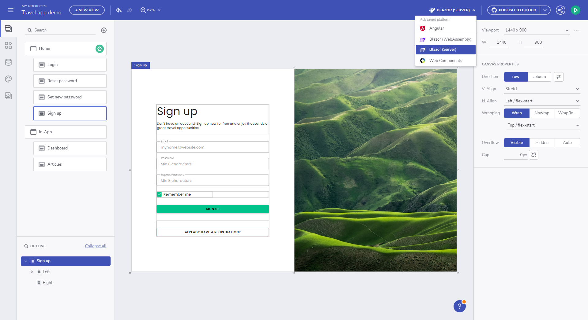
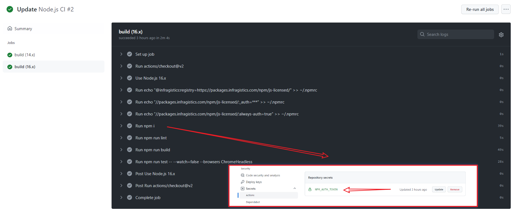

# アプリを生成する

> [!NOTE]
><b>Ignite UI App Builder でデザインされたアプリケーションは、ダウンロードするか、GitHub リポジトリに直接アップロードできます。 

<section class="video-container">
    

        

            <iframe width="100%" height="450" src="https://www.youtube.com/embed/zxT-nIXKn7I" frameborder="0" allowfullscreen></iframe>
        

        
コードのプレビューと生成について

    

</section>

Angular コード生成を備えた App Builder が市場に出てから数か月が経ちましたが、.NET 6 リリースでは Blazor コード生成を開始し、現在では Web コンポーネント コード生成もサポートしています。

プラットフォーム ピッカー ドロップダウンは、`[GitHub に公開]` と `[プレビュー]` アクションボタンの隣のナビゲーション バーにあります。`[Blazor Server`/`Blazor Web Assembly`] オプションを選択して Blazor のコードを生成するか、`[Angular]` で生成したアプリとコードのプレビューを表示します。`Web Components` オプションも利用できます。

コード生成のプラットフォームの選択

すべてのスタイリングおよびレイアウト プロパティを使用してアプリケーションが生成されると、デザインおよび開発のユーザー ストーリーが完成します。現在、Ignite UI App Builder には、すべてのアプリケーション ファイルを GitHub リポジトリにアップロードするか、パッケージとしてダウンロードしてローカルで実行するオプションがあります。

## ライセンス コードのエクスポート

### ライセンス ユーザー
**ライセンス ユーザー**の場合、アプリ生成時に [Ignite UI for Angular](https://jp.infragistics.com/products/ignite-ui-angular) のライセンス版パッケージが使用されます。これは、**アプリケーションのダウンロード**と **GitHub への公開**の両方に適用されます。

アプリケーションを GitHub に公開する際、プロジェクトのビルドと、基本テストを実行する CI を追加します。ライセンス版パッケージを使用するために GitHub CI から必要な NPM_AUTH_TOKEN も公開します。

NPM 認証トークン

### トライアル ユーザー
**トライアル ユーザー**の場合、アプリ生成時に [Ignite UI for Angular](https://jp.infragistics.com/products/ignite-ui-angular)の無料トライアル版パッケージが使用されます。これは、**アプリケーションのダウンロード**と **GitHub への公開**の両方に適用されます。

フル ライセンス パッケージにアップグレードする方法 (プロジェクトが Ignite UI for Angular のトライアル版を使用している場合)、および、ライセンス版の npm フィードを使用するように環境と CI をセットアップする方法については、[ライセンス FAQ とインストール ドキュメント](https://jp.infragistics.com/products/ignite-ui-angular/angular/components/general/ignite-ui-licensing) を参照してください。

あるいは、`npm run infragistics-login` を実行するとライセンス フィードへのログインが案内されます。

## サポートされているコンポーネント

現在、AppBuilder は Angular と Blazor のコード生成をサポートしています。以下は、プラットフォームごとにサポートされているコンポーネントのリストです:

| コンポーネント              | Angular            | Blazor             | Web Components     |
|------------------------|--------------------|--------------------|--------------------|
| **レイアウト**                                                                           |
| Absolute Layout        | :heavy_check_mark: | :heavy_check_mark: | :heavy_check_mark: |
| Card                   | :heavy_check_mark: | :construction:     | :construction:     |
| Column Layout          | :heavy_check_mark: | :heavy_check_mark: | :heavy_check_mark: |
| Expansion Panel        | :heavy_check_mark: | :heavy_check_mark: | :heavy_check_mark: |
| Row Layout             | :heavy_check_mark: | :heavy_check_mark: | :heavy_check_mark: |
| Tab Layout             | :heavy_check_mark: | :heavy_check_mark: | :heavy_check_mark: |
| Divider                | :heavy_check_mark: | :x:                | :x:                |
| **メニューおよびナビゲーション**                                                               |
| Navigation Bar         | :heavy_check_mark: | :heavy_check_mark: | :heavy_check_mark: |
| Navigation Drawer      | :heavy_check_mark: | :construction:     | :construction:     |
| Views Container        | :heavy_check_mark: | :heavy_check_mark: | :heavy_check_mark: |
| **コンテンツ**                                                                           |
| Avatar                 | :heavy_check_mark: | :construction:     | :construction:     |
| Calendar               | :heavy_check_mark: | :heavy_check_mark: | :heavy_check_mark: |
| Chip                   | :heavy_check_mark: | :heavy_check_mark: | :heavy_check_mark: |
| Icon                   | :heavy_check_mark: | :construction:     | :construction:     |
| Image                  | :heavy_check_mark: | :heavy_check_mark: | :heavy_check_mark: |
| Link                   | :heavy_check_mark: | :heavy_check_mark: | :heavy_check_mark: |
| Text                   | :heavy_check_mark: | :heavy_check_mark: | :heavy_check_mark: |
| Title                  | :heavy_check_mark: | :heavy_check_mark: | :heavy_check_mark: |
| **入力およびフォーム**                                                                     |
| Button                 | :heavy_check_mark: | :heavy_check_mark: | :heavy_check_mark: |
| Button Group           | :heavy_check_mark: | :x:                | :x:                |
| Checkbox               | :heavy_check_mark: | :heavy_check_mark: | :heavy_check_mark: |
| Combo                  | :heavy_check_mark: | :x:                | :x:                |
| Date Picker            | :heavy_check_mark: | :construction:     | :construction:     |
| Drop Down              | :heavy_check_mark: | :heavy_check_mark: | :heavy_check_mark: |
| Floating Action Button | :heavy_check_mark: | :heavy_check_mark: | :heavy_check_mark: |
| Icon Button            | :heavy_check_mark: | :construction:     | :construction:     |
| Input Group            | :heavy_check_mark: | :construction:     | :construction:     |
| Radio Group            | :heavy_check_mark: | :construction:     | :construction:     |
| Select                 | :heavy_check_mark: | :x:                | :x:                |
| Slider                 | :heavy_check_mark: | :heavy_check_mark: | :heavy_check_mark: |
| Switch                 | :heavy_check_mark: | :heavy_check_mark: | :heavy_check_mark: |
| Text Area              | :heavy_check_mark: | :x:                | :x:                |
| Rating                 | :heavy_check_mark: | :x:                | :heavy_check_mark: |
| **グリッドおよびリスト**                                                                     |
| Grid                   | :heavy_check_mark: | :construction:     | :construction:     |
| Tree Grid              | :heavy_check_mark: | :construction:     | :construction:     |
| List                   | :heavy_check_mark: | :heavy_check_mark: | :heavy_check_mark: |
| Tree                   | :heavy_check_mark: | :heavy_check_mark: | :heavy_check_mark: |
| **通知**                                                                     |
| Badge                  | :heavy_check_mark: | :heavy_check_mark: | :heavy_check_mark: |
| Banner                 | :heavy_check_mark: | :x:                | :x:                |
| Dialog Window          | :heavy_check_mark: | :x:                | :x:                |
| Snackbar               | :heavy_check_mark: | :heavy_check_mark: | :heavy_check_mark: |
| Reveal Dashboard       | :heavy_check_mark: | :x:                | :x:                |

> 注: 部分的に生成されたコンポーネントは :construction: でマークされます。Blazor コンポーネントの既知の問題および制限の詳細については、[Blazor サポート](../blazor-support.md#既知の問題点および制限事項)を参照してください。

## その他のリソース

* [Blazor サポート](../blazor-support.md)
* [アプリケーションを GitHub にアップロードする](upload-application-to-github.md)
* [アプリケーションをローカルで実行する](run-application-locally.md)
* [アプリケーション コードのプレビュー](../preview-code.md)
* [Indigo.Design はじめに](https://jp.infragistics.com/products/indigo-design/help/getting-started)
* [App Builder コンポーネント]({environment:appbuilderBaseUrl}/components)
