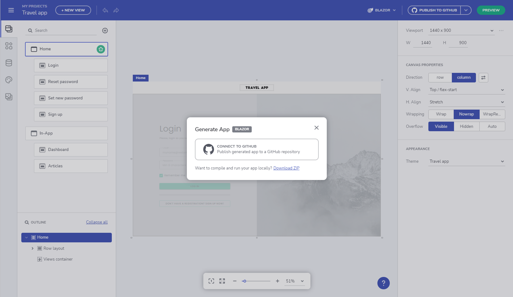
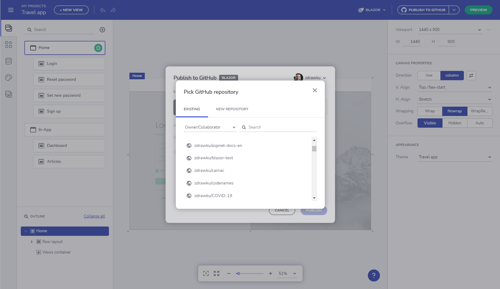
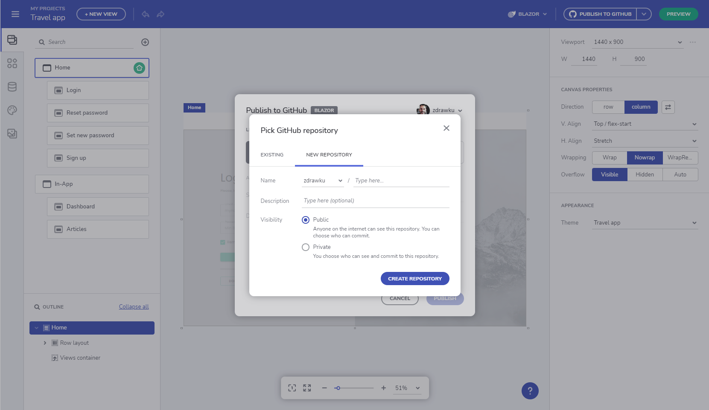

# アプリケーションを Github にアップロードする

> [!NOTE]
><b>App Builder でデザインの準備ができたら、非公開または GitHub リポジトリにアップロードできます。 

### トピック コンテンツ:
* <a href="#はじめに">はじめに</a>
* <a href="#uploading-an-application-to-github">アプリケーションを Github にアップロードする</a>

## はじめに
App Builder の優れた機能の 1 つに、コード生成サービスがあります。アプリ デザインを完成させ、コードをレビューすると、ユーザーは最終的なアプリケーションコードを取得できます。アプリ コードを App Builder 内から直接 GitHub リポジトリに簡単にアップロードできるため、エクスペリエンスがさらに向上します。GitHub は開発者に人気のあるツールで、App Builder 機能を使用すると、レビューアーの割り当て、変更の追跡、コメントなど、すべての GitHub 機能を利用できます。この機能を提供することにより、製品チームはデザインからコード作成へのコラボレーションのストーリーにさらに 1 つの要素を追加するだけでなく、App Builder プラットフォームを、エンジニアに馴染みのある有名なサービスと統合しました。 

## アプリケーションを Github にアップロードする
アプリケーションのデザインを完了し、そのコードをプレビューした後、完全なアプリ コード リポジトリを生成します。これを行うには、[アプリの生成] ボタンに移動し、GitHub アカウントを App Builder に接続します。ボタン メニューからアプリケーション ファイルをダウンロードすることもできます。

App Builder を GitHub に接続する

GitHub アカウントでログインした後、Indigo.Design にアクセスしてアプリ コードが保存されるリポジトリを取得する必要があります。ここで、新しいリポジトリの作成または既存のリポジトリへの追加を選択できます。新しいリポジトリを作成する場合、アプリの名前を指定し、説明を追加して公開または非公開リポジトリを選択できます。準備ができたら、アプリのファイルを GitHub にアップロードし、新しい GitHub リポジトリを作成します。

アプリケーションを GitHub の既存のリポジトリに公開する

GitHub に新しいリポジトリを作成する

アップロード プロセスが完了したら、ユーザーは App Builder 内から GitHub リポジトリに変更を適用するか、[GitHub で表示] をクリックして GitHub で更新されたファイルを表示できます。

VS Code で実行されるアプリケーション

## GitHub との統合機能

### すでにプッシュされた変更は上書きされません
App Builder ではなく、コードを使用して外部でアプリケーションの変更を行う場合があります。App Builder GitHub UI から変更をプッシュすると、これらの変更は上書きされません。App Builder 以外の main/master ブランチでのユーザー変更を尊重する新しい統合ポイントを追加しました。App Builder の作業を `main` ブランチにマージでき、次回 App Builder は新しい違いのみを含む PR を作成します。

機能改善:
- プルリクエストの関連ブランチで外部変更が行われた場合の警告。これらの変更を保持するには、現在のプルリクエストをマージしてから新しいリクエストを作成します。

'X' はこのブランチでまだマージされていない変更を加えました

- 他のアプリケーションまたはプラットフォームに対応するリポジトリが選択された場合の警告。

'X' リポジトリは、以前は 'Z' プラットフォームの 'Y' アプリを公開するために使用されていました

- アプリケーションの履歴で使用される異なるリポジトリ間を行き来できます。
- 競合が見つかった場合の警告とガイダンス。

> [!NOTE]
> これらの変更は GitHub との一方向の操作であることに注意してください (つまり、Github の変更を AppBuilder に戻すことはできません)。

## その他のリソース

* [アプリケーションをローカルで実行する](run-application-locally.md)
* [アプリケーション コードをプレビューする](../preview-code.md)
* [Indigo.Design はじめに](https://jp.infragistics.com/products/indigo-design/help/getting-started)
* [Indigo.Design コンポーネント](https://jp.infragistics.com/products/indigo-design/help/components/components-overview)
