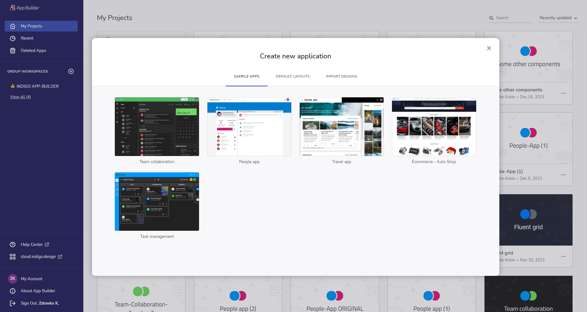

# App Builder を使用した作業の開始

> [!NOTE]
><b>App Builder は、Indigo.Design ホーム画面の [アプリ] タブまたは [App Builder ドメイン](https://cloud.indigo.design/login-and-redirect?target=appbuilder&path=/)から起動できます。そこから、すべてのアクティブなアプリケーションを管理することもできます。App Builder でアプリの編集が完了したら、[コードの生成] ボタンからコードを生成し、ローカルで実行します。

### トピック コンテンツ:
* <a href="#app-builder-を起動する">Indigo.Design から App Builder を起動する</a>
* <a href="#コードの取得">コードの取得</a>
* <a href="#アプリをローカルで実行する">アプリをローカルで実行する</a>

<section class="video-container">
    

        

            <iframe src="https://www.youtube.com/embed/DK50La2GFJ0" frameborder="0" allowfullscreen></iframe>
        

        
App Builder を使ってみましょう

    

</section>

## App Builder を起動する
App Builder プロファイルに直接ログインするか、Indigo.Design でサインインします。ホーム画面が表示されます。ここから 3 つの主要な Indigo.Design 製品 (プロトタイプとユーザビリティ テスト)、および最新の App Builder ([アプリ] タブ) にアクセスできます。

App Builder のホーム画面から、ユーザーは新しいアプリを起動し、既存のアプリをプレビューまたは編集できます。コンテキスト メニューを使用して、既存のアプリを名前変更、複製、またはアーカイブすることもできます。

App Builder サインイン

Indigo.Cloud サインイン

Indigo.Design ホーム画面

[App Builder]({environment:infragisticsBaseUrl}/products/indigo-design/app-builder) を初めて起動したときに表示されるのは、簡単なオンボーディング ツアーを提案するポップアップ ウィンドウです。次に表示されるのは、[新しいプロジェクト] の作成ダイアログです。新しいアプリを開始する方法は 4 つあります:
1. <b>既存のデザインから作成</b> - Sketch の Indigo.Design UI キットを使用して作成された既存の Sketch ファイルがある場合、この時点でアップロードして App Builder でデザインを続行できます。Sketch の絶対レイアウトと App Builder の Flex レイアウトの違いにより、Sketch ファイルの解析後に追加の調整が必要になる場合があります。
2. <b>サンプル アプリ</b> - 入門アプリは、App Builder を使用して作成されたアプリケーションを探索するのに役立ち、独自のユーザー スペースでそれらを変更することもできます。また、独自のアプリを最初から作成しなくても、より大きなアプリケーション用に生成されたコードをプレビューするための優れたソースです。App Builder を初めて使用する場合は、[Sample Apps] オプションを開始点として使用することをお勧めします。これは、ツールのすばらしい機能を利用してアプリケーションの構築を開始するための最も簡単な方法です。
3. <b>既定のレイアウト</b> - 定義済みの基本レイアウトを使用して新しいアプリケーションを作成します。
4. <b>Blank (空白)</b> - 新しいアプリを最初から作成します。

[新しいプロジェクト] ダイアログ

注: App Builder にアクセスすると、デザイン時に App Builder を終了せずに、アプリ内のサイド メニューからアクティブなアプリケーションを簡単に切り替えたり、App Builder のワークスペースに戻ることができます。

サイド メニュー

## コードの取得
App Builder は、常にライブ実行中の Web アプリケーションをデザイン画面とプレビュー ウィンドウの両方に表示します。基になるコードとアプリケーション モデルは、デザイン画面でアプリケーションに変更を加えると、リアルタイムで更新されます。生成されたアプリケーション コードはプレビュー ウィンドウでいつでも表示できます。また、生成されたアプリケーションを完全なアプリケーション コード リポジトリとしてダウンロードして、選択したコード エディターで開くこともできます。次に、App Builder を使用してデザインしたアプリケーションをマシン上でローカルにビルドして実行し、生成されたコードに追加の変更を加えることができます。
 

アプリケーション プレビュー ウィンドウ

生成されたアプリケーションのコードを VS Code で実行する

> [!NOTE]
> アプリケーションのコードがダウンロードされると、ローカルで行われた変更は App Builder ユーザー スペースに反映されません。

## オンプレミス版の App Builder
App Builder は、ソフトウェア製品の検出、ソフトウェア製品の設計、インタラクティブな製品概念実証の構築、ピクセルパーフェクトなコード プロジェクトの生成などの統合プラットフォームを開発者、デザイナー、製品マネージャーに提供する SaaS です。

規制の厳しい業界に属する企業もあります。ほとんどの場合、セキュリティ上の理由から、App Builde rなどのクラウド ベースのソリューションへのアクセスが制限されているか、特定の場所でのインターネット接続が制限されています。このセグメントをカバーするためには、このような組織が App Builder をファイアウォールの内側に導入するための簡単な方法を提供する必要がありました。この方法では、独自のインフラ上で動作するプラットフォームのインスタンスを使用し、内部の人員のみがアクセスできるようにする必要がありました。

オンプレミス アプリケーションは信頼性が高く、安全であるため、クラウドでは実現できないレベルの制御を維持できます。

オンプレミス ソリューションの[インストール方法に関する技術的な詳細](on-prem-prerequisites-and-installation.md)については、このトピックを参照してください。

オンプレミス版

## アプリをローカルで実行する

ダウンロードしたアプリケーションを実行するには、次の前提条件がマシンにインストールされている必要があります。生成されたアプリケーションをローカルで実行する方法の詳細については、[このトピック](generate-app/run-application-locally.md)を参照してください。

1. NodeJS.
2. Visual Studio Code (VS Code をお勧めしますが、別のコード エディターを使用することもできます)。

    

      
      <a target="_blank" href="https://nodejs.org/en/download/" class="no-external-icon"
         style="color:white;background-color:#09f;text-decoration:none;font-weight:700;font-size:16px;padding: 5px 15px 5px 15px;">
        NODE のダウンロード
      </a>
    

    

      
      <a target="_blank" href="https://code.visualstudio.com/download" class="no-external-icon"
         style="color:white;background-color:#09f;text-decoration:none;font-weight:700;font-size:16px;padding: 5px 15px 5px 15px;">
        VS CODE のダウンロード
      </a>
    

## チュートリアル ビデオ
ローコードな App Builder について詳しくは、このビデオ チュートリアルをご覧ください:

> [!Video https://www.youtube.com/embed/WSQ38lLacH4]

## 問題の報告またはフィードバックの送信

[このリポジトリ](https://github.com/IgniteUI/app-builder)は、問題や機能リクエストの送信、および製品の全般的なディスカッション、質問、共有したいフィードバックを対象としています。
## その他のリソース

* [App Builder インターフェイスの概要](interface-overview.md)
* [単一ページとナビゲーション](single-page-apps-and-navigation.md)
* [App Builder コンポーネント](indigo-design-app-builder-components.md)
* [Flex レイアウト](flex-layouts/flex-layouts.md)
* [Desktop アプリの実行方法](running-desktop-app.md)
* [アプリを生成する](generate-app/generate-app-overview.md)
* [Indigo.Design はじめに](https://jp.infragistics.com/products/indigo-design/help/getting-started)