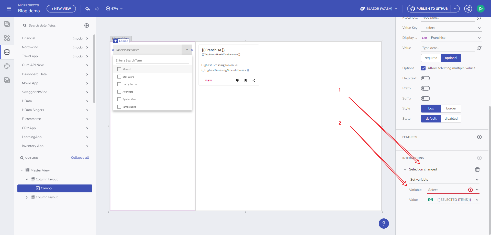

# App Builder でのコンポーネント プロパティのバインド

App Builder でコンポーネント プロパティにバインドするには、コンポーネントの構成のプロパティをさまざまなデータ ソースに接続する必要があります。このプロセスは、バインド可能なコンポーネントの各プロパティに表示されるプラグ アイコンによって容易になります。これをよりよく理解するために例を詳しく見てみましょう。

## 変数を使用した簡素バインド

以前は、Title と Subtitle を Card コンポーネントにバインドするには、データ配列を反復処理する必要がありました。この反復により、特定のデータ フィールドをバインドするためにデータ コンテキストが使用できるようになりました。ただし、変数の導入により、バインドはより多用途になりました。今後は、任意の型の変数を作成し、それを Card コンポーネントに直接バインドできるため、データ リピーターが不要になります。

> [!NOTE]
> このトピックの例では、[Northwind WebAPI](https://data-northwind.indigo.design/swagger/index.html) を使用します。

### 配列変数を介して繰り返されるデータ

映画のコレクションがあり、選択したものに基づいて最も興行収入の高い映画の詳細を表示したいというシナリオを考えてみましょう。以下はその方法です。

1. **映画コレクションをバインドする**: 映画コレクションを、複数の選択をサポートするコンポーネント (Combo box など) に接続します。前述のように、イベント ハンドラーを追加し、変数アクションを設定します。

配列型の変数

1. **配列変数を作成する**: 「Box Office Revenue」 型の空の配列変数を作成します。データ タイプは、Combo コンポーネントのデータ ソースに基づいて自動的に決定されます。

   
   
新しい変数のダイアログ

2. **Card コンポーネントにバインドする**: 「selectedMovies」 変数をカード コンポーネントにリンクします。Title プロパティと Subtitle プロパティをデータ コンテキストの適切なデータ フィールドにバインドします。

   
   
データ コンテキストのバインド

その結果、選択に基づいて動的に更新されるカード コンポーネントが生成されます。

結果

## グローバル変数を使用したクロスビュー通信

変数のスコープを理解することは非常に重要です。ここまで学習したことは以下の通りです。

- **グローバル変数**: 異なるビュー間のデータ転送を容易にします。1 つのビューで作成されたグローバル変数は、他のすべてのビューでアクセスできます。
- **ローカル変数**: 同じビューのコンポーネント内でデータ交換を処理します。

## 重要ポイント

App Builder コンポーネント バインドの本質は何ですか?

- **柔軟性の向上**: App Builder の変数を使用すると、より柔軟で効率的なデータ バインドが可能になり、データ リピーターの必要性が減ります。
- **簡素化されたデータコンテキスト**: 変数をコンポーネントに直接バインドすることで、動的な UI 要素の作成が簡素化されます。
- **スコープの認識**: グローバル変数とローカル変数の違いを理解することは、さまざまなビューにわたって効果的なデータ管理を行うためのキーとなります。
- **実用化**: 映画コレクションをカード コンポーネントにバインドするプロセスは、データ バインドに変数を使用することの実用性と容易さを示しています。

## その他のリソース

- [変数の管理](variables-management.md)
- [URL パラメーターのバインド](url-parameters-binding.md)
- [ルート パラメーターを使用したナビゲーション](route-parameters-navigation.md)
- [イベントとアクションの操作](working-with-events-and-actions.md)
- [マスター/詳細の概念](../master-detail/master-detail.md)
- [ステップバイステップのアプリ作成例](../master-detail/step-by-step-examples.md)
- [App Builder コンポーネント](../indigo-design-app-builder-components.md)
