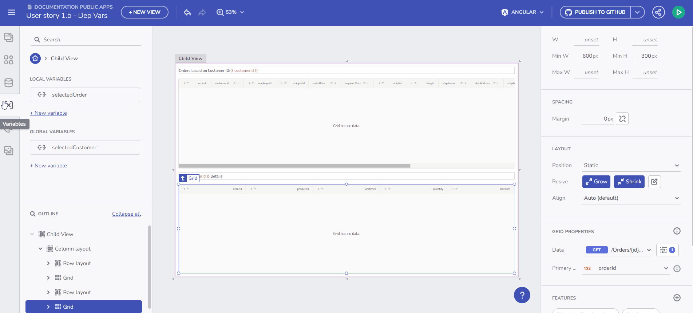
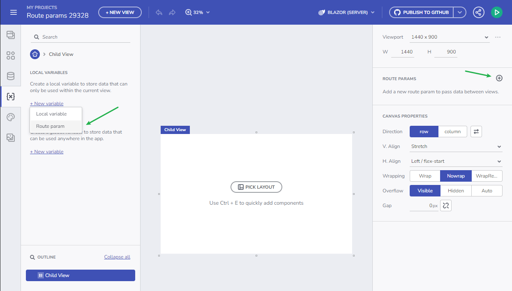
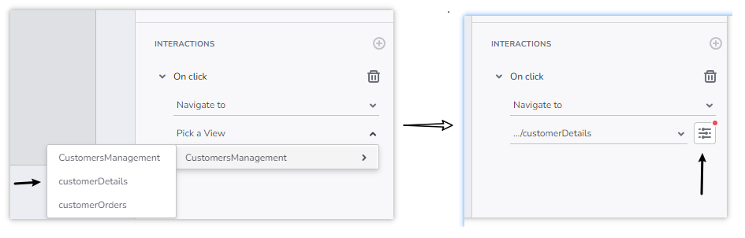

# ルート パラメーターを使用したナビゲーション ガイド

アプリケーションの状態を管理する方法のひとつとして、App Builder の**特別な種類**の変数 (`ルート パラメーター`など) を使用すると、アプリケーション内のナビゲーションが容易になります。

## ルート パラメーターについて

ルート パラメーターは変数として機能し、ユーザーによる作成、値の保存と割り当て、アプリケーション内の他のプロパティへのバインド、が可能です。ただし、ルート パラメーターには、ユーザーがアプリ内でナビゲーションを構築できるようにするという特定の用途があります (ナビゲーションを参照)。ナビゲーション ルートにパラメーター バインドが必要な場合、ユーザーはルート パラメーターをバインドしてこのプロセスを容易にすることができます。

アプリ変数とルート パラメーターの主な違いは次のとおりです。

- ルート パラメーターは子ビューでのみ作成でき、子ビューは特定のナビゲーション ルートのランディング ページとして機能します。
- ルート パラメーターには、`string` (文字列)、`numeric` (数値)、または `boolean` (ブール型) のみを使用できます。他のタイプのサポートは将来のバージョンで導入される予定です。
- ルート パラメーターは初期値をサポートしますが、`boolean` ルート パラメーターは `FALSE` 初期値のみをサポートします。
- ルート パラメーターは、変数の設定アクションのターゲット変数ではありません。

変数の概要

## ルート パラメーターの作成

ユーザーは次の 2 つの方法でルート パラメーターを作成できます。

1. [変数] セクションの [**新しい変数**] > **[ルート パラメーター]** フローを使用します。
2. [プロパティ] パネルの一部である [ルート パラメーター] セクションの [+ 追加] ボタンを使用します。

パラメーター名は、変数と同じ検証を受けます。

ルート パラメーターの作成

## ルート パラメーターの使用法

- 子ビューにルート パラメーターが 1 つだけある場合、それはアプリケーション ルーティングの**パス パラメーター**として扱われます。これにより、pathParameter に特定の値を渡しながら、`/child-view/pathParameter` へのナビゲーションが可能になります。

- ビューに対して複数のルート パラメーターが作成されると、これらのパラメーターはナビゲーションで**クエリ パラメーター**として扱われます: `/child-view/pathParameter=value1&pathParameter2=value2`。ビュー内の唯一のルート パラメーターが boolean 型である場合、それはクエリ パラメーターのように扱われます。

## オプションおよび必須のルート パラメーター

`ルート パラメーター`に初期値がある場合、それはナビゲーションのオプションのパラメーターとして扱われます。オプションのルート パラメーターを作成すると、アプリケーションに 2 つの有効なルートが存在することになります。

1. `/app/customerDetails/customerID`
2. `app/customerDetails`

オプション 2 では、customerID パラメーターの値が設定されていない場合、`customerID` プロパティの処理はターゲット フレームワークによって異なる場合があります。Angular フレームワークと WebComponents フレームワークは、デフォルトで `undefined` (未定義) の値を割り当てますが、この値は、App Builder のプロパティに設定された初期値によってオーバーライドされます。

## ルート パラメーターを使用して子ページに移動する

1. デザイン画面にコンポーネント (ボタンなど) を追加し、ドロップダウンから子ビューを選択して、それに `[次へ移動]` インタラクションをアタッチします。

2. 選択した子ビューにルート パラメーターがある場合、ユーザーには追加のダイアログを開くオプションが表示され、そのダイアログで、ルート パラメーターに値を指定したり、変数をバインドしたりすることができます。

エンドポイントからのデータの初期化

## その他のリソース

* [コンポーネント プロパティのバインド](component-properties-binding.md)
* [URL パラメーターのバインド](url-parameters-binding.md)
* [イベントとアクションの操作](working-with-events-and-actions.md)
* [マスター/詳細の概念](../master-detail/master-detail.md)
* [アプリ作成 - ステップバイステップの例](../master-detail/step-by-step-examples.md)
* [App Builder コンポーネント](../indigo-design-app-builder-components.md)