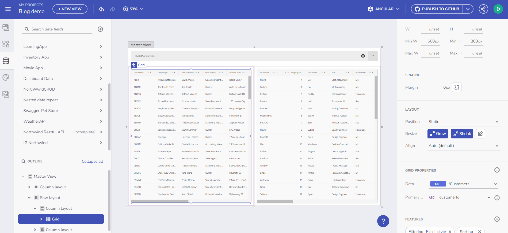

# App Builder での URL パラメーターのバインド

App Builder では、データ リクエストやリピーターに URL パラメーターを使用することを含め、高度なデータ操作および表示の技法を実装可能です。この機能は、動的なデータ駆動型アプリケーションを作成するために重要です。

## データ リクエスト
パスまたはクエリ パラメーターを必要とするデータ エンドポイントを扱う場合、App Builder の URL パラメーター バインド機能がとても有用です。この機能により、アプリケーションは URL で指定されたパラメーターに基づいてデータ要求を行うことができます。たとえば、Customer Orders にバインドされた Grid コンポーネントを考えてみましょう。「CustomerID」 パス パラメーターを使用することにより、グリッドは指定された顧客に関連するデータを動的に取得して表示します。

> [!NOTE]
> このトピックの例では、[Northwind WebAPI](https://data-northwind.indigo.design/swagger/index.html) を使用します。

データ リクエスト

## データ リピーター

データ リピーターはこの概念をさらに発展させます。たとえば、Tree ノード コンポーネントは、選択された Customer ID に基づいて取得される Orders コレクションを通じて繰り返すことができます。単純なデータ バインドとは異なり、これにはコンポーネントをデータ リピート コンテキストにバインドするもので、URL パラメーターに基づいて取得したデータから UI 要素を動的に作成できるようになります。

データ リピーター

## 重要ポイント
App Builder での URL パラメーター バインドにより、動的なデータ駆動型アプリケーションを作成するための無数の可能性が提供されますこの機能を活用することで、ユーザーのナビゲーションや入力に最適に応答するアプリケーションを構築することができ、全体的なユーザー エクスペリエンスと実用レベルのシナリオでのアプリケーションの適用性を向上させることができます。

- **動的なデータ取得**: App Builder の URL パラメーター バインドにより、動的なデータの取得が可能になり、グリッドやツリーなどのコンポーネントが URL パラメーターに基づいてデータを表示できるようになります。
- **ユーザー エクスペリエンスの向上**: この機能は、コンテキスト固有のデータを提供することでアプリケーションとのユーザー インタラクションを強化し、全体的なユーザー エクスペリエンスを向上させます。
- **データの表示**: データ リピーターを URL パラメーターと組み合わせて使用​​する機能により、特にネストされたデータ構造または階層データ構造が必要なシナリオで、データを表示するための多用途なアプローチが提供されます。
- **シームレスな統合**: App Builder での URL パラメーターとデータ リクエストおよびリピーターの統合はシームレスであるため、開発者は複雑なデータ駆動型アプリケーションを簡単に作成できます。
- **以前のコンセプトとの一貫性**: この機能は、以前に説明したコンポーネント プロパティのバインドと変数管理の概念に基づいて構築されており、App Builder の機能の包括的かつ一貫した性質を示しています。

## その他のリソース

* [変数の管理](variables-management.md)
* [ルート パラメーターを使用したナビゲーション](route-parameters-navigation.md)
* [コンポーネント プロパティのバインド](component-properties-binding.md)
* [イベントとアクションの操作](working-with-events-and-actions.md)
* [マスター/詳細の概念](../master-detail/master-detail.md)
* [ステップバイステップのアプリ作成例](../master-detail/step-by-step-examples.md)
* [App Builder コンポーネント](../indigo-design-app-builder-components.md)