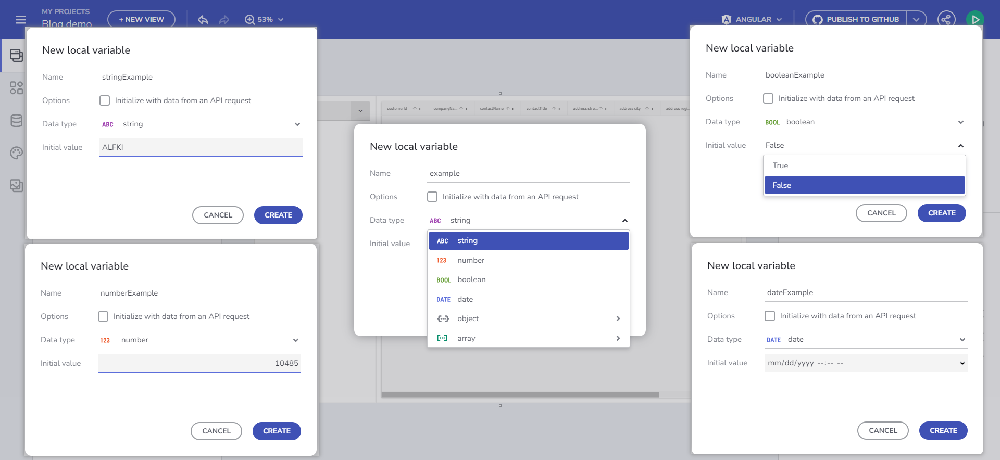
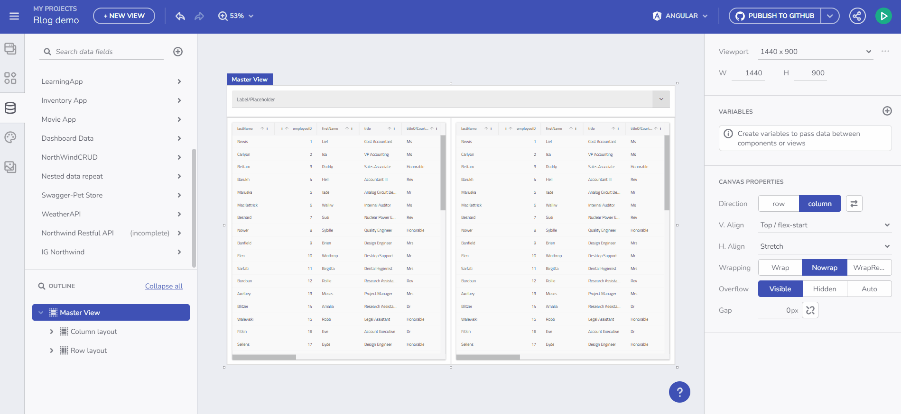

# App Builder での変数管理のガイド

App Builder は、アプリケーション内の変数を管理するための包括的でユーザーフレンドリーなアプローチを提供するようになりました。この機能は、コンポーネントやビュー間でのデータ転送を容易にし、アプリケーションの対話性と動的機能を強化するために不可欠です。

変数の概要

## 変数型について

App Builder では、変数は主に次の 2 つのカテゴリに分類されます。

- **グローバル変数**: アプリケーション内の異なるビュー間でのデータ転送に使用されます。
- **ローカル変数**: 同じビュー内のコンポーネント間のデータ転送に使用されます。

変数は、文字列、数値、ブール、日付、オブジェクト、配列といったデータ型を持ちます。App Builder の柔軟な設計により、これらの変数を簡単に定義でき、アプリケーションのさまざまな要件を満たします。

プリミティブ型の場合は、値エディターを使用してデフォルト値を設定できます。配列型とオブジェクト型の場合、アプリで使用可能なデータ ソース スキーマに基づいて、フライアウト メニューからエンドポイントまたはスキーマ型を選択できます。

変数の管理

> [!NOTE]
> このトピックの例では、[Northwind WebAPI](https://data-northwind.indigo.design/swagger/index.html) を使用します。

## 変数の作成方法

### インタラクション セクション

変数を利用する特定のコンポーネント イベントに関連付けられた変数は、[インタラクション] セクションを通じて管理します。

たとえば、Financial -> Box Office Revenue テーブルにバインドされたコンボを追加し、変数の設定アクションを使用して選択変更イベント ハンドラーを追加した場合、変数フィールドを選択して [+ 新しい変数] ボタンを使用できます。

コンポーネントのイベント ハンドラー経由

これをクリックすると、コンボ データ ソースの型 (Box Office Revenue) と コンボ選択モードに基づいて、データ型がすでに入力された状態で [新しい変数] ダイアログが開きます。変数の型は選択モードによって決まります。単一選択モードは単一のオブジェクト (Box Office Revenue) を示し、複数選択モードはオブジェクトの配列 (Box Office Revenue の配列) を示します。

新しい変数のダイアログ

これは、アプリケーションのライフサイクルに不可欠な**変数作成の主要なフロー**とみなされます。

1. コンポーネントから始めます。
2. それをデータにバインドします。
3. イベントを追加します。
4. 特定のアクションにリンクします (変数の設定アクション)。
5. 状態を保持する変数を作成します。
6. この変数を後でアプリ内で使用します。

ユーザー フローのビデオ

### 変数のツールボックス セクション

こちらで変数を作成および編集できます。検証プロセスは名前付けを支援します。変数の型を、事前定義されたドロップダウン メニューから選択するか、API リクエストからの自動初期化によって設定します。これにより、選択したエンドポイントのスキーマ データ 型に基づいてデータ型が決定されます。

変数の作成

以下に、変数の利用について詳しく説明します。

## エンドポイントからのデータの初期化

データを変数に保存し、任意のコンポーネントのデータ コンテキストで使用します。変数の型は、選択したエンドポイントのデータ スキーマに基づいて自動的に決定されます。

たとえば、/Customers エンドポイント リクエストからのデータを Combo コンポーネントにバインドするには、変数を作成し、[API リクエストからのデータで初期化する] を選択します。これにより、Customers の配列が取得されます。

エンドポイントからのデータの初期化

## コンポーネント イベント コンテキストまたはデータ コンテキストを通じて変数値を設定します。

この機能を使用すると、空の変数にデータを動的に入力できます。まず、Customers 配列型の空の変数を作成します。[変数の作成/編集] ダイアログの [データ型] ドロップダウンから「配列」項目を選択し、データ ソース (/Customers など) を選択します。変数に `selectedCustomers` という名前を付けます。以下の gif は、このような変数を作成し、Combo の値選択が変更されたときにデータを入力する方法を示しています。このシナリオの最後のステップは、Grid コンポーネントを `selectedCustomers` 配列にバインドすることです。

イベントおよびデータ コンテキストの例

次のセクションでは、変数値の設定ではなくプロパティ バインドに重点を置き、コンポーネントへのバインドに焦点を当てて、同様のシナリオについて説明します。

## 重要ポイント

変数を使用してアプリケーションを構築する際に、これまでに学んだことをまとめます。

- **効率的なデータ管理**: App Builder の変数管理システムは、アプリケーション内のデータ フローを合理化し、効率とユーザー エクスペリエンスを向上させます。
- **柔軟性と制御**: このプラットフォームは変数の型と初期化方法に柔軟性を提供し、データ処理を緻密に制御できます。
- **直感的なユーザー インターフェイス**: ユーザーフレンドリーなダイアログと、変数の作成と管理のための構造化されたプロセスにより、App Builder は複雑なタスクを簡素化します。
- **動的なデータ バインド**: エンドポイントから変数を初期化し、イベントまたはデータ コンテキストを通じて変数値を設定できる機能により、動的で応答性の高いアプリケーションが可能になります。
- **シームレスな統合**: 変数管理とコンポーネント イベントおよびデータ バインドの統合により、一貫性のある直感的な開発エクスペリエンスが保証されます。

App Builder での変数管理のこれらの側面を習得することで、開発者は、より動的で応答性の高い、データ駆動型の Web アプリケーションを作成できます。

## その他のリソース

- [コンポーネント プロパティのバインド](component-properties-binding.md)
- [URL パラメーターのバインド](url-parameters-binding.md)
- [ルート パラメーターを使用したナビゲーション](route-parameters-navigation.md)
- [イベントとアクションの操作](working-with-events-and-actions.md)
- [マスター/詳細の概念](../master-detail/master-detail.md)
- [ステップバイステップのアプリ作成例](../master-detail/step-by-step-examples.md)
- [App Builder コンポーネント](../indigo-design-app-builder-components.md)
