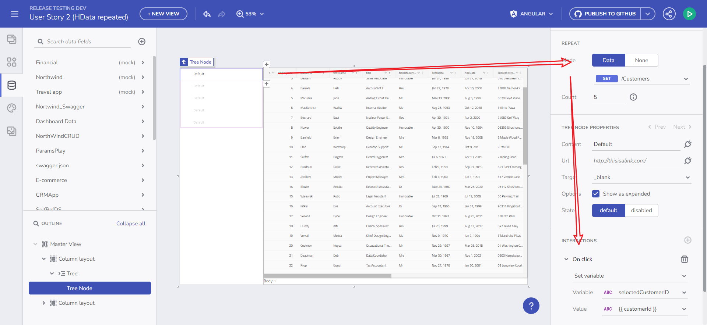

# App Builder でのイベントとアクションを操作する

App Builder では、インタラクティブで応答性の高いアプリケーションを作成するための重要な側面は、イベントとアクションを効果的に使用することです。この機能は、コンポーネントと変数管理、ユーザーインタラクションの統合に不可欠です。

## コンポーネントのイベント ハンドラーの理解

App Builder は、変数管理のコンテキストで重要な役割を果たすまざまなコンポーネント イベント ハンドラーを公開しています。主なイベント:

- **選択変更のイベント**: Combo コンポーネントで使用されます。
- **行選択変更のイベント**: Grid コンポーネントで使用されます。
- **クリック イベント**: すべてのコンポーネントで使用できるこのイベントは、クリック アクションで変数を設定するコンテキストで使用されます。

> [!NOTE]
> このトピックの例では、[Northwind WebAPI](https://data-northwind.indigo.design/swagger/index.html) を使用します。

## 動的変数の型の調整

App Builder の Grid コンポーネントと Combo コンポーネントでは、選択モードの設定が可能です。興味深いことに、選択した選択モードに基づいて、変数の型が動的に変化します。例えば、シングル選択モードで顧客の配列にバインドされた Combo コンポーネントは、選択したアイテムのイベント コンテキストを通じて Customer オブジェクトを渡します。

イベントの使用

## OnClick イベント ハンドラーとデータ コンテキスト

App Builder のすべてのコンポーネントには OnClick イベント ハンドラーが搭載されており、変数のコンテキストで利用できます。繰り返しデータを含むシナリオでは、OnClick -> 変数設定 のアクションを通じて特定のアイテムのデータ コンテキストにアクセスできます。この機能により、ツリー コンポーネントの例で示されているように、ユーザー インタラクションに基づいた変数値を修正できます。

クリック時の例

## `valueKey` を使用した Combo コンポーネントの処理

Combo コンポーネントの注目すべき点は、`valueKey` 属性が設定されいるときの動作です。Combo コンポーネントは、SelectionChanged イベント中にプリミティブ値を渡します。たとえば、`CustomerID` が `valueKey` として設定されている場合、数値が渡されます。また `CustomerName` が設定されている場合は、文字列が渡されます。

コンボ値のキー ノート

## 重要ポイント

- **イベント駆動型のインタラクティビティ**: 選択変更のイベントやクリックのイベントのような App Builder のイベント ハンドラーにより、アプリケーション内での動的なインタラクションが可能になります。
- **変数管理の統合**: これらのイベントは変数管理とシームレスに統合されており、応答性のあるデータ駆動型のアプリケーションが可能になります。
- **動的な変数の型**: コンポーネントの選択モードに基づいて変数の型を動的に変更できる機能により、データ処理の柔軟性が向上します。
- **OnClick データ コンテキスト へのアクセス**: OnClick イベント ハンドラーは、ユーザー インタラクションに基づいて変数を操作するために不可欠なデータ コンテキストへのアクセスを提供します。
- **Combo コンポーネントの柔軟性**: Combo コンポーネントの `valueKey` 機能は、さまざまなデータ型を処理する際の App Builder の柔軟性を示しています。
- **ユーザー エクスペリエンスの向上**: これらの機能は集合的に、ローコード開発プラットフォームの目標に沿った、よりインタラクティブでユーザーフレンドリーなアプリケーションに貢献します。

## その他のリソース

- [変数の管理](variables-management.md)
- [ルート パラメーターを使用したナビゲーション](route-parameters-navigation.md)
- [コンポーネント プロパティのバインド](component-properties-binding.md)
- [URL パラメーターのバインド](url-parameters-binding.md)
- [マスター/詳細の概念](../master-detail/master-detail.md)
- [ステップバイステップのアプリ作成例](../master-detail/step-by-step-examples.md)
- [App Builder コンポーネント](../indigo-design-app-builder-components.md)
